# 第二章

TODO: check TOC

- HTTP
- Express 伺服器
  - Next-Express 伺服器、nodemon
  - Index.getInitialProps
  - 測試我們的伺服器
- User 資料模型與 mongoose
- MongoDB 資料庫與 dotenv
  - 測試伺服器與資料庫之連線
  - 取得文件
- Session
  - 設定 session
  - 儲存 session
  - 測試 session 與 cookie
- MenuWithAvatar 與 Header 元件
- 在 Vercel 上部署

---

在我們開工之前，先取得`1-end`的程式碼。[1-end](https://github.com/menon-pheno/fullstack-bookstore/tree/master/book/1-end)資料夾位於[fullstack-bookstore repo](https://github.com/menon-pheno/fullstack-bookstore)`book`的目錄內。

- 如果你還沒有將 fullstack-bookstore 給 clone 下來的話，用`git clone https://github.com/menon-pheno/fullstack-bookstore`這個指令將 repo 複製到你的電腦上
- 注意：如果你想要用自己的 GitHub 帳號自己管理程式的話，你應該將我們的 repo fork 出來並且執行`git clone https://github.com/<你的 github 名稱>/fullstack-bookstore.git`。這樣你就可以將你的改動直接 push 到你的`fullstack-bookstore` repo
- 在`1-end`的資料夾內執行`yarn`來安裝所有的套件

TODO: Confirm packages
我們在第二章會安裝以下幾個套件：

- `"connect-mongo"`
- `"dotenv"`
- `"express"`
- `"express-session"`
- `"mongoose"`
- `"nodemon"`（位於 `devDependencies`）

請確定使用我們指定的套件跟版本，並忽略任何升級的警告。我們會定期更新套件且測試相容性。我們無法確保新的套件版本與目前的程式碼都相容，套件升級時有的時候會導致一些預料之外的問題。

到這章的尾聲時，你會有一個包含 `MONGO_URL_TEST`、`SESSION_NAME` 及 `SESSION_SECRET` 等環境變數的 `.env` 檔。

我們鼓勵且歡迎你在閱讀本章的時候，可以在我們的 GitHub repo: [https://github.com/menon-pheno/fullstack-bookstore/issues/new](https://github.com/menon-pheno/fullstack-bookstore)回報任何 bug、錯字或是任何解釋不清楚的地方。

---

在第一章我們探討了我們專案的結構、Next.js、ESLint/Prettier 格式化、HOCs 以及伺服器端渲染。我們也將應用程式與 Material-UI 的函式庫整合並加上一些全域與共享 style。

到目前為止，我們的程式會將一些靜態資料傳送到 `Index` 頁面。我們並沒有使用 API 等功能去管理資料。我們的 `Index` 頁面沒有任何動態資料、我們不會針對資料庫做 CRUD、更別說我們的使用者沒有任何認證機制。

我們在本章的主要目標有以下：

TODO: update

- 將我們的伺服器與 MongoDB 資料庫連結
- 在伺服器端產生一個 `session`，將一個 `Session` MongoDB 文件存入資料庫，然後將對應的 `cookie` 存到使用者的瀏覽器

到本章的尾聲時，我們會實作一個 `MenuWithAvatar` 元件，並且改進我們的 `Header` 元件。

`yarn dev` 以及造訪 `https:/localhost:3000`：

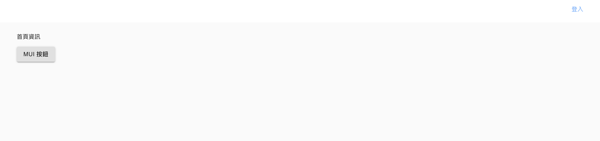

可以看到，我們目前的程式很單純，也沒有任何使用者認證機制。*所有的使用者*都可以造訪 `Index` 頁面，`Header` 元件也對所有的使用者來說都一樣。目前沒有任何辦法讓使用者*登入*並且看到自己專屬的頁面。

我們需要將我們的應用程式與資料庫連接起來才能為我們的應用程式增加使用者認證的功能。一般來說，伺服器端會收到一個來自於客戶端（使用者的瀏覽器）的登入 request，伺服器接者會在*資料庫*（這個資料庫可能是應用程式自己擁有，但是也可能是外部的資料庫）內搜尋並確認此使用者是否存在。如果使用者有存在於資料庫內，伺服器會將對應使用者的資訊透過 response 到瀏覽器。

一般而言，伺服器會*等待監聽*來自客戶端的請求（request, `req`），執行一些伺服器端函式，然後回傳結果（response, `res`）。要能夠更清楚了解伺服器的工作，我們稍微離題，並且探討 HTTP 這個*客戶端-伺服器端*的溝通協定。

---

## HTTP

在我們建立 Express 伺服器已經定義 Express 各 API 的路由之前，我們需要對 HTTP 有基本的認識。

超文本傳輸協定（HyperText Transfer Protocol，HTTP）是一個客戶端與伺服器端的協定。它定義了一組電腦之間如何交換資訊的規範。客戶端通常指的是瀏覽器，而伺服器端是由一或多台透過 `response(res)` 來回傳客戶端的 `request(req)` 的機器。HTTP 是目前網路上最主流的協定，可以參考以下更詳盡地說明：

[https://developer.mozilla.org/en-US/docs/Web/HTTP/Overview](https://developer.mozilla.org/en-US/docs/Web/HTTP/Overview)

HTTP 的基本理解的重要性在哪？當我們在做任何資料的交換與傳輸時，我們都會將動作用瀏覽器的 `request` 與伺服器回傳的 `response` 去理解跟解釋。

---

### Index.getInitialProps

我們接下來針對 `Index` 這個頁面元件做以下兩個改動：

- 我們會定義 `Index.getInitialProps` 函式，用它來從伺服器取得要提供給頁面使用的 `user` prop
- 我們會定義這個 `user` prop 的型態與初始值


我們在第一章有提到 `getInitialProps`。它是 Next.js 提供的函式，可以在瀏覽器端或是伺服器端執行，用來提供資料給頁面元件的 props。如果你希望某一個頁面可以同時支援由瀏覽器端以及伺服器端來渲染，你可以透過 `getInitialProps` 來呼叫 API 以取得資料然後將資料以 props 的方式傳到頁面元件裡。

回到我們一開始的主要目標：定義 `user` props 的型態與值還有定義 `Index.getInitialProps` 函式。

1. 我們驗證 prop 的型態以及預設值的方式與我們專案的所有的元件的做法相同：

```JSX
import PropTypes from 'prop-types';

const propTypes = {
  user: PropTypes.shape({
    displayName: PropTypes.string,
    email: PropTypes.string.isRequired,
  }),
};

const defaultProps = {
  user: null,
};
```

在 export 頁面之前增加兩行，將 `Index` 的 `propTypes` 以及 `defaultProps` 屬性給指定為上面定義的內容：

```JSX
Index.propTypes = propTypes;
Index.defaultProps = defaultProps;

export default Index;
```

對 stateless functional component 來說，我們需要將 `user` prop 明確地傳入：

```JSX
const Index = ({ user }) => (
  // 省略
);
```

2. `getInitialProps` 可以透過 `ctx` 這個參數（你也可以選擇拿 `{ req }` 或是 `{ query }` 拿解構過的參數）。我們在這邊傳入 `ctx` 為參數，然後取得 `query` 內的 user 來當作頁面的初始 props。

```JSX
Index.getInitialProps = async (ctx) => ({ user: ctx.query.user });
```

將上述兩個步驟綜合起來，你的 `Index` 頁面元件會變成：

```JSX
import Head from 'next/head';
import Button from '@material-ui/core/Button';
import PropTypes from 'prop-types';

const propTypes = {
  user: PropTypes.shape({
    displayName: PropTypes.string,
    email: PropTypes.string.isRequired,
  }),
};

const defaultProps = {
  user: null,
};

const Index = ({ user }) => (
  <div style={{ padding: '10px 45px' }}>
    <Head>
      <title>首頁</title>
      <meta name="說明" content="這是首頁的說明資訊" />
    </Head>
    <p>首頁資訊</p>
    <Button variant="contained">MUI 按鈕</Button>
  </div>
);

Index.propTypes = propTypes;
Index.defaultProps = defaultProps;

export default Index;

```

TODO: not needed
我們快要可以測試驗證我們的伺服器是否可以傳送資料到使用者的瀏覽器了。唯一缺少的部分是要定義 `/` Express 路由來將資料回傳到瀏覽器。

---

### 測試我們的伺服器

我們再來檢視一下我們之前定義（後來刪掉）的 Express `/` 路由：

```JavaScript
server.get('/', (req, res) => {
  res.send('太棒了，Express 自動更新');
});
```

請注意，我們的伺服器在這個路由**並不會渲染任何頁面**。我們的伺服器只是單純回傳一個 HTTP response，因為參數是一個 `String`，所以 [res.send](expressjs.com/en/api.html#res.send) 函式會將 `Content-Type` 設定為 `text/html`。所以結果回傳到瀏覽器的會是一個 body 內容為 `太棒了，Express 自動更新` 的頁面。

但是我們要的是在我們的伺服器渲染我們的 `Index` 頁面，然後將渲染的 HTML 傳到瀏覽器。我們也是因為這樣所以刪掉我們舊的 `/` Express 路由。我們的目標是定義一個會以 `query` 物件將 `user` 的值傳到 `Index` 頁面元件並且渲染 `Index` 頁面的新 `/` Express 路由。Next.js 透過 `app.render(req, res, route, query)` 函式就可以達到這個目的：

[https://github.com/vercel/next.js/blob/canary/examples/custom-server/server.js](https://github.com/vercel/next.js/blob/canary/examples/custom-server/server.js)

在我們的情況裡，`(req, res, route, query)` 這四個參數會變成 `(req, res, '/', { user })`。

因此我們新 Express 路由可以定義成以下：

```JavaScript
server.get('/', (req, res) => {
  const user = { email: 'default@bookstore.org' };
  app.render(req, res, '/', { user });
});
```

這裡要注意到我們指定了一個具有 `email` 屬性的 `user` 物件。這是因為我們的伺服器還沒有連接到任何資料庫，但是我們想要先測試是否有成功的在伺服器端傳送資料到瀏覽器端。因此我們現在單純的寫死 `user` 這個物件，而不是從資料庫取得。

另外值得注意的是，我們使用了一個語法的縮寫，將 `app.render(req, res, '/', { user: user })` 簡化為 `app.render(req, res, '/', { user })`。

上面的片段程式碼負責了以下：

- 監控並處理對 `/` 路由進行的 `GET` 請求
- 將 `user` 以 `query` 傳入，這樣我們就能在 `Index.getInitialProps` 以 `ctx.query.user` 的方式取得，用來渲染 `Index` 頁面（因為第三個參數是 `/`，會對應到 `pages/index.jsx`）

將這個新的 `/` Express 路由加到你的 `server/server.js`。要記得這個路由要在下面這行之前定義：

```JavaScript
server.get('*', (req, res) => handle(req, res));
```

`yarn dev-express` 啟動你的專案，並造訪 `http://localhost:8000`：

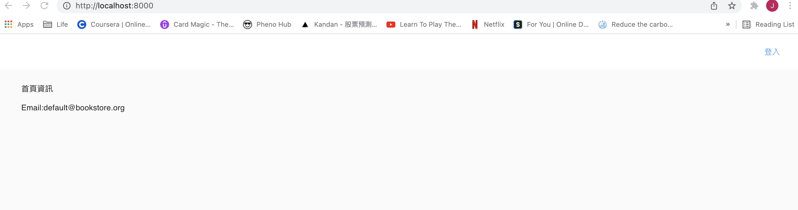

成功！我們的伺服器將 `query` 物件以 `{ user }` 的形式傳給了 `Index.getInitialProps` 函式使用。這個函式會將 `user` 以 prop 的方式傳入 `Index` 頁面元件。最後，當使用者造訪 `/` 這個路由的時候，伺服器正確地回傳了一個被注入資料（`user.email`）的伺服器端渲染頁面。

我們目前是把 `user` 給寫死。在下個小節，我們將會把我們的伺服器與 MongoDB 資料庫連接，以後將會從資料庫取得 `user` 物件跟對應的資料。

---

## User 資料模型與 mongoose

在之前的小節，我們透過整合 Express.js 與 Next.js 建立了一個客製的伺服器。我們將 `user` 物件在伺服器上寫死。在這個小節，我們要使用 `mongoose` 套件裡的 `mongoose.model` 函式來定義我們的第一個 `User` 資料模型：

[https://mongoosejs.com/docs/models.html#compiling](https://mongoosejs.com/docs/models.html#compiling)

範例程式如下：

```JavaScript
const schema = new mongoose.Schema({ name: 'string', size: 'string' });
const Tank = mongoose.model('Tank', schema);
```

我們為什麼需要一個 `User` 資料模型呢？因為只將我們的伺服器與 MongoDB 連接是不夠的。我們的伺服器還需要透過 MongoDB API 來與 MongoDB 資料庫進行互動。我們在這裡選擇了使用 `mongoose` 套件而不是使用原生的 MongoDB API：

[https://mongoosejs.com/docs/api/model.html](https://mongoosejs.com/docs/api/model.html)

當我們對我們的資料模型呼叫 Mongoose API 的 `create` 函式時，我們會產生這個模型的實體，也就是一個 MongoDB 文件（document），並且將之存到我們的資料庫內：

[https://mongoosejs.com/docs/api/model.html#model_Model.create](https://mongoosejs.com/docs/api/model.html#model_Model.create)

使用方法：

```JavaScript
Model.create()
```

以上面的 `Tank` 資料模型為例，它的資料結構（schema）很單純，就只有兩個欄位：

```JavaScript
{ name: 'string', size: 'string' }
```

下面是另外一個欄位較多的資料結構範例。我們另外更指定了欄位的一些額外屬性：

```JavaScript
const blogSchema = new Schema({
  title: String,
  author: String,
  body: String,
  comments: [{ body: String, date: Date }],
  date: { type: Date, default: Date.now },
  hidden: Boolean,
  meta: {
    votes: Number,
    favs: Number
  }
})
```

讓我們用類似的方式定義我們的 `User` 資料結構：

```JavaScript
const mongoose = require('mongoose');

const { Schema } = mongoose;

const mongoSchema = new Schema({
  googleId: {
    type: String,
    required: true,
    unique: true,
  },
  googleToken: {
    access_token: String,
    refresh_token: String,
    token_type: String,
    expiry_date: Number,
  },
  slug: {
    type: String,
    required: true,
    unique: true,
  },
  createdAt: {
    type: Date,
    required: true,
  },
  email: {
    type: String,
    required: true,
    unique: true,
  },
  isAdmin: {
    type: Boolean,
    default: false,
  },
  displayName: String,
  avatarUrl: String,
});
```

可以看到我們指定了所有參數的資料型態（`String`、`Date`、`Boolean`、`Number`）- 有的是 `required`，而有的是有 `default` 值。第三章我們將會整合 Google OAuth API，整合完之後我們會從 Google 的 OAuth 伺服器得到 `googleId`、`googleToken`、`email`、`displayName` 以及 `avatarUrl` 的資訊。我們會隨著書上的進度逐漸地再加上其他欄位。舉例來說，在第六章我們會增加整合 Github 所需要的欄位。

你可以看到我們的資料結構已經有一定的複雜度，裡面更有一些你可能不熟悉的屬性：

- `type` 指定了資料型態，例如 `String` 或 `Boolean`
- `required`（`Boolean`）指定該欄位是否必須 - 舉例來說，如果你嘗試新增一個沒有 `slug` 欄位的 `User` MongoDB 文件，系統會報錯誤
- `unique`（`Boolean`）指定資料庫是否要針對這個欄位設定 `unique index`。我們會在第五章探討索引（index） 以及 索引類別（index types）

下面連結有更多關於資料結構的設定選項：

[https://mongoosejs.com/docs/schematypes.html#schematype-options](https://mongoosejs.com/docs/schematypes.html#schematype-options)

有了資料結構後，產生資料模型就非常簡單，就是使用 `mongoose.model` 函式：

```JavaScript
const User = mongoose.model('User', mongoSchema);
```

綜合以上的說明，新增 `server/models/User.js`（也新增 `models` 這個資料夾），內容如下：

```JavaScript
const mongoose = require('mongoose');

const { Schema } = mongoose;

const mongoSchema = new Schema({
  googleId: {
    type: String,
    required: true,
    unique: true,
  },
  googleToken: {
    access_token: String,
    refresh_token: String,
    token_type: String,
    expiry_date: Number,
  },
  slug: {
    type: String,
    required: true,
    unique: true,
  },
  createdAt: {
    type: Date,
    required: true,
  },
  email: {
    type: String,
    required: true,
    unique: true,
  },
  isAdmin: {
    type: Boolean,
    default: false,
  },
  displayName: String,
  avatarUrl: String,
});

const User = mongoose.model('User', mongoSchema);

module.exports = User;
```

這樣一來，我們就有方法從 MongoDB 資料庫取得 `User` 文件了。假設我們的資料庫裡面有個 `User` MongoDB 文件，而且它的 `slug` 值是 `super-author`，那我們可以使用 Mongoose API 的 `findOne` 函式來從資料庫取得這筆資料：

```JavaScript
User.findOne({ slug: 'super-author' })
```

除了 `User` 資料模型之外，我們還會產生 `Book`、`Chapter`、`EmailTemplate` 以及 `Purchase` 等資料模型。我們更會使用許多 Mongoose API（例如 `findOne`、`create`、`update` 及其他）來對我們的資料庫進行新增／讀取／更新／刪除（CRUD）等動作：

[https://mongoosejs.com/docs/api/model.html](https://mongoosejs.com/docs/api/model.html)

注意一下，Mongoose API 的函式回傳的是一個 `Promise`。我們會在第三章探討 `Promise` 所代表的意義。

---

## MongoDB 資料庫與 dotenv

到這邊，我們有一個 `User` 資料模型，但是我們還沒有將伺服器與 MongoDB 的資料庫連接起來。使用 `mongoose` 來與 MongoDB 連接很單純，你傳入 `uri` 以及 `options` 用來呼叫 `mongoose.connect` 就行了：

```JavaScript
mongoose.connect(uri, options);
```

`uri` 是 MongoDB 資料庫的位址資訊，格式如下：

```
mongodb://[username:password@]host1[:port1][,...hostN[:portN]][/[defaultauthdb][?options]]
```

[https://docs.mongodb.com/manual/reference/connection-string/](https://docs.mongodb.com/manual/reference/connection-string/)

打開 `server/server.js`，引入 `mongoose`、定義 `MONGO_URL`、`options` 及呼叫 `mongoose.connect` 如下：

```JavaScript
const express = require('express');
const next = require('next');
// 新增
const mongoose = require('mongoose');

const dev = process.env.NODE_ENV !== 'production';
// 新增
const MONGO_URL = process.env.MONGO_URL_TEST;
// 新增
const options = {
  useNewUrlParse: true,
  useCreateIndex: true,
  useFindAndModify: false,
  useUnifiedTopology: true,
};
// 新增
mongoose.connect(MONGO_URL, options);

const port = process.env.PORT || 8000;
const ROOT_URL = `http://localhost:${port}`;

const app = next({ dev });
const handle = app.getRequestHandler();

app.prepare().then(() => {
  const server = express();

  server.get('/', (req, res) => {
    const user = { email: 'default@bookstore.org' };
    app.render(req, res, '/', { user });
  });

  server.get('*', (req, res) => handle(req, res));

  server.listen(port, (err) => {
    if (err) throw err;
    console.log(`> 在 ${ROOT_URL} 上準備好了`);
  });
});
```

上面的 `options` 設定，主要是針對排除一些我們在寫這本書當下的 `mongoose` 一些舊版本相關的警告，並非必要的設定。

如果你這時候使用 `yarn dev-express` 啟動伺服器，你會得到以下的錯誤：

```
MongooseError: The `uri` parameter to `openUri()` must be a string, got "undefined".
```

這個錯誤原因是源自於我們並沒有將 process.env.MONGO_URL_TEST 指定任何值。在軟體開發的習慣中，我們稱 `MONGO_URL_TEST` 為一個環境變數（environmental variable）。它代表的是我們身為開發者在程式碼之外所定義的變數及對應的值。以網路應用程式為例子，使用環境變數的好處是我們的程式碼內不需要也不應該存放具有敏感性的值，並且當這些值需要更動的時候，重新部署程式的需求會降低。我們的專案還會陸續增加許多環境變數。

我們推薦使用 `dotenv` 套件來管理你的環境變數：

[https://github.com/motdotla/dotenv](https://github.com/motdotla/dotenv)

重要的一點，我們透過 `dotenv` 管理的環境變數只會在伺服器端有辦法存取。預設來說，瀏覽器是無法取得環境變數的。我們在第八章處理付款整合的時候會探討如何開放讓瀏覽器存取一部分的環境變數。

你在本章一開始時，在 `2-begin` 的資料夾中執行 `yarn` 的時候就安裝了 `dotenv` 這個套件。在專案的根目錄下新增一個 `.env` 檔，內容如下：

```
MONGO_URL_TEST="XXXXXX"
```

切記，如果你的程式碼有放在 Github 或是任何其他的雲端 git 系統上，要將 `.env` 記錄在 `.gitignore` 檔案裡。這樣你才不會誤將敏感的資訊，例如 API 鑰碼等內容發佈到 Github 上。

將 `dotenv` 用 `require('dotenv')` 引入至 `server/server.js`，然後呼叫它的 `config` 函式：

```JavaScript
const express = require('express');
const next = require('next');
const mongoose = require('mongoose');

require('dotenv').config();

const dev = process.env.NODE_ENV !== 'production';
const MONGO_URL = process.env.MONGO_URL_TEST;

const options = {
  useNewUrlParser: true,
  useCreateIndex: true,
  useFindAndModify: false,
  useUnifiedTopology: true,
};

mongoose.connect(MONGO_URL, options);

const port = process.env.PORT || 8000;
const ROOT_URL = `http://localhost:${port}`;

const app = next({ dev });
const handle = app.getRequestHandler();

app.prepare().then(() => {
  const server = express();

  server.get('/', (req, res) => {
    const user = { email: 'default@bookstore.org' };
    app.render(req, res, '/', { user });
  });

  server.get('*', (req, res) => handle(req, res));

  server.listen(port, (err) => {
    if (err) throw err;
    console.log(`> 在 ${ROOT_URL} 上準備好了`);
  });
});
```

在你呼叫 `config` 函式完，之後的程式碼都可以透過 `process.env.xxx` 來呼叫 `xxx` 這個環境變數。舉例來說，如果你程式碼裡面在呼叫 `config` 之後加上 `console.log(process.env.MONGO_URL_TEST);` 你會在終端機看到 `XXXXXX` 這個值被印出來。可想而知，我們需要將 `XXXXXX` 替換成我們 MongoDB 資料庫的真實 URL。這是我們測試伺服器與資料庫連線前的最後一個工作。

我們會推薦使用 MongoDB Atlas 的*免費*資料庫叢集：

[https://www.mongodb.com/cloud/atlas](https://www.mongodb.com/cloud/atlas)

下面的連結有介紹如何註冊以及創建免費叢集的步驟：

[https://docs.atlas.mongodb.com/getting-started/#b-create-an-service-free-tier-cluster](https://docs.atlas.mongodb.com/getting-started/#b-create-an-service-free-tier-cluster)

不過我們就目前的介面（以後介面可能會有微調），一步步的介紹，在註冊帳號並登入後：

---

1. 建立一個組織： 按下 `Create an Organization`


2. 為組織取名： 取名字並按 `Next`


3. 邀請其他人員（非必須）： 我們的教學就不邀請其他人，直接按 `Create Organization`


=> 你應該會被導往 Organization 下的 Projects 頁面


4. 建立專案： 按下 `New Project`


5. 為專案取名： 取名字並按 `Next`


6. 邀請其他人員（非必須）： 我們的教學就不邀請其他人，直接按 `Create Project`


=> 你應該會被導往 Projects 下的 Databases 頁面


7. 建立資料庫： 按下 `Build a Database`

8. 選擇免費的叢集： 在 Free/Shared 的選項按 `Create`


=> 你應該會被導往選擇資料庫地區跟雲端商的選擇頁面

9. 作出決定： 基本上使用預設應該就可以，按 `Create Cluster`


=> 你應該會被導往建立連線方式的頁面

10.

- 建立叢集的第一組使用者／密碼： 選擇 `Username and Password`，輸入你的 username/password


- 允許你伺服器的 ip 連線到 MongoDB： 選擇 `My Loacal Environment` 並且點選 `Add My Current IP Address`


11. 大功告成！Databases 頁面下應該會看到一個 `Cluster0` 了！


---

你建立的這個免費叢集（`Cluster0`）可以存放多個 MongoDB 資料庫。不過稍微注意一下，因為這是免費的，所以提供的資源（CPU 及記憶體）當然相對的較少。叢集內的所有資料庫會共享這些有限的資源。

現在我們有叢集了，可以來組出我們的 `MONGO_URL_TEST` 環境變數了。

---

1. 點選 `Cluster0` 的 `CONNECT` 按鈕


2. 選擇 `Connect your application`


3. URI 範例出現


---

一般而言，URI 的格式如下：

```
mongodb+srv://<username>:<password>@cluster0.<url>/<db>?retryWrites=true&w=majority
```

請注意到 `<db>` 在截圖中是 `myFirstDatabase`，這是 MongoDB Atlas 自行設定的預設，你可以任意地選擇別的名稱，MongoDB Atlas 會自行新增你 URI 裡所命名的資料庫名稱。我們在本書中會將資料庫命名為 `bookstore`

將 `<username>`、`<password>`、`<url>`、`<db>`（這個我們會用 `bookstore`） 用你自己設定的值填入，將結果設定到你 `.env` 的 `MONGO_URL_TEST`。

`yarn dev-express` 啟動你的專案。現在你不會看到任何錯誤，因為 `process.env.MONGO_URL_TEST` 有正確的值，也就代表 `MONGO_URL` 有值了。

**切記**！將 `.env` 加到 `.gitignore` 裡面。將 API 金鑰以及帳密相關資訊存放在雲端是非常不安全的。

---

## 測試伺服器與資料庫之連線

我們只要啟動我們的伺服器，並且執行一些資料庫指令就會在 MongoDB Atlas 上面實際建立一個資料庫。舉例來說，我們可以呼叫 Mongoose API 的 `findOne` 如下：

```JavaScript
User.findOne({ slug: 'pheno-author' });
```

Mongoose 官方文件也有 `findOne` 的範例：

[https://mongoosejs.com/docs/api/model.html#model_Model.findOne](https://mongoosejs.com/docs/api/model.html#model_Model.findOne)

```JavaScript
await Adventure.findOne({ country: 'Croatia' })
```

上面的程式碼代表的是“找一個 `country` 是 'Croatia' 的 advendture，沒有的話回傳 `null`”。

打開你的 `server/server.js`，將 `User` 資料模型引入，並且呼叫 `User.findOne`：

```JavaScript
const express = require('express');
const next = require('next');
const mongoose = require('mongoose');

const User = require('./models/User');

require('dotenv').config();

const dev = process.env.NODE_ENV !== 'production';
const MONGO_URL = process.env.MONGO_URL_TEST;

const options = {
  useNewUrlParser: true,
  useCreateIndex: true,
  useFindAndModify: false,
  useUnifiedTopology: true,
};

mongoose.connect(MONGO_URL, options);

const port = process.env.PORT || 8000;
const ROOT_URL = `http://localhost:${port}`;

const app = next({ dev });
const handle = app.getRequestHandler();

app.prepare().then(() => {
  const server = express();

  server.get('/', async (req, res) => {
    // 現在不用寫死 user 了
    // const user = { email: 'default@bookstore.org' };
    const user = await User.findOne({ slug: 'pheno-author' });
    app.render(req, res, '/', { user });
  });

  server.get('*', (req, res) => handle(req, res));

  server.listen(port, (err) => {
    if (err) throw err;
    console.log(`> 在 ${ROOT_URL} 上準備好了`);
  });
});
```

將 `User` 引入到我們的伺服器並且啟動伺服器會觸發建立資料庫（bookstore）以及 `user` 集合（collection）。

`yarn dev-express` 啟動你的伺服器。MongoDB Atlas 會自動建立一個 `bookstore` 的資料庫以及一個空的 `users` 集合。

到你的 MongoDB Atlas 找到你的免費叢集（Cluster0）並點選 `BROWSE COLLECTIONS`：

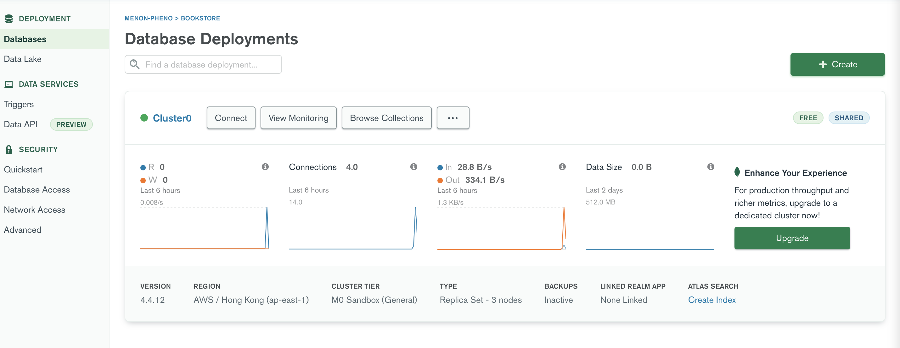

如果你看到你的叢集內有 `bookstore` 這個資料庫，你成功了！你應該會看到類似以下的畫面：

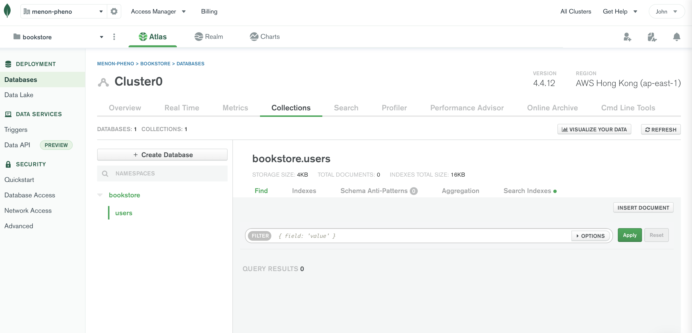

我們到這邊完成了將伺服器連接到 MongoDB 資料庫的工作。

---

### 取得文件

目前我們伺服器雖然已正確連接到 MongoDB Atlas 的 `bookstore` 資料庫，不過我們還沒有真的從資料庫取得任何實際資料。讓我們在 MongoDB Atlas 手動建立一個 MongoDB 文件（document），然後透過 Mongoose API 的 `findOne` 來實際取得這筆資料。

我們這個小節的目標是：**手動**在 `users` 集合內增加一筆 MongoDB 文件，然後正確地在我們的 `Index` 頁面（`pages/index.jsx`）呈現這個使用者的資訊。

在 `bookstore` 資料庫內選到 `users` 集合，然後選取 `INSERT DOCUMENT` 這個按鈕：

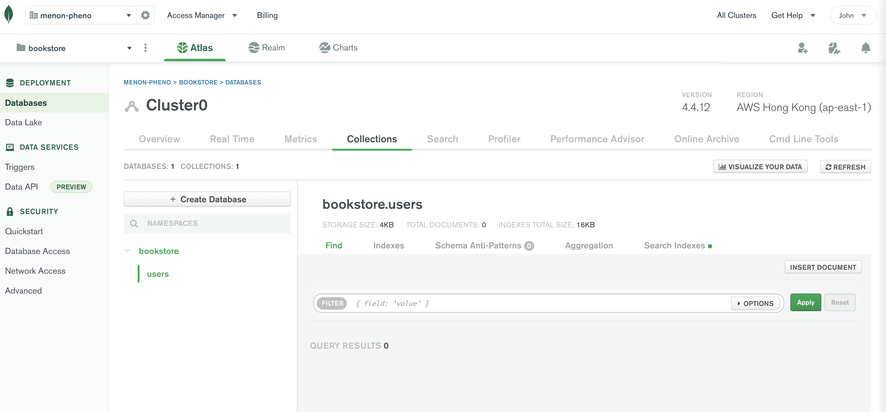

將下列五組的欄位／值加到這個新的 `User` MongoDB 文件（你也可以用自己想要的值，不過程式碼就記得對應調整）：

```JSON
createdAt: 2017-12-17T02:05:57.426+00:00
email: "pheno_the_best@yahoo.com.tw"
displayName: "黃敬強"
avatarUrl: "https://lh3.googleusercontent.com/-XdUIqdMkCWA/AAAAAAAAAAI/AAAAAAAAAAA/4252rscbv5M/photo.jpg?sz=128"
slug: "pheno-author"
```

MongoDB Atlas 會自動產生新文件的 `_id`，所以你需要做的是手動增加 `createdAt`（`Date` 型態）、`email`（`String` 型態）、`displayName`（`String` 型態）、`avatarUrl`（`String` 型態）以及 `slug`（`String` 型態）。

完成後點選 `INSERT` 按鈕：

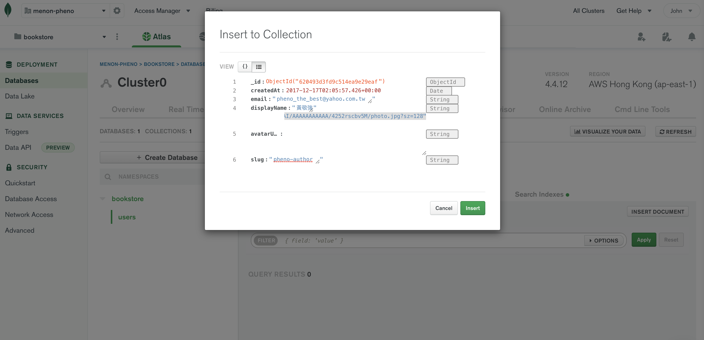

在建立新文件後，你會在 `bookstore.users` 集合裡面看到它：

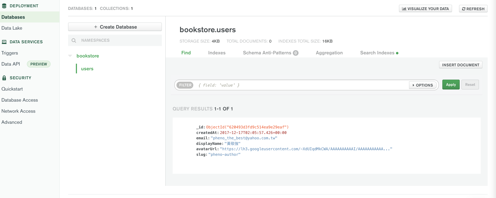

我們的目標是從資料庫取得一筆 MongoDB 文件然後將對應的 `user` 物件從我們的伺服器上傳入至 `Index` 頁面裡。最後我們會將**有資料並渲染過的** `Index` 頁面傳送到瀏覽器。

我們在 `server/server.js` 裡的 `User.findOne` 會將 MongoDB 內的使用者抓出來：

```JavaScript
server.get('/', async (req, res) => {
  // 現在不用寫死 user 了
  // const user = { email: 'default@bookstore.org' };
  const user = await User.findOne({ slug: 'pheno-author' });
  app.render(req, res, '/', { user });
});
```

而我們的 `Index.getInitialProps` 則會將 `user` 資訊注入到頁面元件：

```JavaScript
Index.getInitialProps = async (ctx) => ({ user: ctx.query.user });
```

`yarn dev-express` 並且造訪 `http://localhost:8000`：

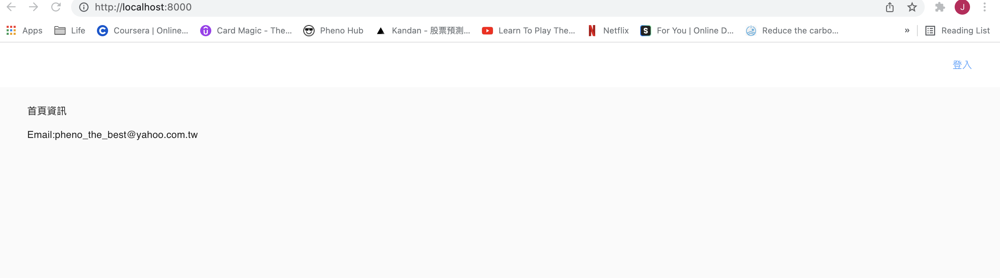

如果你的 `user.email` 有值，那代表你有正確呼叫 Mongoose 的 `findOne` API，恭喜！

在我們繼續下個小節之前，我們做幾個小測試，來確保我們對目前的程式碼有足夠的了解。

找到 `pages/_app.jsx` 內的這行：

```JSX
<Component {...pageProps} />
```

我們進行兩個小測試，驗證 `user` 是照我們所想的在傳遞：

- 將 `<Component {...pageProps} />` 改成 `<Component />`，啟動專案後瀏覽器會顯示一個 `Cannot read properties of null (reading 'email')` 錯誤

  這是因為 `App` HOC 並沒有把 `user` 這個 prop 以 `pageProps` 的一部份給傳入到 `Index` 頁面元件（因為我們把 `{...pageProps}` 給刪除）

- 將 `{...pageProps}` 加回到 `<Component>`，然後我們將 `pageProps` 在瀏覽器的終端機印出來：

  ```JSX
  render() {
    const { Component, pageProps } = this.props;

    console.log(pageProps);

    return (
      <ThemeProvider theme={theme}>
        {/* ThemeProvider makes the theme available down the React tree thanks to React context. */}
        {/* CssBaseline kickstart an elegant, consistent, and simple baseline to build upon. */}
        <Head>
          <meta name="viewport" content="width=device-width, initial-scale=1.0" />
        </Head>
        <CssBaseline />
        <Header {...pageProps} />
        <Component {...pageProps} />
      </ThemeProvider>
    );
  }
  ```

  造訪 `Index` 頁面，用 Chrome 的 `Developer tools > Console` 可以看到一個類似於下面的 `object`：

  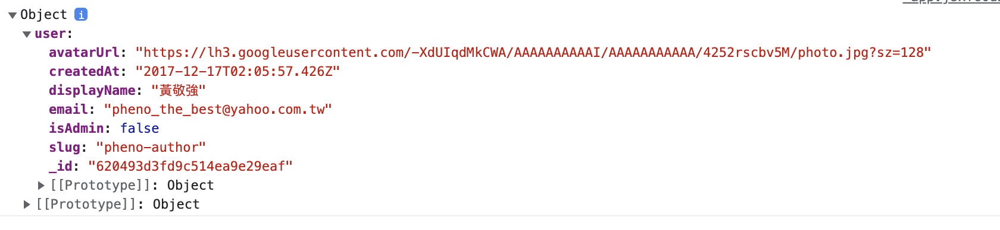

這代表 `pageProps` 這個物件單純是一個 `{ user: { someProperties } }` 這樣的東西。

本章的後面在探討完 `session` 及 `cookie` 的概念後，我們會將使用者一部份的資訊透過 `Header` 元件來顯示。我們是透過 `<Header {...pageProps} />` 的方式將資料傳入 `Header`。到時我們也做類似的驗證。

---

## Session

我們定義好了伺服器，以及連接到 MongoDB 資料庫了，但是我們的應用程式仍舊還沒有使用者認證的功能。第三章我們會透過整合 Google OAuth API 來實作這個功能。不過在我們做這件事之前，我們需要先了解 `session` 及 `cookie` 的觀念。

網頁應用程式如何判斷造訪網頁的使用者是誰？網頁應用程式如何讓使用者維持登入的狀態？你常常會在網路上登入某一個網頁，關掉頁籤再重新打開，然後發現在自己仍然是保持著登入的狀態。應用程式倒底是如何在瀏覽器上**辨識**使用者？

鋪陳了這麼久，應該猜得到：透過 `session` 及 `cookie`。以下說明一下如何透過 `session` 與 `cookie` 建立起一個 **永久性登入時域（persistent login session）**：

- 如果是一位已登出或是第一次造訪我們網頁的使用者進行登入時：

  1. 我們的伺服器會產生一個唯一的 `session` 物件，內含著使用者的 id
  2. 並且對應的會存放一筆 `Session` MongoDB 文件到我們的資料庫
  3. 接者我們的伺服器會產生一個具有 `name` 及 `value` 的唯一 `cookie` 物件
     - `value` 的值是透過令牌（session）的 id 來生成的
  4. 伺服器會將 `cookie` 回傳到瀏覽器端，瀏覽器會將 `cookie` 存放起來

  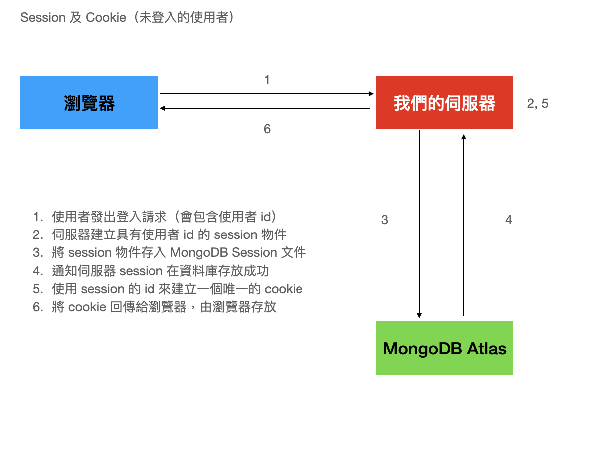

- 已登入的使用者重新造訪我們網頁時：

  1. 瀏覽器會將 `cookie` 帶在請求內
  2. 我們的伺服器會從 `cookie` 解譯出 `value` 的值（就會包含 session id）
  3. 透過 session id 我們可以找到 MongoDB 對應的 `Session` 文件（裡面會包含對應的 user id）
  4. MongoDB 透過 user id 取得對應的 `User` 文件，因此也取得該使用者的資訊
  5. 伺服器將使用者的資訊回傳給瀏覽器，達到永久性登入的效果

  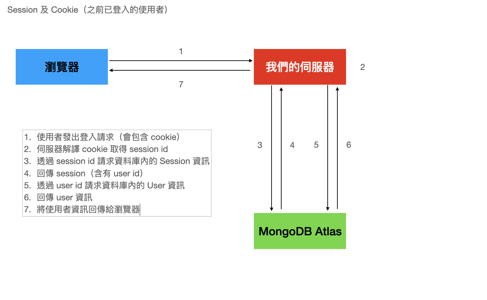

`session` 是一個位於伺服器端可用來存放關於使用者資訊的物件。當使用者造訪你的網頁應用程式時，你的伺服器可以建立一個唯一的 session（註：有人會將 session 翻譯為令牌，但是個人認為這不太傳神，一般業界也滿單純的都直接用 session 這個字，所以就不特別另做翻譯），裡面可以包含例如唯一的 session id、瀏覽器種類與版本、地理資訊以及使用者 id 等資料。

我們在第三章會將上述的整套步驟透過與 Google OAuth API 整合來說明與實作。在本小節中，我們的目標是：

1. 當使用者造訪我們的網頁時，建立一個唯一的 `session`
2. 確定我們會回傳一個 `cookie` 到瀏覽器端，由瀏覽器存放
3. 確定我們建立的 `session` 會被存放到我們的 MongoDB 裡

我們透過 `express-session` 套件來進行第 1 與 2 步，第 3 步我們則是使用 `connect-mongo` 來達成。

---

### 設定 session

一旦我們設定好 `session` 之後，我們的伺服器會建立起對應的 `session` 物件及 `cookie`。

從 `express-session` 引入一個 `session` 實體（instance）。官方網頁有全部的 session 參數的說明：

[https://github.com/expressjs/session](https://github.com/expressjs/session)

官方文件也有設定 `session` 的實際範例：

[https://github.com/expressjs/session#example](https://github.com/expressjs/session#example)

```JavaScript
app.use(session({
  secret: 'keyboard cat',
  resave: false,
  saveUnitialized: true
}))
```

以目前來說，我們只設定以下幾個 session 參數 - `name`、`secret`、`resave`、`saveUnitialized`與`cookie`：

```JavaScript
const sess = {
  name: process.env.SESSION_NAME,
  secret: process.env.SESSION_SECRET,
  resave: false,
  saveUnitialized: false,
  cookie: {
    httpOnly: true,
    maxAge: 14 * 24 * 60 * 60 * 1000,
    domain: 'localhost',
  },
};

server.use(session(sess));
```

我們遵從官方文件，將 `sess` 以 Express 中介層的方式掛載。我們第五章會探討何謂 Express 中介層，現在就先單純的遵循官方文件。

上述的五個 session 參數意義如下：

- [name](https://github.com/expressjs/session#name) 會被設定為 `cookie` 的 `name` - 你可以任意的取個名字。當你的應用程式可能會具有多個 session 及 cookie 的時候這個參數很有幫助(本書的專案還沒複雜到需要就是了)，你可以透過這個設定來定義唯一的 cookie 名稱。

- [secret](https://github.com/expressjs/session#secret) 是拿來將 `cookie` 的 `value` 做加密／解密的金鑰。請設定你自己的金鑰。這裡很重要的一點是，`cookie` 內並不會有 session 的內容資訊 - 它僅有透過 `secret` 加密過的 session id（也就是 `cookie.value`）。更多關於 cookie 的說明可以看：[https://developer.mozilla.org/en-US/docs/Web/HTTP/Cookies](https://developer.mozilla.org/en-US/docs/Web/HTTP/Cookies)。伺服器會在記憶體內存放一個 `session` 物件。我們會透過 `store` 將 `session` 物件存放到資料庫（下面會再多加說明）

- [resave](https://github.com/expressjs/session#resave) 為 `true` 時，會在就算 `session` 沒有更動的時候也強制要將 session 存到 `store`

- [saveUninitialized](https://github.com/expressjs/session#saveuninitialized) 為 `true` 時會將任何新增但是未經初始化的 session 存到 `store`

- [cookie](https://github.com/expressjs/session#cookie) 顧名思義就是這個 session 的 cookie。`httpOnly: true` 代表這個 cookie 不能被瀏覽器端的 JavaScript 給存取到，僅能由 HTTP 來存取 - 透過伺服器的回應取得，和透過瀏覽器的請求傳送。這是個安全性較高的選項。瀏覽器會在 `maxAge` 毫秒後移除被儲存的 `cookie`。我們在這邊將 `maxAge` 設定為 14 天。`domain` 指定 `Domain Set-Cookie` 這個屬性的值。你在 `session` 物件、MongoDB 的 `Session` 文件以及瀏覽器上的 `Developer tools > Application > Cookies > http://localhost:8000` 中都可以看到 `cookie` 所使用的 `httpOnly` 與 `maxAge` 值。

設定 session 就這樣直接了當完成了。

將上述的程式加到 `server/server.js` 下面這段位置：

```JavaScript
app.prepare().then(() => {
  const server = express();

  const sess = {
    name: process.env.SESSION_NAME,
    secret: process.env.SESSION_SECRET,
    resave: false,
    saveUnitialized: false,
    cookie: {
      httpOnly: true,
      maxAge: 14 * 24 * 60 * 60 * 1000,
      domain: 'localhose',
    },
  };

  server.use(session(sess));

  // 以下省略
}
```

別忘了將 `express-session` 引入：

```JavaScript
const session = require('express-session');
```

---

### 儲存 session

將 `session` 物件儲存在伺服器的記憶體上既沒擴充性也沒有可靠性。當伺服器重啟的時候或是將專案重新部署的時候都將失去你的 `session` 物件。將 `session` 物件存放到你的資料庫是比較可靠的做法。

我們的伺服器已經連接到 MongoDB 資料庫了，順理成章的，我們應該要將 `session` 物件給存放到資料庫裡。我們透過在之前的 session（`sess`） 的設定內增加 `store` 這個參數來達成這個目標：

[https://github.com/expressjs/session#store](https://github.com/expressjs/session#store)

我們透過 `connect-mongo` 套件的 `MongoStore` 來建立這個 `store`。官方範例如下：

[https://github.com/jdesboeufs/connect-mongo#express-or-connect-integration](https://github.com/jdesboeufs/connect-mongo#express-or-connect-integration)

```JavaScript
const session = require('express-session');
const MongoStore = require('connect-mongo')(session);

app.use(session({
  secret: 'foo',
  store: new MongoStore(options)
}));
```

我們 session 設定裡的 `store` 參數可由以下程式碼來定義：

```JavaScript
const mongoSessionStore = require('connect-mongo');

const MongoStore = mongoSessionStore(session);

store: new MongoStore({
  mongooseConnection: mongoose.connection,
  ttl: 14 * 24 * 60 * 60, // session 儲存 14 天
})
```

由於我們已經使用 `mongoose` 與資料庫連結了，因此我們可以將 `mongoose.connection` 作為 `mongooseConnection` 這個屬性的值。`ttl` 屬性是 session 的保存期限（單位是秒），我們將之設定為 14 天 - 與 `cookie.maxAge` 一樣。你到時候會在資料庫內看到 `ttl` 參數會被存成 `expires` 這個參數。

你的 session 設定（`sess`）現在會變成如下：

```JavaScript
const sess = {
  name: process.env.SESSION_NAME,
  secret: process.env.SESSION_SECRET,
  store: new MongoStore({
    mongooseConnection: mongoose.connection,
    ttl: 14 * 24 * 60 * 60,
  }),
  resave: false,
  saveUnitialized: false,
  cookie: {
    httpOnly: true,
    maxAge: 14 * 24 * 60 * 60 * 1000,
    domain: 'localhost',
  },
};
```

有的 `store` 的設定之後，我們的 `session` 物件就會在 MongoDB 資料庫裡對應地被正確的儲存、更新以及移除。

在 `server/server.js` 加上上面的程式碼，以及所需要的 `import` 指令，結果應該如下：

```JavaScript
const express = require('express');
const next = require('next');
const mongoose = require('mongoose');
const session = require('express-session');
const mongoSessionStore = require('connect-mongo');

const User = require('./models/User');

require('dotenv').config();

const dev = process.env.NODE_ENV !== 'production';
const MONGO_URL = process.env.MONGO_URL_TEST;

const options = {
  useNewUrlParser: true,
  useCreateIndex: true,
  useFindAndModify: false,
  useUnifiedTopology: true,
};

mongoose.connect(MONGO_URL, options);

const port = process.env.PORT || 8000;
const ROOT_URL = `http://localhost:${port}`;

const app = next({ dev });
const handle = app.getRequestHandler();

app.prepare().then(() => {
  const server = express();

  const MongoStore = mongoSessionStore(session);

  const sess = {
    name: process.env.SESSION_NAME,
    secret: process.env.SESSION_SECRET,
    store: new MongoStore({
      mongooseConnection: mongoose.connection,
      ttl: 14 * 24 * 60 * 60,
    }),
    resave: false,
    saveUnitialized: false,
    cookie: {
      httpOnly: true,
      maxAge: 14 * 24 * 60 * 60 * 1000,
      domain: 'localhost',
    },
  };

  server.use(session(sess));

  server.get('/', async (req, res) => {
    // 現在不用寫死 user 了
    // const user = { email: 'default@bookstore.org' };
    const user = await User.findOne({ slug: 'pheno-author' });
    app.render(req, res, '/', { user });
  });

  server.get('*', (req, res) => handle(req, res));

  server.listen(port, (err) => {
    if (err) throw err;
    console.log(`> 在 ${ROOT_URL} 上準備好了`);
  });
});

```

下一小節我們就可以來測試新增並儲存 `session` 以及 `cookie` 了。

---

### 測試 session 與 cookie

我們設定並初始化 session，以確保 `session` 會正確的存放（CRUD）到我們的資料庫 - 現在可以來測試了。

由於我們設定了 `resave: false` 以及 `saveUninitialized: false`，因此我們需要更動 `session` 這個物件才會觸發將 `session` 儲存到資料庫的動作，例如：

```JavaScript
req.session.foo = 'bar';
```

將上面那行程式碼加到我們的 `/` Express 路由如下：

```JavaScript
server.get('/', async (req, res) => {
  // 現在不用寫死 user 了
  // const user = { email: 'default@bookstore.org' };
  req.session.foo = 'bar';
  const user = await User.findOne({ slug: 'pheno-author' });
  app.render(req, res, '/', { user });
});
```

當使用者造訪 `Index` 頁面（也就是 `/` 路由）時，由於我們的 `session` 會被更動，因此會觸發後續的動作，將 `session` 物件存到 MongoDB 的 `Session` 文件內，然後回傳一個具有 session id 的 `cookie` 給瀏覽器。

在你的 `.env` 檔案加上兩個環境變數：

```JSON
SESSION_NAME="xxxxxx"
SESSION_SECRET="xxxxxx"
```

將 `xxxxxx` 用你自己的值代替。這些值可以任意設定，例如 `bookstore.session` 及 `1aosdjpo1i2`。

`yarn dev-express` 並且造訪 `http://localhost:8000`。接著開啟 Chrome 的 `Developer tools` 並選擇 `Application > Cookies > http://localhost:8000`：

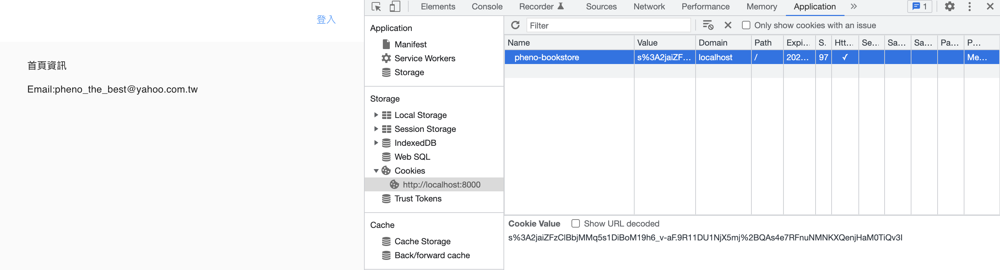

你可以看到一個 `pheno-bookstore` 的 cookie 了（會是你自己所設定的 `SESSION_NAME` 的值）！可以看到 `cookie.name`、`HTTPOnly（httpOnly）`為 `true`（以勾勾代表）以及 `cookie` 會在產生後的 14 天過期失效。這是由於我們設定 `maxAge: 14 * 24 * 60 * 60 * 1000`（14 天）。

現在去你的 MongoDB Atlas，看一下 `bookstore.sessions` 集合，看一下最新建立的 `Session` MongoDB 文件：

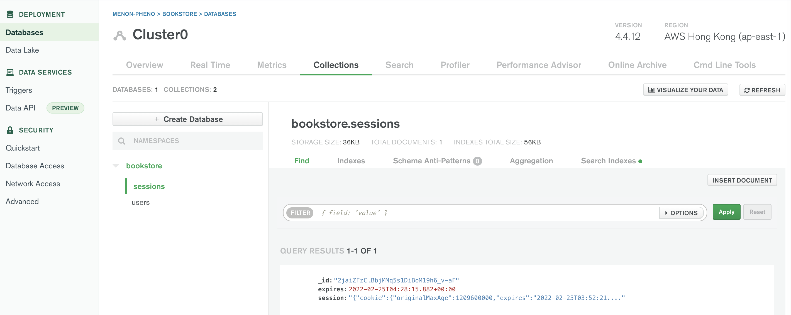

在我們資料庫內的這筆文件的 `session` 欄位會具備我們在這小節所設定的所有欄位與值。舉例來說，確認一下 `cookie.httpOnly: true`、`cookie.originalMaxAge: 1209600000`（這是對應我們所設定的 `cookie.maxAge`）以及 `foo: bar`。

我們會鼓勵你實驗調整 `sess` 的設定參數，看一下 `session` 以及 `cookie` 對應的變化。我們這邊示範一下將 cookie 重新命名與改變 `httpOnly` 的值。

將你的 `.env` 檔的 `SESSION_NAME` 更動（我們將 `pheno-bookstore` 改成 `menon-bookstore`），以及把 `server/server.js` 的 `httpOnly: true` 改為 `httpOnly: false`。回到瀏覽器，當你的伺服器重啟之後：

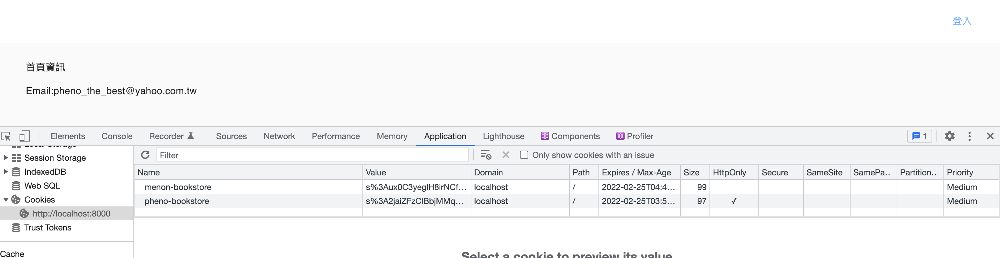

再次造訪 `Developer tools > Application > Cookies > http://localhost:8000`。不意外的，會看到 `menon-bookstore` 這個 cookie，而其 `HTTPOnly` 是 `false`（沒勾勾）。

而在我們的資料庫內的 `bookstore.sessions` 會新增第二筆 session 文件，而且其 `cookie.httpOnly: false`。

希望這節實務的操作與練習有讓你比較清楚 `session` 以及 `cookie`。我們第三章會延續這些觀念來整合 Google OAuth API。最主要的事情就是將使用者的 id 存放到 `session` 物件內。

---

## MenuWithAvatar 與 Header 元件

對網頁應用程式來說，很常見的一個情況是根據使用者的狀態為條件來顯示不同的使用者介面（user interface, UI）。舉個常見的例子，當使用者在未登入的狀態時，顯示一個導向 `Login` 頁面的連結；而如果是在已登入的狀態，改為顯示使用者的頭像及下拉選單。

在我們本章的最後小節，我們要來定義 `MenuWithAvatar` 這個非頁面元件，並且更新我們目前的 `Header` 元件。主要的目標與工作有以下：

- 建立 `MenuWithAvatar` 元件，它長相會很接近 Material-UI 的 `Avatar` 元件，不過當點擊 `MenuWithAvatar` 時，我們會顯示一個下拉選單（這是利用跟結合 Material-UI 的 `Menu` 元件來完成）

- 針對目前的 `Header` 做兩個重點改變：
  1. 將 `App` HOC 的 `user` 以 prop 的方式傳入 `Header`；而 `Header` 再根據 `user` 的值做條件式的 UI（conditional UI）
  2. 在 `Header` 元件內引入並使用 `MenuWithAvatar`

讓我們來建議一個會顯示可點擊的頭像的 `MenuWithAvatar` 的元件吧。當使用者點擊這個頭像時，我們要呈現一個具有連結的下拉選單。我們所有的頁面都可以使用這個元件；目前我們會在 `Header` 元件裡面使用它。因此所有具有 `Header` 元件的頁面都會包含 `MenuWithAvatar` 元件。

我們會以 Material-UI 的 `Menu` 元件為基礎來建立 `MenuWithAvatar`。我們會參照以下的程式碼：

[https://v4.mui.com/components/menus/](https://v4.mui.com/components/menus/) 內的 `Simple Menu`

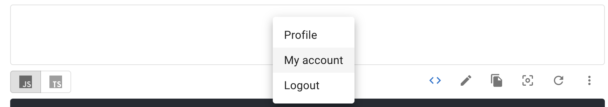

上面範例的程式碼如下：

```JSX
import React from 'react';
import Button from '@material-ui/core/Button';
import Menu from '@material-ui/core/Menu';
import MenuItem from '@material-ui/core/MenuItem';

export default function SimpleMenu() {
  const [anchorEl, setAnchorEl] = React.useState(null);

  const handleClick = (event) => {
    setAnchorEl(event.currentTarget);
  };

  const handleClose = () => {
    setAnchorEl(null);
  };

  return (
    <div>
      <Button aria-controls="simple-menu" aria-haspopup="true" onClick={handleClick}>
        Open Menu
      </Button>
      <Menu
        id="simple-menu"
        anchorEl={anchorEl}
        keepMounted
        open={Boolean(anchorEl)}
        onClose={handleClose}
      >
        <MenuItem onClick={handleClose}>Profile</MenuItem>
        <MenuItem onClick={handleClose}>My account</MenuItem>
        <MenuItem onClick={handleClose}>Logout</MenuItem>
      </Menu>
    </div>
  );
}
```

我們會根據上面程式碼做幾個修改：

1. 將 `Open Menu` 這個按鈕改成一個頭像。這個頭像會是一個 Material-UI 的 `Avatar` 元件
2. 將 `MenuItem` 元件改成 `Link` 及 `a` 元素
3. 選單那個選項的文字，我們不去寫死，而是透過將文字放在 `options` 這個 props 從 `Header` 元件開始傳到 `MenuWithAvatar`
4. 我們使用 class 元件實作 `MenuWithAvatar`，因此會使用 `state` 以及 `this.setState` 而非使用 `useState` 及 `setAnchorEl`

做了以上四個修改後，你的 `components/MenuWithAvatar.jsx` 應該會變成：

```JSX
import React from 'react';
import PropTypes from 'prop-types';
import Link from 'next/link';
import Menu from '@material-ui/core/Menu';
import MenuItem from '@material-ui/core/MenuItem';
import Avatar from '@material-ui/core/Avatar';

const propTypes = {
  src: PropTypes.string.isRequired,
  alt: PropTypes.string.isRequired,
  options: PropTypes.arrayOf(Object).isRequired,
};

class MenuWithAvatar extends React.Component {
  constructor() {
    super();

    this.state = {
      anchorEl: undefined,
    };
  }

  handleClick = (event) => {
    this.setState({ anchorEl: event.currentTarget });
  };

  handleClose = () => {
    this.setState({ anchorEl: null });
  };

  render() {
    const { options, src, alt } = this.props;
    const { anchorEl } = this.state;

    return (
      <div>
        <Avatar
          aria-controls={anchorEl ? 'simple-menu' : null}
          aria-haspopup="true"
          onClick={this.handeClick}
          onKeyPress={this.handleClick}
          src={src}
          alt={alt}
          style={{ margin: '0px 20px 0px auto', cursor: 'pointer' }}
        />
        <Menu
          id="simple-menu"
          anchorEl={anchorEl}
          open={Boolean(anchorEl)}
          onClose={this.handleClose}
          keepMounted
        >
          {options.map((option) => (
            <div id="wrappingLink" key={option.text}>
              {option.anchor ? (
                <MenuItem
                  onClick={(event) => {
                    event.preventDefault();
                    window.location.href = option.href;
                    this.handleClose();
                  }}
                >
                  {option.text}
                </MenuItem>
              ) : (
                <Link href={option.href} as={option.as || option.href}>
                  <MenuItem>{option.text}</MenuItem>
                </Link>
              )}
            </div>
          ))}
        </Menu>
      </div>
    );
  }
}

MenuWithAvatar.propTypes = propTypes;

export default MenuWithAvatar;

```

將 `MenuWithAvatar` 引入 `components/Header.jsx` 元件裡。定義 `MenuWithAvatar` 的 `options` prop 資料：

```JavaScript
const optionsMenu = [
  {
    text: '有問題嗎？',
    href: 'https://github.com/menon-pheno/fullstack-bookstore/issues',
  },
  {
    text: '登出',
    href: '/logout',
    anchor: true,
  },
];
```

使用 `MenuWithAvatar` 的方式如下：

```JSX
import MenuWithAvatar from './MenuWithAvatar';

// 省略
const Header = ({ user }) => (
  // 省略
  <Grid item xs={12} style={{ textAlign: 'right' }}>
    {user ? (
      <div style={{ whiteSpace: ' nowrap' }}>
        {user.avatarUrl ? (
          <MenuWithAvatar options={optionsMenu} src={user.avatarUrl} alt={user.displayName} />
        ) : null}
      </div>
    ) : (
      <Link href="/login">
        <a style={{ margin: '0px 20px 0px auto' }}>登入</a>
      </Link>
    )}
  </Grid>
  // 省略
);
```

我們在 `Header` 帶入 `{ user }` 這個 prop，並且做了一些（明確的說是兩次）的條件運算子（conditional operator）：

```
condition ? expressionIfTrue : expressionIfFalse
```

可以在下面連結看關於條件運算子的說明：

[https://developer.mozilla.org/en-US/docs/Web/JavaScript/Reference/Operators/Conditional_Operator](https://developer.mozilla.org/en-US/docs/Web/JavaScript/Reference/Operators/Conditional_Operator)

在我們上面的例子中

- `user` 無值的時候（`undefined` 或 `null`）我們顯示`登入`的連結
- 如果 `user` 以及 `user.avatarUrl` 有值（非 `undefined` 跟非 `null`）我們就顯示 `MenuWithAvatar`
- 如果 `user` 有值但是 `user.avatarUrl` 無值則我們什麼都不顯示

上面的程式碼了解後，我們調整一下 UI 的內容，將 `Header` 分為兩區：

```JSX
<Grid item sm={11} xs={9} style={{ textAlign: 'left' }}>
  // 這裡假設沒登入的時候，就在 Header 左邊顯示一個書店 logo
  // 這個書店 logo 會連結到網頁的根目錄（首頁）
  // 已登入的話則不顯示
</Grid>
```

```JSX
<Grid item sm={1} xs={3} style={{ textAlign: 'right' }}>
  // 這邊維持前述的程式碼一樣，唯一調整的是 sm 及 xs 的值，因為這個 row 現在有兩個 grid item 了
</Grid>
```

將註解以程式碼填入：

記得引入 `Avatar` 元件：

```JSX
import Avatar from '@material-ui/core/Avatar';
<Grid item sm={11} xs={9} style={{ textAlign: 'left' }}>
  {user ? null : (
    <Link href="/">
      <Avatar
        src="https://storage.googleapis.com/builderbook/logo.svg"
        alt="書店 logo"
        style={{ margin: '0px auto 0px 20px', cursor: 'pointer' }}
      />
    </Link>
  )}
</Grid>
```

```JSX
<Grid item sm={1} xs={3} style={{ textAlign: 'right' }}>
  {user ? (
    <div style={{ whiteSpace: ' nowrap' }}>
      {user.avatarUrl ? (
        <MenuWithAvatar options={optionsMenu} src={user.avatarUrl} alt={user.displayName} />
      ) : null}
    </div>
  ) : (
    <Link href="/login">
      <a style={{ margin: '0px 20px 0px auto' }}>登入</a>
    </Link>
  )}
</Grid>
```

你的 ESLint 應該會針對 `Header` 元件的 `user`、`user.avatarUrl` 及 `user.displayName` 因為沒有 `props` 驗證而報警告。依照我們之前對 `Index` 頁面的方式在以下位置增加 `user` prop 的型態檢查：

```JSX
import PropTypes from 'prop-types';
// 省略
const optionsMenu = [
  {
    text: '有問題嗎？',
    href: 'https://github.com/menon-pheno/fullstack-bookstore/issues',
  },
  {
    text: '登出',
    href: '/logout',
    anchor: true,
  },
];

// 省略
const Header = ({ user }) => (
  // 省略
);
const propTypes = {
  user: PropTypes.shape({
    avatarUrl: PropTypes.string,
    displayName: PropTypes.string,
  }),
};

const defaultProps = {
  user: null,
};

Header.propTypes = propTypes;
Header.defaultProps = defaultProps;
```

你完成的 `Header` 元件應該如以下：

```JSX
import Link from 'next/link';
import Toolbar from '@material-ui/core/Toolbar';
import Grid from '@material-ui/core/Grid';
import Avatar from '@material-ui/core/Avatar';
import PropTypes from 'prop-types';

import MenuWithAvatar from './MenuWithAvatar';
import { styleToolbar } from './SharedStyles';

const optionsMenu = [
  {
    text: '有問題嗎？',
    href: 'https://github.com/menon-pheno/fullstack-bookstore/issues',
  },
  {
    text: '登出',
    href: '/logout',
    anchor: true,
  },
];

const propTypes = {
  user: PropTypes.shape({
    avatarUrl: PropTypes.string,
    displayName: PropTypes.string,
  }),
};

const defaultProps = {
  user: null,
};

const Header = ({ user }) => (
  <div>
    <Toolbar style={styleToolbar}>
      <Grid container direction="row" justify="space-around" align="center">
        <Grid item sm={11} xs={9} style={{ textAlign: 'left' }}>
          {user ? null : (
            <Link href="/">
              <Avatar
                src="https://storage.googleapis.com/builderbook/logo.svg"
                alt="書店 logo"
                style={{ margin: '0px auto 0px 20px', cursor: 'pointer' }}
              />
            </Link>
          )}
        </Grid>
        <Grid item sm={1} xs={3} style={{ textAlign: 'right' }}>
          {user ? (
            <div style={{ whiteSpace: ' nowrap' }}>
              {user.avatarUrl ? (
                <MenuWithAvatar options={optionsMenu} src={user.avatarUrl} alt={user.displayName} />
              ) : null}
            </div>
          ) : (
            <Link href="/login">
              <a style={{ margin: '0px 20px 0px auto' }}>登入</a>
            </Link>
          )}
        </Grid>
      </Grid>
    </Toolbar>
  </div>
);

Header.propTypes = propTypes;
Header.defaultProps = defaultProps;

export default Header;

```

我們現在可以來做些測試驗證了。

`yarn dev-express` 啟動專案並造訪 `http://localhost:8000`：

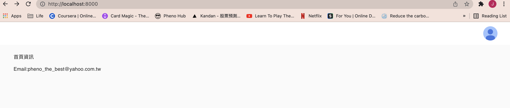

點擊使用者頭像，應該會看到一個下拉選單：

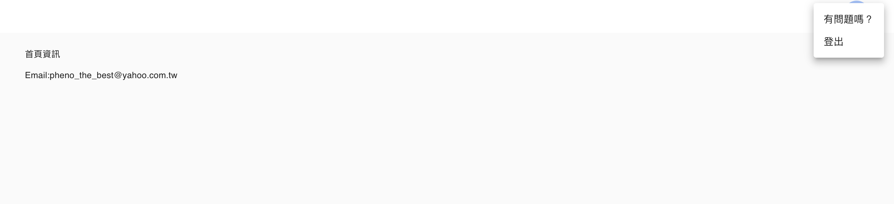

希望你看到一樣的結果！

我們另外做個教育性的測試，到 `page/_app.jsx` 找到下面這行：

```JSX
<Header {...pageProps} />
```

將 `{...pageProps}` 刪掉，防止 `Index` 元件的 props 透過 `App` HOC 傳入 `Header` 元件：

```JSX
<Header />
```

存檔後造訪 `http://localhost:8000`，你將**不會看到**頭像，並且左方會出現一個連接到 `/` 的書店 logo：

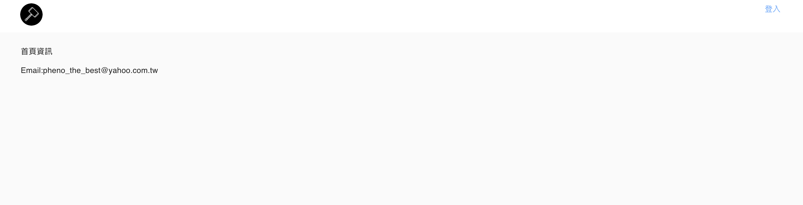

記得把 `{...pageProps}` 加回去。

在本章中，我們探討了 HTTP 請求以及回應、建立了 Express/Next.js 混合伺服器並且將我們的伺服器與 MongoDB 資料庫連接。我們也討論了 `session` 及 `cookie` 相關的概念並如何利用這概念建立了永久性的登入 session。最後我們也針對使用者介面做了一些改進與調整。

第三章我們將會整合 Google OAuth API 來讓我們的網頁應用程式真的有使用者驗證（user authentication）的功能。我們將會把使用者 id 存入 `session` 物件來真的建立永久性的登入 session。沿途我們更會討論一些關鍵的 JavaScript 概念，例如 `Promise` 及其對應的 `async/await` 語法糖（syntactic sugar）。

## 在 Vercel 上部署

如果你這時候將目前的專案上傳至 Vercel（你只要將與 Vercel 連接的 repository 的 main branch 更新，就會自動將軟體部署上雲），你將會看到錯誤：

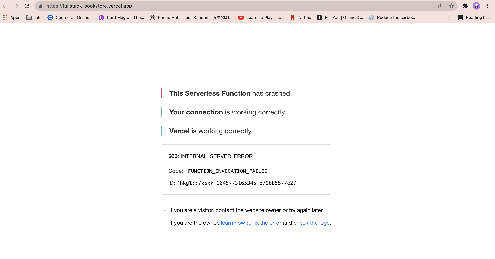

原因也很簡單，因為 `.env` 我們是不上傳的，因此我們雲上的應用程式找不到對應的環境變數。

---

這章到這裡是尾聲，你的程式現在應該長得像 `book/2-end` 的內容。

可以比較一下，修改有問題的地方。

如果有發現任何 bug、錯字或是解釋不清楚的部分，歡迎透過 pheno_the_best@yahoo.com.tw 告知。

如果你覺得看了這本書有收穫，也歡迎給我們一些書評。也一樣是歡迎將書評寄到 pheno_the_best@yahoo.com.tw，謝謝！

---
