# 第二章

TODO: check TOC

- 概述
- 建立 MongoDB 連線
  - MongoDB Atlas
  - Next.js 環境變數
  - Mongoose
  - 重構 - 抽出 `User` 資料模型
- Vercel 部署

---

在我們開工之前，先取得`1-end`的程式碼。[1-end](https://github.com/menon-pheno/fullstack-bookstore/tree/master/book/1-end)資料夾位於[fullstack-bookstore repo](https://github.com/menon-pheno/fullstack-bookstore)`book`的目錄內。

- 如果你還沒有將 fullstack-bookstore 給 clone 下來的話，用`git clone https://github.com/menon-pheno/fullstack-bookstore`這個指令將 repo 複製到你的電腦上
- 注意：如果你想要用自己的 GitHub 帳號自己管理程式的話，你應該將我們的 repo fork 出來並且執行`git clone https://github.com/<你的 github 名稱>/fullstack-bookstore.git`。這樣你就可以將你的改動直接 push 到你的`fullstack-bookstore` repo
- 在`1-end`的資料夾內執行`yarn`來安裝所有的套件

我們在第二章會安裝以下幾個套件：

- `"mongoose"`

請確定使用我們指定的套件跟版本，並忽略任何升級的警告。我們會定期更新套件且測試相容性。我們無法確保新的套件版本與目前的程式碼都相容，套件升級時有的時候會導致一些預料之外的問題。

另外我們會使用一個 `MONGODB_URI` 的環境變數。

我們鼓勵且歡迎你在閱讀本章的時候，可以在我們的 GitHub repo: [https://github.com/menon-pheno/fullstack-bookstore/issues/new](https://github.com/menon-pheno/fullstack-bookstore)回報任何 bug、錯字或是任何解釋不清楚的地方。

---

## 概述

在第一章我們進行了建構我們專案的前置作業，我們有了個簡單的頁面，但是相信大家都認同這個網站還沒什麼真正的價值。要讓網站有價值，99% 都是需要讓網站與後端的某種資料庫做連結，讓網站消化資料庫的內容來提供我們使用者實際的價值。所以這就是我們這章的重點，將我們的網站與資料庫做連結，讓我們開始吧！

首先快速介紹本章的幾個技術選擇以及主要的原因：

- 我們將使用 [MongoDB](https://en.wikipedia.org/wiki/MongoDB) 作為我們資料庫

  - 它夠紅
  - 它夠成熟
  - 可以讓沒有碰過 [NoSQL](https://en.wikipedia.org/wiki/NoSQL) 的讀者嘗試 NoSQL 的資料庫使用方法

- 我們將使用 [MongoDB Atlas](https://www.mongodb.com) 這個雲端服務來存放我們的資料庫

  - 它是 MongoDB 的官方雲端服務
  - 它有免費的資料庫選項讓讀者可以試用
  - 讓讀者可以多嘗試使用雲端服務

- 我們將使用 `mongoose` 套件，來管理我們的 MongoDB
  - 在後續的章節，我們會建立多個有關我們書店的資料模型，透過 `mongoose` 這個套件管理資料模型是比較簡潔的
  - Next.js 有[官方的 Next.js with mongoose-mongodb 範例](http://github.com/vercel/next.js/tree/canary/examples/with-mongodb-mongoose)，比較不用擔心這種組合會退流行

---

## 建立 MongoDB 連線

要建立我們網站與 MongoDB 之間的連線，當然是先要有一個 MongoDB 供使用。

### MongoDB Atlas

我們會推薦使用 MongoDB Atlas 的*免費*資料庫叢集：

[MongoDB Atlas 網址](https://www.mongodb.com/cloud/atlas)

下面的連結有介紹如何註冊以及創建免費叢集的步驟：

[建立帳號的教學](https://docs.atlas.mongodb.com/getting-started/#b-create-an-service-free-tier-cluster)

不過我們就目前的介面（以後介面可能會有微調），一步步的介紹，在註冊帳號並登入後：

---

1. 建立一個組織： 按下 `Create an Organization`

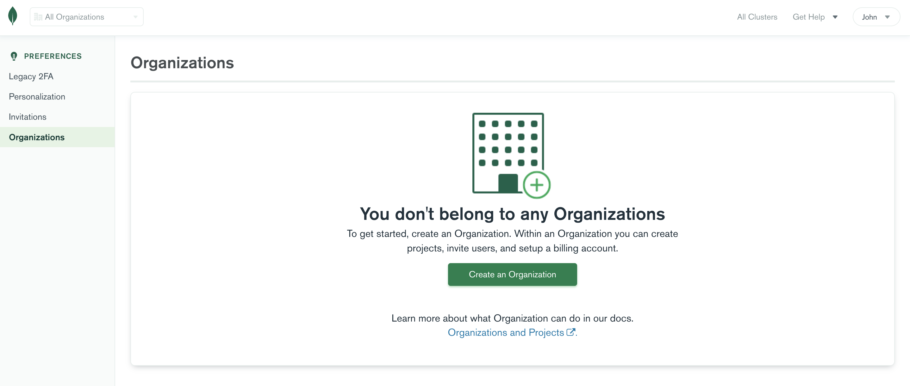

2. 為組織取名： 取名字並按 `Next`

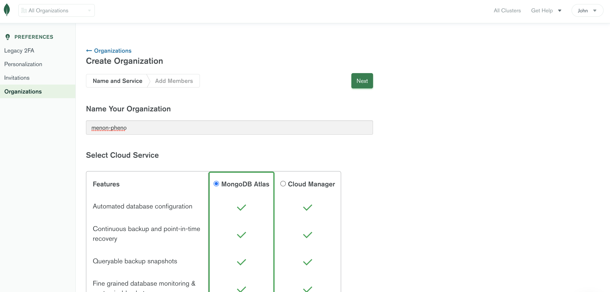

3. 邀請其他人員（非必須）： 我們的教學就不邀請其他人，直接按 `Create Organization`

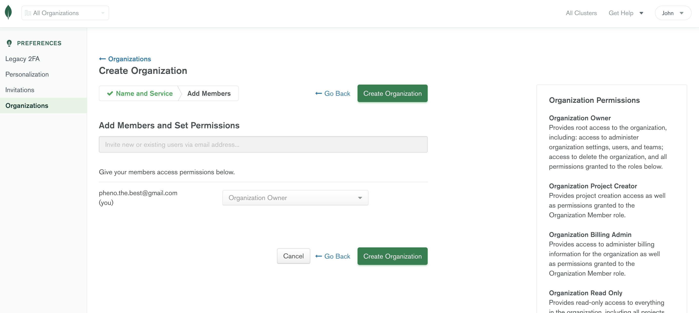

=> 你應該會被導往 Organization 下的 Projects 頁面

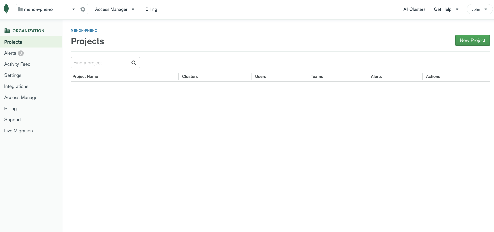

4. 建立專案： 按下 `New Project`

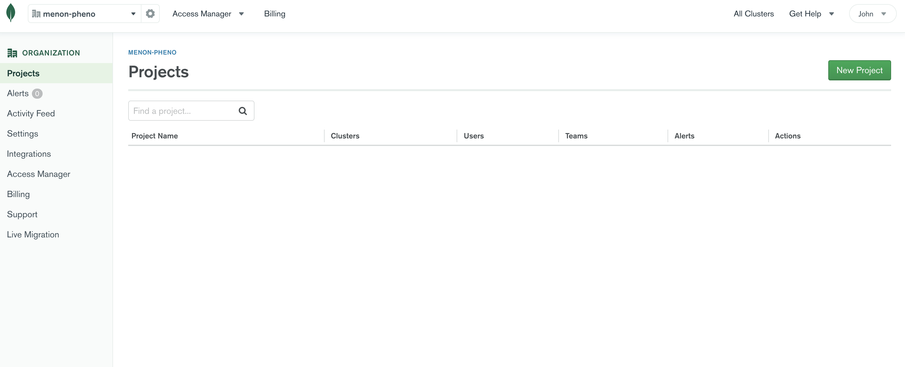

5. 為專案取名： 取名字並按 `Next`

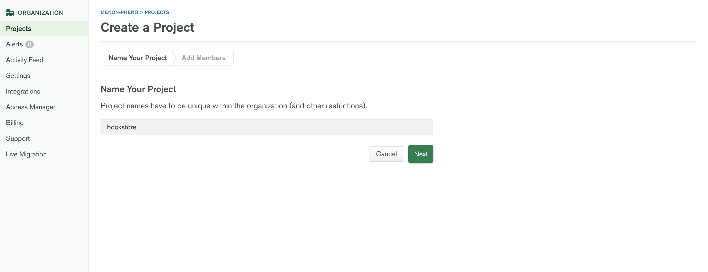

6. 邀請其他人員（非必須）： 我們的教學就不邀請其他人，直接按 `Create Project`

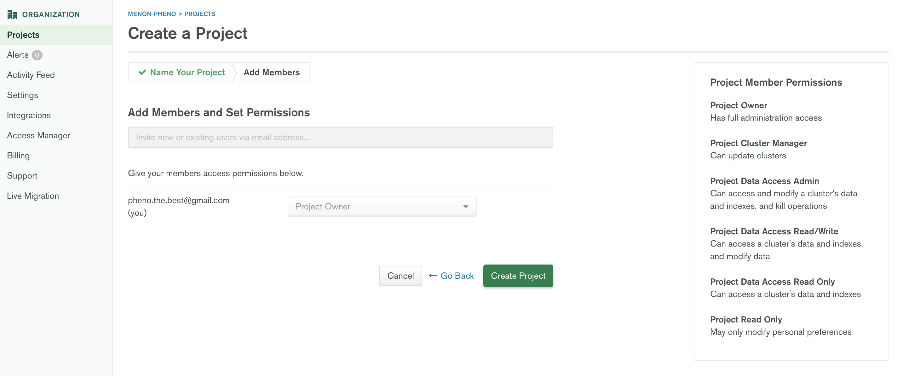

=> 你應該會被導往 Projects 下的 Databases 頁面

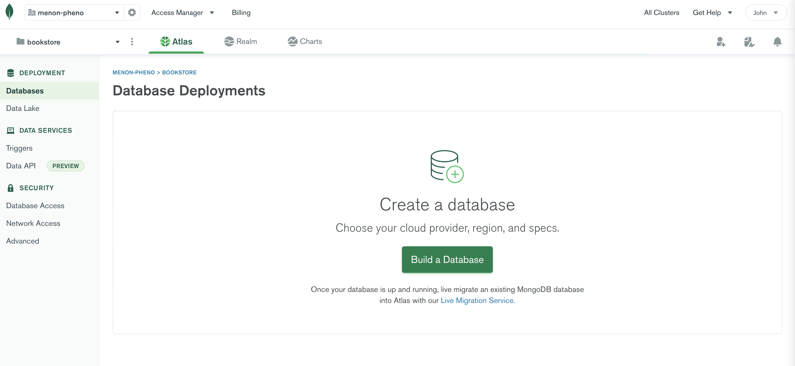

7. 建立資料庫： 按下 `Build a Database`

8. 選擇免費的叢集： 在 Free/Shared 的選項按 `Create`

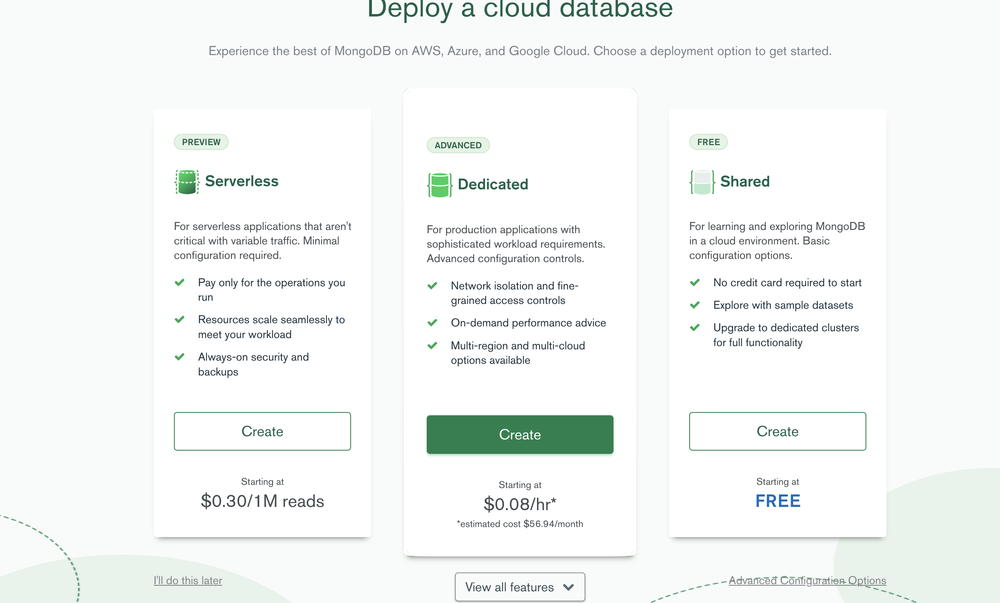

=> 你應該會被導往選擇資料庫地區跟雲端商的選擇頁面

9. 作出決定： 基本上使用預設應該就可以，按 `Create Cluster`

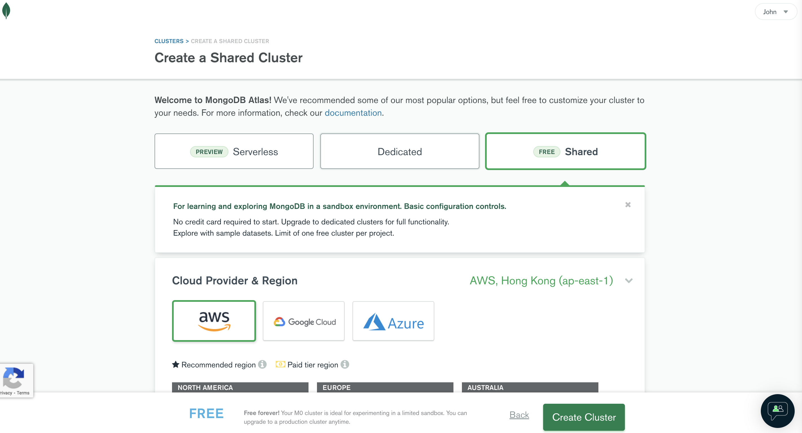

=> 你應該會被導往建立連線方式的頁面

10.

- 建立叢集的第一組使用者／密碼： 選擇 `Username and Password`，輸入你的 username/password

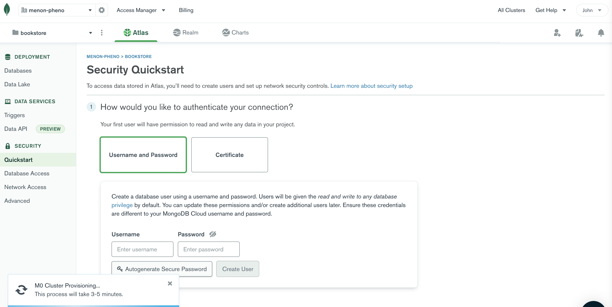

- 允許你伺服器的 ip 連線到 MongoDB： 選擇 `My Loacal Environment` 並且點選 `Add My Current IP Address`

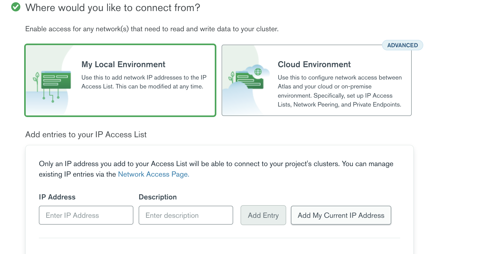

11. 大功告成！Databases 頁面下應該會看到一個 `Cluster0` 了！

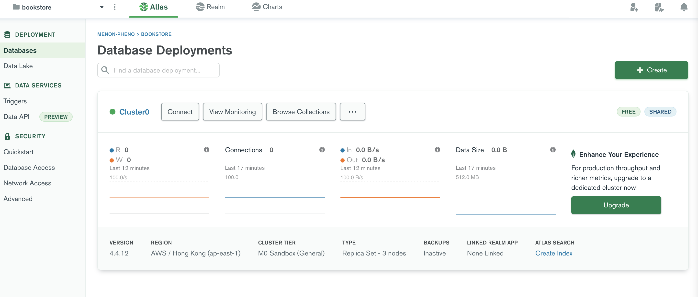

---

你建立的這個免費叢集（`Cluster0`）可以存放多個 MongoDB 資料庫。不過稍微注意一下，因為這是免費的，所以提供的資源（CPU 及記憶體）當然相對的較少。叢集內的所有資料庫會共享這些有限的資源。

現在我們有叢集了，可以來產生出我們的 `MONGODB_URI` 環境變數了。

---

1. 點選 `Cluster0` 的 `CONNECT` 按鈕

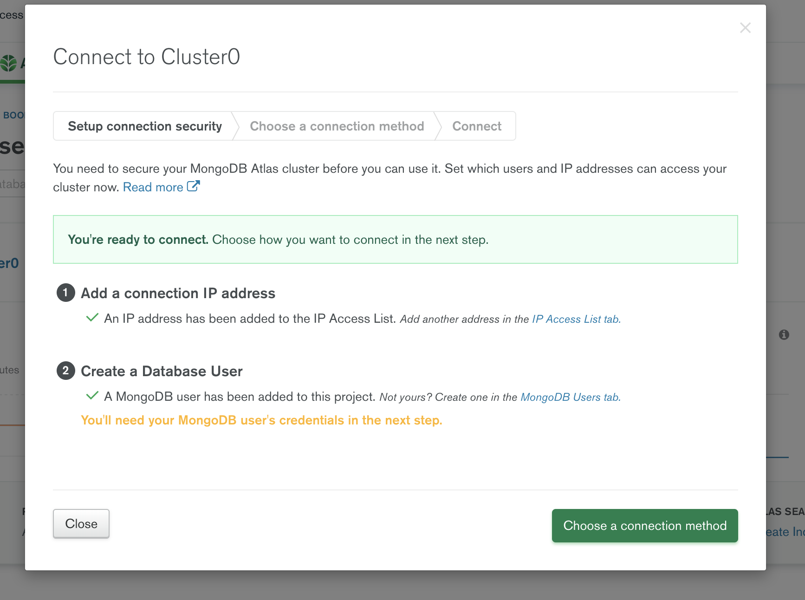

2. 選擇 `Connect your application`

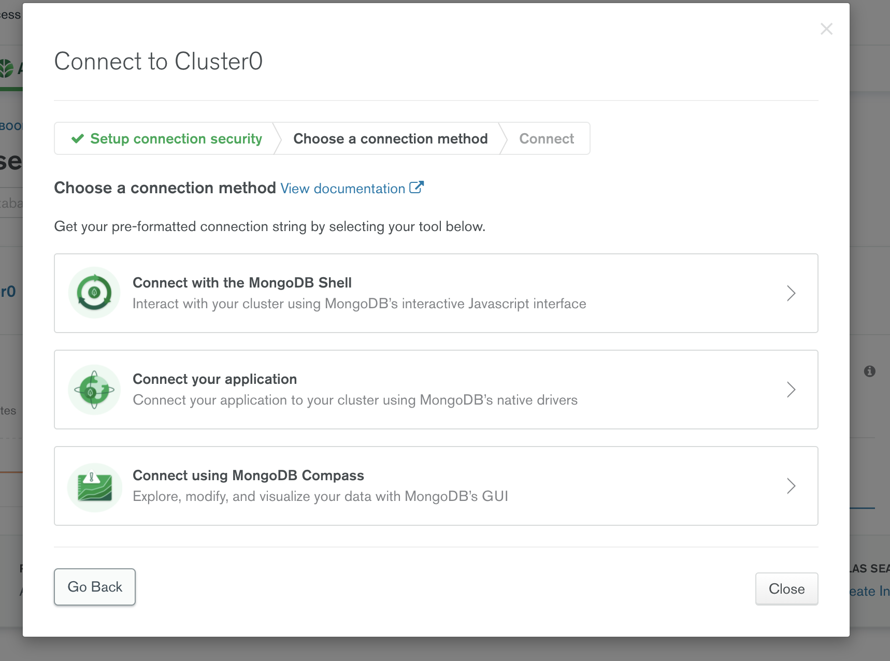

3. URI 範例出現

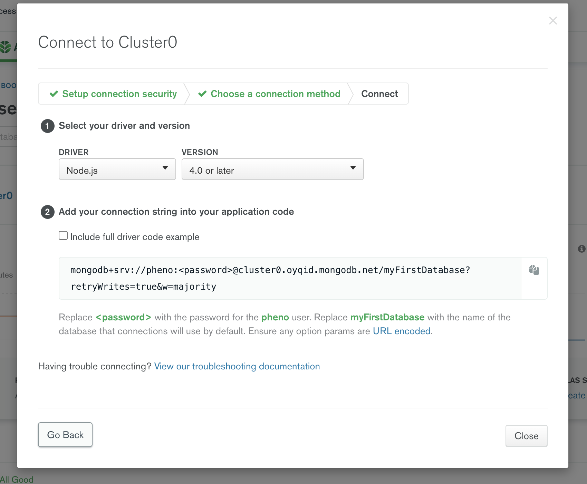

---

### Next.js 環境變數

上面看到的 URI 就是我們 MongoDB 的雲端位址了。在根目錄下新增一個 `.env.local` 檔案，內容為：

```
MONGODB_URI="你的 MONGODB URI"
```

`.env.local` 是一個 Next.js 存放環境變數用的檔案（[Next.js 環境變數官方說明](https://nextjs.org/docs/basic-features/environment-variable#environment-variable-load-order)）。我們這樣可以在我們的專案裡面透過 `process.env.MONGODB_URI` 存取到 `.env.local` 內 `MONGODB_URI` 所對應的值。主要用環境變數的原因是，我們不希望將敏感的資訊傳送到雲端（即便是 github 這樣的大網站，也是有可能資料外洩）。

---

### Mongoose

有了一個雲端的 MongoDB（及對應的 URI） 之後，如同概述裡講到的，我們透過 `mongoose` 套件來進行我們的網站與 MongoDB 的連接。我們會參照 [Next.js Mongoose+MongoDB 的官方範例](https://github/vercel/next.js/tree/canary/examples/with-mongodb-mongoose)來進行這個工作。

所以我們先來安裝 `mongoose`：

```
yarn add mongoose@6.0.11
```

安裝後，我們將與 MongoDB 連線的程式放在 `lib/dbConnect.js`（新增這個目錄跟檔案）：

```JavaScript
import mongoose from "mongoose";

const MONGODB_URI = process.env.MONGODB_URI;

if (!MONGODB_URI) {
  throw new Error(`MONGODB_URI 未定義`);
}

/**
 * 我們使用 cached 來避免開發的途中因為熱更新（hot reload）
 * 每次更動程式的時候都新建立一個 mongodb 的連線
 */

let cached = global.mongoose;

if (!cached) {
  cached = global.mongoose = { conn: null, promise: null };
}

async function dbConnect() {
  if (cached.conn) {
    return cached.conn;
  }

  if (!cached.promise) {
    const opts = {
      bufferCommands: false,
    };

    cached.promise = mongoose.connect(MONGODB_URI, opts).then((mongoose) => {
      return mongoose;
    });
  }

  cached.conn = await cached.promise;
  return cached.conn;
}

export default dbConnect;
```

其中最重要的一行程式碼是 `cached.promise = mongoose.connect(MONGODB_URI, opts).then((mongoose) => { return mongoose; });` 可以看到我們呼叫 `mongoose.connect()` 來對 `MONGODB_URI` 這個位置做連線。

我們先在 MongoDB Atlas 新增兩筆 `bookstore.users` 集合的文件：

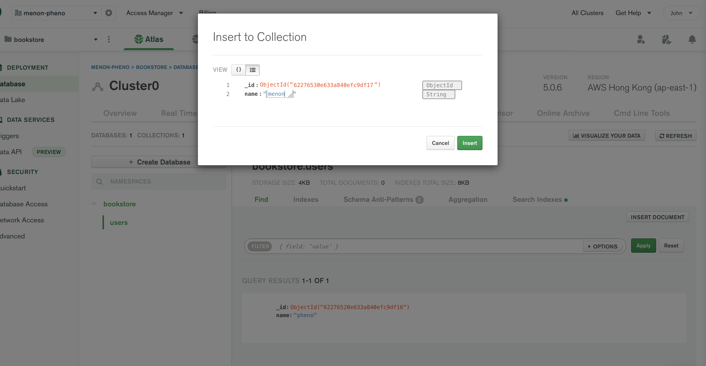

`_id` 是 MongoDB 自己產生的 id，我們現在這兩筆 `bookstore.users` 文件只是單純兩筆有不同的 `name` 欄位的簡單資料。新增這個是為了待會可以測試跟驗證我們真的有從 MongoDB 撈取到資料。

我們將 `pages/index.js` 調整一下，讓我們的頁面會顯示從 MongoDB 拿到的資訊：

```JavaScript
import Head from "next/head";
import mongoose from "mongoose";

import dbConnect from "../lib/dbConnect";
import Header from "../components/Header";

// users 這個 props 會是來自 MongoDB 的 bookstore.
const Home = ({ users }) => {
  return (
    <>
      <Head>
        <title>首頁</title>
        <meta name="描述" content="這是關於首頁的描述" />
      </Head>
      <Header />
      <p>首頁的內容</p>
      {users.map((user) => (
        <div key={user._id}>
          <p>{user.name}</p>
        </div>
      ))}
    </>
  );
};

// 從 MongoDB 取得 user(s) 資訊

export async function getServerSideProps() {
  await dbConnect();

  // mongoose 是透過 mongoose.Schema() 來對應 MongoDB 內的某個 collection
  const UserSchema = new mongoose.Schema({
    name: {
      type: String,
      required: true,
      unique: true,
    },
  });

  const User = mongoose.models.User || mongoose.model("User", UserSchema);

  const result = await User.find({});
  const users = result.map((doc) => {
    const user = doc.toObject();
    user._id = user._id.toString();
    return user;
  });

  return { props: { users: users } };
}

export default Home;
```

這次的 `pages/index.js` 有幾個重點：

- 可以看到我們的 `Home` 元件現在會傳入一個 `users` prop，而我們透過 JavaScript 的 `map` 來將拿到的 `users` 逐一的顯示 `user.name` 於頁面上

- 而 `users` 這個 prop 是透過 Next.js 所提供的 `getServerSideProps` 將之傳送到 `Home` 元件內

  - [getServerSideProps 官方文件](nextjs.org/docs/basic-features/data-fetching/get-server-side-props)
  - 注意一點，這個函式僅會在伺服器端執行
  - 當瀏覽器嘗試造訪頁面時，`getServerSideProps` 會在伺服器端執行，然後將結果傳入至頁面內，再回傳到瀏覽器，因此對瀏覽器而言是不知道有 `getServerSideProps` 的存在
  - 我們使用 `mongoose.Schema` 來建立一個 `UserSchema`，這會對應到 MongoDB 內的 `user` 集合
    - 上面範例的 `UserSchema` 很單純，但是我們未來會逐漸增加 `UserSchema` 的複雜度，到時就可以體會到使用 `mongoose` 的方便性

我們的 `http://localhost:3000` 現在應該會變成：

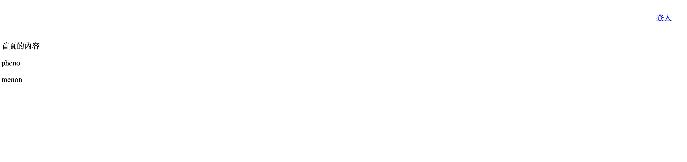

### 重構 - 抽出 `User` 資料模型

一般來說，上面 `/pages/index.js` 裡所建立 `UserSchema` 以及建立 `User` 資料模型的動作是幾乎所有透過 `mongoose` 連接 MongoDB 的標準動作。並且常見的管理方式是將這些資料模型都放到 `/models` 資料夾內（你可以看到官方範例裡面也是這樣做的）。

新增 `/models/User.js`（也新增 `models` 資料夾），內容如下：

```JavaScript
import mongoose from "mongoose";

// UserSchema 會對應到你 MongoDB 內的某個 collection
const UserSchema = new mongoose.Schema({
  name: {
    type: String,
    required: true,
    unique: true,
  },
});

export default mongoose.models.User || mongoose.model("User", UserSchema);

```

這個就不多做說明，因為跟之前的程式碼幾乎沒有改變，只是抽到一個檔案，然後將結果 export 出來。

`pages/index.js` 就變得簡單一點了：

```JavaScript
import Head from "next/head";

import dbConnect from "../lib/dbConnect";
import User from "../models/User";
import Header from "../components/Header";

// users 這個 props 會是來自 MongoDB 的 bookstore.
const Home = ({ users }) => {
  return (
    <>
      <Head>
        <title>首頁</title>
        <meta name="描述" content="這是關於首頁的描述" />
      </Head>
      <Header />
      <p>首頁的內容</p>
      {users.map((user) => (
        <div key={user._id}>
          <p>{user.name}</p>
        </div>
      ))}
    </>
  );
};

// 從 MongoDB 取得 user(s) 資訊

export async function getServerSideProps() {
  await dbConnect();

  const result = await User.find({});
  const users = result.map((doc) => {
    const user = doc.toObject();
    user._id = user._id.toString();
    return user;
  });

  return { props: { users: users } };
}

export default Home;
```

這裡也不多做解釋，唯一值得一提的是，這樣重構後，`pages/index.js` 不用 import `mongoose`，可以從邏輯上理解為，`index.js` 頁面不需要去管所謂的實作細節，單純看的是與資料庫連線，`mongoose` 算是與資料庫連線的實作細節，而這塊已經不用 `pages/index.js` 去操心。

## Vercel 部署

可以注意一下，現在你對應雲端的 Vercel 網站，應該是會執行失敗的，這是因為我們 `MONGODB_URI` 這個環境變數並沒有上傳到 Vercel 所連結的 github repository，所以雲端的網站就無法連線到 MongDB。因此我們需要在 Vercel 將這個環境變數提供給網站。

新增 Vercel 的環境變數是在你專案的 `Settings > Environment Variables` 內做管理：

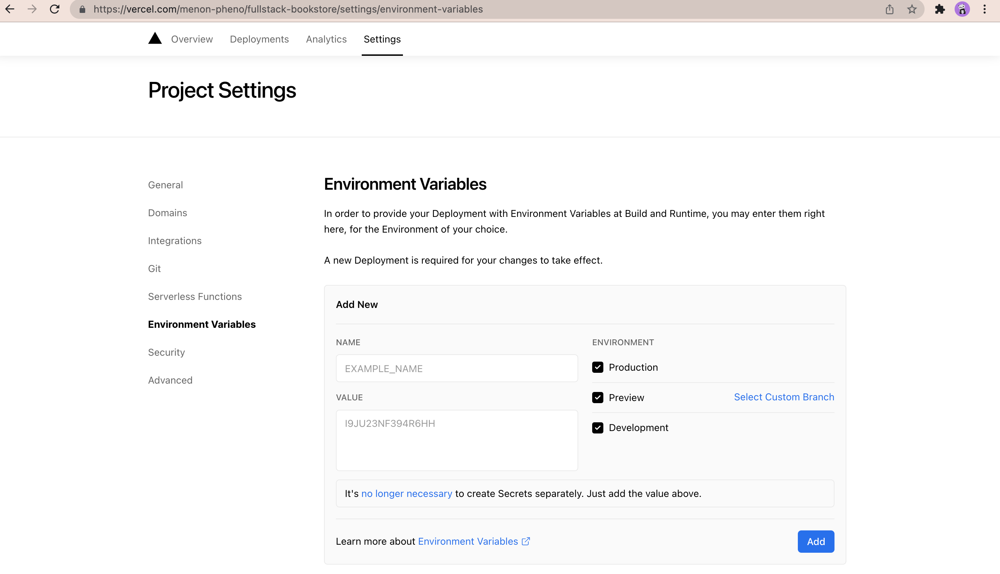

新增一個 `MONGODB_URI` 及它的 URI 值，你的雲端網站又復活了：

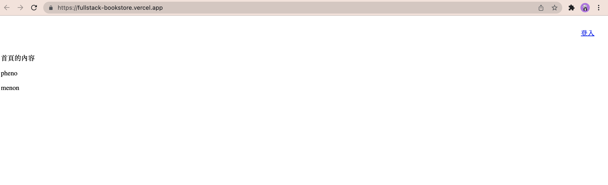
