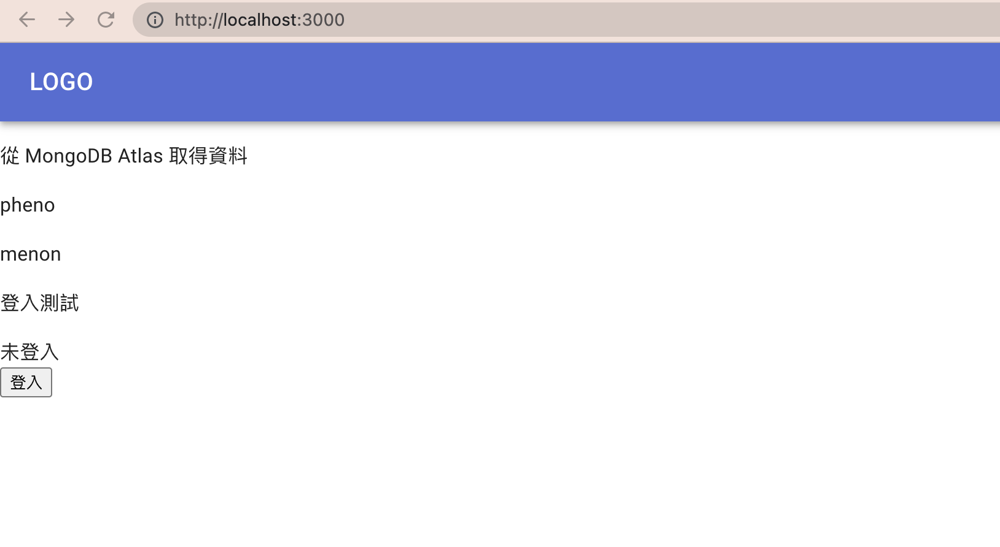
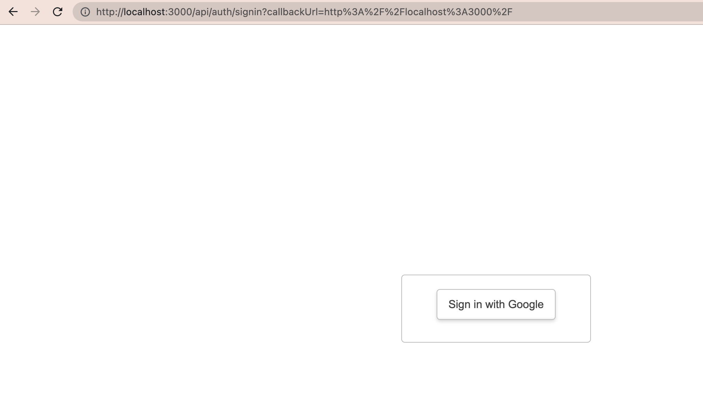
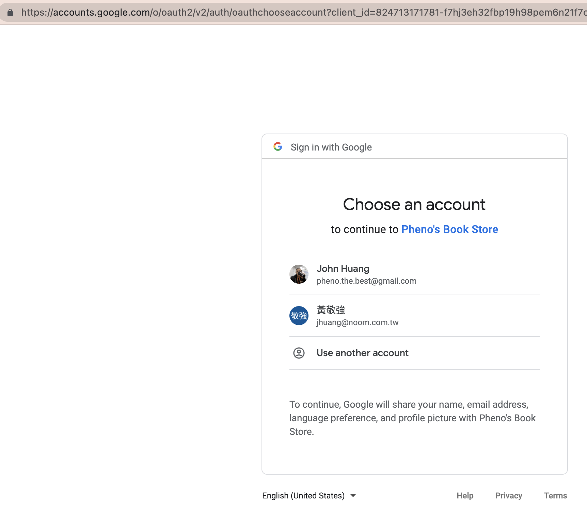
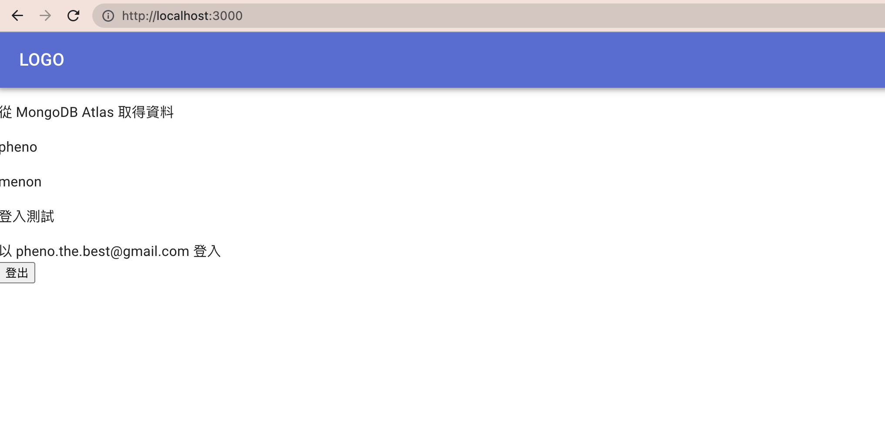
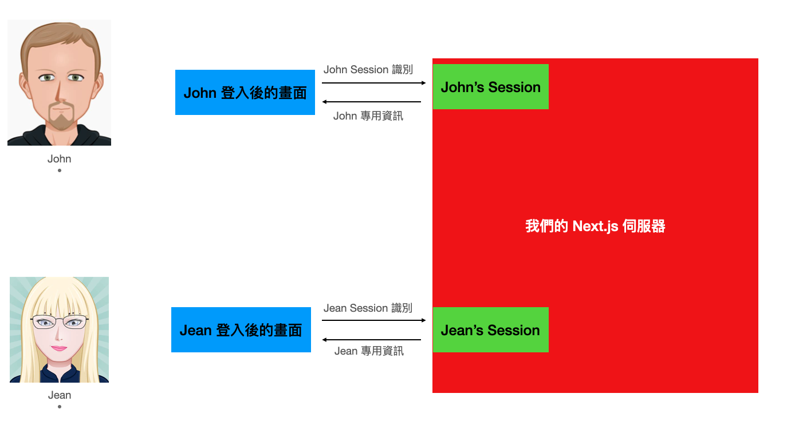
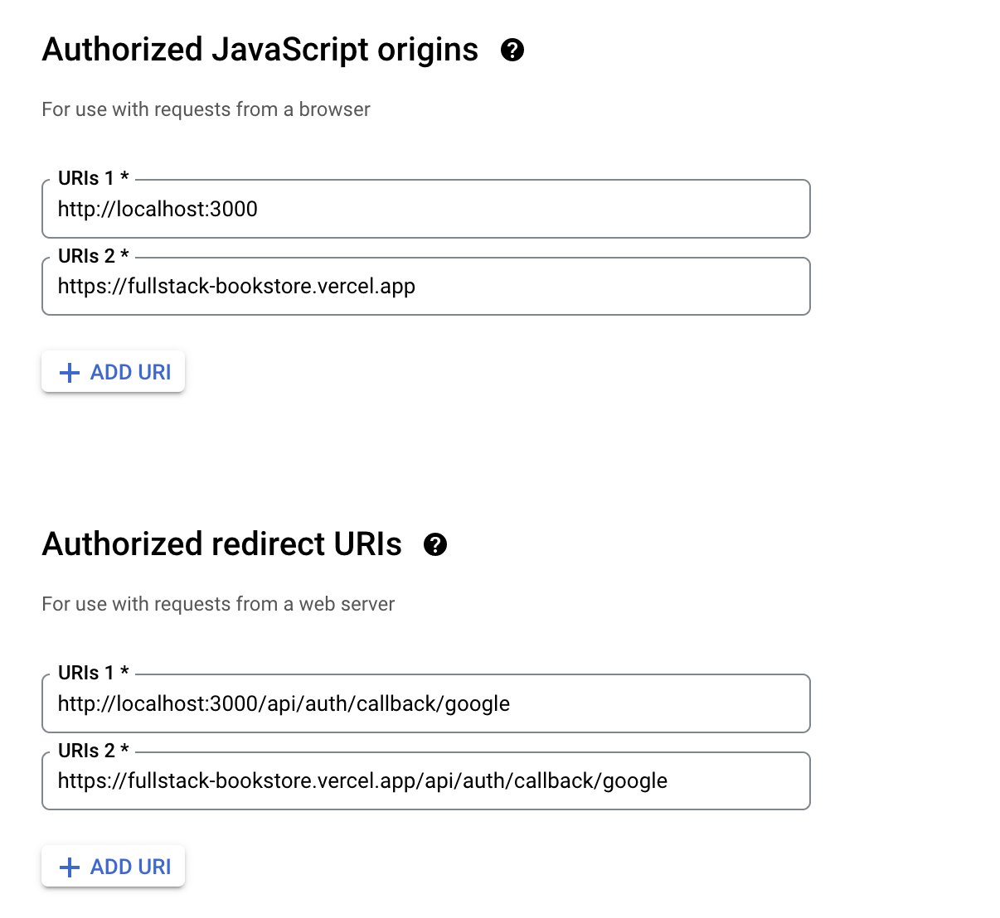

# 第三章

- 概述
- `next-auth`

  - GCP（Google Cloud Platform）設定
  - `next-auth` 初版
  - 何謂 OAuth
  - session（網頁應用程式）
  - 部署上 Vercel

- withAuth（認證用）HOC
  - getInitialProps 函式
  - withAuth HOC 的參數
  - 測試 withAuth
  - 登入頁面（Login）與 NProgress
  - 非同步（asynchronous）執行及 callback
    - Promise.then
    - async/await
  - 整合 Google OAuth API
    - setupGoogle 函式、verify 函式、passport 及 strategy
    - /auth/google、/oauth2callback 及 /logout Express 路由
    - User.publicFields 及 User.signInOrSignUp 函式
    - generateSlug 函式
    - GCP（Google Cloud Platform）設定與測試

---

在我們開工之前，先取得`2-end`的程式碼。[2-end](https://github.com/menon-pheno/fullstack-bookstore/tree/master/book/2-end)資料夾位於[fullstack-bookstore repo](https://github.com/menon-pheno/fullstack-bookstore)`book`的目錄內。

- 如果你還沒有將 fullstack-bookstore 給 clone 下來的話，用`git clone https://github.com/menon-pheno/fullstack-bookstore`這個指令將 repo 複製到你的電腦上
- 注意：如果你想要用自己的 GitHub 帳號自己管理程式的話，你應該將我們的 repo fork 出來並且執行`git clone https://github.com/<你的 github 名稱>/fullstack-bookstore.git`。這樣你就可以將你的改動直接 push 到你的`fullstack-bookstore` repo
- 在`2-end`的資料夾內執行`yarn`來安裝所有的套件

我們在第三章有新增以下幾個套件：

- `"next-auth"`

看一下第三章的 [package.json](https://github.com/menon-pheno/fullstack-bookstore/blob/master/book/3-begin/package.json)。

請確定使用我們指定的套件跟版本，並忽略任何升級的警告。我們會定期更新套件且測試相容性。我們無法確保新的套件版本與目前的程式碼都相容，套件升級時有的時候會導致一些預料之外的問題。

記得將你第二章建立的 `.env.local` 檔案放到專案的根目錄下。到本章的尾聲時，你會另外加上：

- `GOOGLE_ID`
- `GOOGLE_SECRET`
- `NEXTAUTH_URL`
- `NEXTAUTH_SECRET`

到你的 `.env.local` 檔內。

我們鼓勵且歡迎你在閱讀本章的時候，可以在我們的 GitHub repo: [https://github.com/menon-pheno/fullstack-bookstore/issues/new](https://github.com/menon-pheno/fullstack-bookstore)回報任何 bug、錯字或是任何解釋不清楚的地方。

---

## 概述

我們到目前為止，有了一個可以和雲端 MongoDB Atlas 連接的網站，並且介紹了怎麼透過適合的 Material-UI 元件，來設計我們的頁面。這章最主要的重點在於，讓我們的網站可以進行使用者認證的功能。這章我們就要來讓網站支援 Google 登入，並且將資訊存入我們連接的 MongoDB Atlas 內。

---

## `next-auth`

[Next.js 認證的官方建議](https://nextjs.org/docs/authentication)可以看到它建議的完整認證支援的套件是 `next-auth`。我們從善如流，安裝 `next-auth` 來使用：

```
yarn add next-auth
```

然後看一下 [next-auth 的官方說明](https://next-auth.js.org/getting-started/example#existing-project)

讓我們逐步說明每個步驟的意涵以及實作的內容。

### GCP（Google Cloud Platform）設定

由於我們這邊將會實作的是讓使用者可以透過他們的 Google 帳號來登入我們的網站，我們必須將我們的專案在 GCP 上註冊，以取得 GCP 核發給我們專案專屬的 `Client ID` 以及 `Client secret`。請參閱[GCP 註冊專案的官方文件](https://developers.google.com/identity/sign-in/web/devconsole-project)。由於官方文件相當清楚，我們不重複，就照著做，取得 OAuth 認證資料，要注意的有以下兩件事：

- `Authorized JavaScript origins` 填 `http://localhost:3000`
- `Authorized redirect URIs` 填 `http://localhost:3000/api/auth/callback/google`

另外一提，當我們要部署上 Vercel 的時候，要再各自新增雲端網址的 URI。

將取得的 `Client ID` 及 `Client Secret` 放到我們的 `.env.local` 檔內：

```
GOOGLE_ID="{你的 Google Client ID}"
GOOGLE_SECRET="{你的 Google Client Secret}"
```

### `next-auth` 初版

我們先來快速在我們的專案上實作一個有實際達到使用 Google 登入功能的階段性，然後再來解釋過程並且逐步改戰。

1. 新增 `pages/api/auth/[...nextauth].js` 這個檔案（同時新增 `pages/api` 以及 `pages/api/auth` 這兩個資料夾），內容如下：

   ```JavaScript
   import NextAuth from "next-auth";
   import GoogleProvider from "next-auth/providers/google";

   export default NextAuth({
    providers: [
      GoogleProvider({
        clientId: process.env.GOOGLE_ID,
        clientSecret: process.env.GOOGLE_SECRET,
      }),
    ],
    secret: process.env.NEXAUTH_SECRET,
   });
   ```

   - 上面的 `secret` 屬性，你可以使用終端機執行 `openssl rand -base64 32` 來取得一個安全性夠高的字串，然後將這個值加入到 `.env.local` 內
   - 另外在 `.env.local` 上加上 `NEXAUTH_URL="http://localhost:3000"` 這個環境變數

2. `pages/_app.js` 修改成以下（我把更動的部分上面加了註解）：

   ```JavaScript
   import PropTypes from "prop-types";
   import { CacheProvider } from "@emotion/react";
   import { CssBaseline } from "@mui/material";
   import { ThemeProvider } from "@mui/material/styles";
   import Head from "next/head";
   // 使用 `next-auth/react` 來紀錄使用者的 session
   import { SessionProvider } from "next-auth/react";

   import createEmotionCache from "../styling/createEmotionCache";
   import basicTheme from "../styling/themes/basicTheme";

   const clientSideEmotionCache = createEmotionCache();

   export default function MyApp(props) {
     const {
       Component,
       // pageProps 多補上一個 session 屬性
       pageProps: { session, ...pageProps },
       emotionCache = clientSideEmotionCache,
     } = props;
     return (
       // 將我們原本 _app.js 所回傳的元件，用 <SessionProvider> 包覆起來
       <SessionProvider session={session}>
         <CacheProvider value={emotionCache}>
           <Head>
             <meta name="viewport" content="initial-scale=1, width=device-width" />
           </Head>
           <ThemeProvider theme={basicTheme}>
             <CssBaseline />
             <Component {...pageProps} />
           </ThemeProvider>
         </CacheProvider>
       </SessionProvider>
     );
   }

   MyApp.propTypes = {
     Component: PropTypes.elementType.isRequired,
     emotionCache: PropTypes.object,
     pageProps: PropTypes.object.isRequired,
   };

   ```

3. `pages/index.js` 更動如下（我一樣在更動處加上註解）：

   ```JavaScript
   import Head from "next/head";
   // 使用 next-auth/react 所提供的功能
   import { useSession, signIn, signOut } from "next-auth/react";

   import dbConnect from "../lib/dbConnect";
   import User from "../models/User";
   import Header from "../components/Header";

   const Home = ({ users }) => {
     const { data: session } = useSession();
     return (
       <>
         <Head>
           <title>首頁</title>
           <meta name="描述" content="這是關於首頁的描述" />
         </Head>
         <Header />
         <p>從 MongoDB Atlas 取得資料</p>
         {users.map((user) => (
           <div key={user._id}>
             <p>{user.name}</p>
           </div>
         ))}

         {/*下面多了一個區塊做登入相關的展示*/}
         <p>登入測試</p>
         {session ? (
           <>
             以 {session.user.email} 登入 <br />
             <button onClick={() => signOut()}>登出</button>
           </>
         ) : (
           <>
             未登入 <br />
             <button onClick={() => signIn()}>登入</button>
           </>
         )}
       </>
     );
   };

   // 從 MongoDB 取得 user(s) 資訊

   export async function getServerSideProps() {
     await dbConnect();

     const result = await User.find({});
     const users = result.map((doc) => {
       const user = doc.toObject();
       user._id = user._id.toString();
       return user;
     });

     return { props: { users: users } };
   }

   export default Home;

   ```

我們看一下 `yarn dev` 的結果：



網頁下方就是我們在 `pages/index.js` 暫時加上的測試區，點擊`登入`按鈕：



網址列的值可以稍微注意一下，晚點的說明會提到。點擊`Sign in with Google`：



一樣注意一下網址列，它是指向 Google 所提供的外部網頁，不是我們自己的網站。點選一個想要登入的帳號：



可以看到，我們的頁面（http://localhost:3000）現在顯示已登入（如果你點擊`登出`也會對應的登出）。

總結一下，透過 `next-auth` 進行認證的功能其實相當簡單：

1. 我們加了一個 `[...nextauth].js` Next.js API 路由（待會說明 Next.js API 路由）
   - 裡面指定了我們要採取的認證方式（`GoogleProvider`）
2. 在 `_app.js` 包覆了一個 `SessionProvider` 讓我們的專案都可以存取到使用者是否登入的資訊（待會說明 session 的概念）
3. 而處理 Google OAuth 的細節跟實作則被 `next-auth` 給包辦了（待會說明 OAuth 的觀念）

讓我們在接下來的三個小節，反序地說明以上幾個重點觀念：OAuth、session、以及 Next.js 的 API 路由。有了這些觀念後，回頭看前面的程式碼應該會好理解很多。

---

### 何謂 OAuth

[OAuth Wikipedia 說明](https://en.wikipedia/wiki/OAuth) 裡可以看到，OAuth 是 Open Authorization 的簡寫。它本身是一套公開的標準，這個標準能夠讓使用者可以在不公開自己帳號的密碼之前提下，提供外部網站或是軟體所需要的資訊。以我們上面的實際程式碼為例子，可以看到我們在進行完登入後，於我們的 `http://localhost:3000` 有顯示使用者的 email（我拿截圖的 `pheno.the.best@gmail` 為例），但是登入的過程中，我們的網站都沒有接觸到 `pheno.the.best@gmail.com` 在 Google 的密碼。上面有提到，注意到實際進行登入行為（也就是輸入帳密的過程），是在 Google 所提供的頁面，跟我們網站本身無關，可以簡化的先想成，是在 Google 端登入成功後，Google 將 `pheno.the.best@gmail.com` 這樣的資訊回傳到我們的網站，因此我們是在沒有接觸到使用者的真正密碼的情況下完成了登入。

目前世界上多數的大公司（例如，Amazon、Google、Facebook、Microsoft 及 Twitter 等）都有支援這套標準。某種程度是對外部網站以及對各大公司的一個雙贏局面，對正在起步中的網站，要吸引使用者自行願意註冊帳號其實是很難的，如果網站提供 Google 帳號登入這樣的功能（就如同我們現在的實例），那所有具有 Google 帳號的使用者都變成了我們的潛在用戶。

在這邊我們在省略一些細節的情況下，利用我們上節寫的程式來大致描繪我們的網站透過 `next-auth` 如何進行 OAuth（會以 Google 為例） 的流程：

1. 當使用者在我們的網頁（http://localhost:3000）上點擊`登入`按鍵時
   1. 我們的 `onClick` 會呼叫 `next-auth` 提供的 `signIn()` 函式
   2. `signIn()` 實際上是會透過瀏覽器呼叫 `GET {ROOT_URL}/api/auth/signin` 的一個 HTTP request
   3. `GET {ROOT_URL}/api/auth/signin` 則是會被我們定義的 `pages/api/auth/[...nextauth].js` 給處理（這在後面討論 Next.js API 路由的時候，會比較清楚）。但是簡單看的話，可以看到 HTTP request 的 `/api/auth` 對應到 `(pages)/api/auth`，可以理解為 `[...nextauth].js` 這個檔案會處理這個 HTTP request
   4. `[...nextauth].js` 裡的 `NextAuth` 實際上會回傳給瀏覽器一個 `next-auth` 產出的頁面，這個頁面上會列出我們所設定的登入選項（也就是 `providers` 屬性）。因為我們只有設定一個 `provider`（`GoogleProvider`），因此回傳的頁面就只有 Google 這個選項：
      
      註：有興趣的話可以嘗試看看多加一個 `provider` 看看結果是什麼
2. 瀏覽器會渲染呈現收到 `next-auth` 所回傳的頁面（也就是正上方的截圖）。當使用者點擊`Sign in with Google` 這個按鈕時
   1. 瀏覽器會發出一個 `POST {ROOT_URL}/api/auth/signin/google` 的 HTTP 請求
   2. 這個請求一樣會是被我們的 `pages/api/auth/[...nextauth].js` 給處理
      - `[...nextauth].js` 所 export 的 `NextAuth` 會幫我們做一系列的設定，諸如設定我們打算要從 Google 端取得的資料範疇（scope，我們在網頁呈現的 email 就是 scope 的一部份）、Google 的 client ID 還有設定處理 Google 會做的 callback URL 等項目
   3. 上述步驟設定完後，`next-auth` 會從我們的 Next.js 伺服器發送 `GET google.com/login/oauth2/auth/` 也就是對外部的 Google 伺服器發送 HTTP request，而這個 request 會帶著上面第二步驟的準備好的資訊
   4. Google 的伺服器在收到 HTTP 請求後會回傳它自己的登入頁面到瀏覽器
      
3. 瀏覽器會渲染從 Google 收到的登入頁面（也就是正上方的截圖，並請注意到，這是 Google 提供的頁面，跟我們的專案無關，看網址列就可以發現）。使用者選擇 Google 帳號，並且輸入帳密後，瀏覽器會將帳密以 HTTP POST 的方式傳到 Google 伺服器（詳細網址由 Google 控制，可能會變動），讓 Google 的伺服器來驗證
   1. Google 的伺服器端驗證使用者的帳密正確
   2. Google 的伺服器會產生一個一次性的授權碼（access code）並且透過我們在前面 GCP 小節中設定的 `Authorized redirect URIs` callback 將這個一次性授權碼傳到 Next.js 的伺服器，以實際的例子，Google 伺服器會對我們的 Next.js 呼叫 `GET http://localhost:3000/api/auth/callback/google?code={一次性的授權碼}` 的 HTTP 請求，而這個請求一樣是 `[...nextauth].js` 會來處理
   3. `[...nextauth].js` 會在拿到一次性的授權碼後，用此授權碼向 Google 伺服器請求以取得可以存取所指定的資料範疇的 access token，我們的 Next.js 伺服器會透過 `next-auth` 對 Google 伺服器發出類似於 `POST google.com/login/oauth/access_token {code: 前面步驟取得的一次性授權碼}` 的 HTTP 請求
   4. Google 伺服器確認一次性的授權碼無誤後就會回傳 access token 給我們的 Next.js 伺服器
   5. 我們的 Next.js 伺服器有了 access token 後就可以取得資料範疇（scope）內所允許的資料，例如我們在頁面上呈現的使用者 email 等資訊
   6. `next-auth` 接著會產生所謂的 session token（待會說明，但是可以先想成是登入成功的相關資訊）並且將之存放（這也就是我們在 `pages/_app.js` 內 `SessionProvider` 會存有的資料），而由於 `pages/_app.js` 會將 `session` 資訊提供到所有的頁面，因此所有的頁面都可以被當作是已登入
4. 使用者在瀏覽器上看到我們登入網站了！

---

### session（網頁應用程式）

我們這小節的名稱可以看到一點澄清，因為 session 這個詞在資訊科學領域有很多地方都會使用。在接下來討論的 session，我們專指的是網頁應用程式（web application）的 session，當然，這也就適用於我們目前實際在開發的專案。那 session 到底是什麼？

簡言之，我們在開發網站的時候，往往會需要將與某使用者相關的資訊，暫時性的存放在伺服器端。舉個簡單的例子，假設有兩位使用者 John 及 Jean 在各自的電腦上登入我們的網站，我們當然會希望我們的網站要知曉現在有兩位使用者登入，並且 John 及 Jean 的電腦只看得到屬於自己帳號該有的資料。因此，在伺服器端就會需要存放兩組資料，一份是 John 的相關資訊，另一份是 Jean 的相關資訊。先撇開細節，但是在伺服器端所存放的使用者資訊就是我們所說的 session。以上面的例子來看，我們的伺服器就會存放兩個 session，一個是屬於 John 的，另外一個屬於 Jean 的。示意圖如下：



幾個重點值得注意：

- 前面提到的 session 是暫時性的，常見的幾個會清空 session 的情境是：
  - 使用者登出
  - 通常 session 會設定一個使用期限，使用期限到的時候會刪除 session 資訊
- 一個 session 只會對應到一個使用者（一個使用者其實可以對應到多個 session，但是這個情境我們暫時不討論，最常見的狀態通常都是一個使用者對應一個 session）
- 雖然示意圖看到 session 是存放於伺服器內，這不是唯一的做法
  - 我們目前的程式碼的確是將 session 資訊存於 Next.js 的記憶體內
  - 晚點我們會調整成將 session 存放到 MongoDB Atlas 內，將 session 存放到資料庫內是個常見的做法，因為可以確保資料不會因為 Next.js 伺服器關閉或重啟而消失
- 示意圖可以看到 `John Session 識別` 及 `Jean Session 識別` 這兩個箭頭，這代表的是從各自使用者的瀏覽器嘗試對 Next.js 伺服器發出 HTTP request 時要傳送某種資訊，讓伺服器知道這個 HTTP request 是要使用/存取對應的正確 session 資訊，至於怎麼傳送，還有傳送的詳情基本上有滿多變化的，[next-auth session 設定官方文件](https://next-auth.js.org/configuration/options#session) 可以看到 `next-auth` 有提供許多設定的彈性

---

### 部署上 Vercel

我們要將目前的專案部署到 Vercel 需要做一些設定：

1. 在 Vercel 網站上我們將我們在 `.env.local` 的環境變數加上：

- `NEXTAUTH_SECRET`
- `GOOGLE_ID`
- `GOOGLE_SECRET`

2. 在 GCP 上我們要將專案雲端的網址加到 `Authorized JavaScript origins` 及 `Authorized redirect URIs`：



大功告成，我們專案在雲端也復活了。
