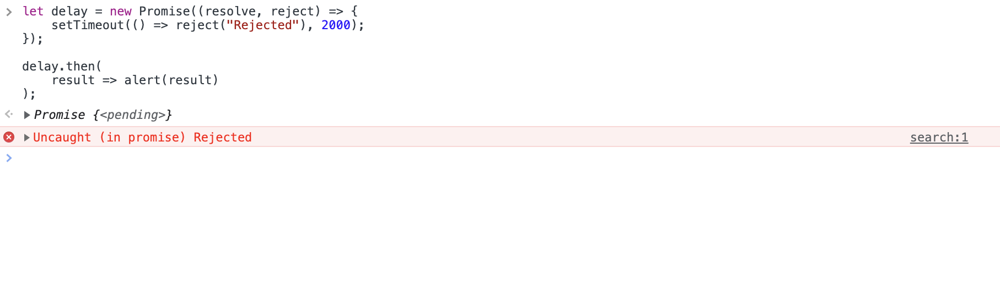

# 第三章

- withAuth（認證用）HOC
  - getInitialProps 函式
  - withAuth HOC 的參數
  - 測試 withAuth
  - 登入頁面（Login）與 NProgress
  - 非同步（asynchronous）執行及 callback
    - Promise.then
    - async/await
  - 整合 Google OAuth API
    - setupGoogle 函式、verify 函式、passport 及 strategy
    - /auth/google、/oauth2callback 及 /logout Express 路由
    - User.publicFields 及 User.signInOrSignUp 函式
    - generateSlug 函式
    - this
    - GCP（Google Cloud Platform）設定與測試

---

在我們開工之前，先取得`3-begin`的程式碼。[3-begin](https://github.com/menon-pheno/fullstack-bookstore/tree/master/book/3-begin)資料夾位於[fullstack-bookstore repo](https://github.com/menon-pheno/fullstack-bookstore)`book`的目錄內。

- 如果你還沒有將 fullstack-bookstore 給 clone 下來的話，用`git clone https://github.com/menon-pheno/fullstack-bookstore`這個指令將 repo 複製到你的電腦上
- 注意：如果你想要用自己的 GitHub 帳號自己管理程式的話，你應該將我們的 repo fork 出來並且執行`git clone https://github.com/<你的 github 名稱>/fullstack-bookstore.git`。這樣你就可以將你的改動直接 push 到你的`fullstack-bookstore` repo
- 在`3-begin`的資料夾內執行`yarn`來安裝所有的套件

我們在第三章有新增幾個套件：

- `"lodash"`
- `"nprogress"`
- `"passport"`
- `"passport-google-oauth"`

看一下第三章的 [package.json](https://github.com/menon-pheno/fullstack-bookstore/blob/master/book/3-begin/package.json)。

請確定使用我們指定的套件跟版本，並忽略任何升級的警告。我們會定期更新套件且測試相容性。我們無法確保新的套件版本與目前的程式碼都相容，套件升級時有的時候會導致一些預料之外的問題。

記得將你第二章建立的 `.env` 檔案放到專案的根目錄下。到本章的尾聲時，你會另外加上 `GOOGLE_CLIENTID` 以及 `GOOGLE_CLIENTSECRET` 的環境變數到 `.env` 檔案內。

我們鼓勵且歡迎你在閱讀本章的時候，可以在我們的 GitHub repo: [https://github.com/menon-pheno/fullstack-bookstore/issues/new](https://github.com/menon-pheno/fullstack-bookstore)回報任何 bug、錯字或是任何解釋不清楚的地方。

---

在本章，我們會建立一個名為 `withAuth` 的高階元件（higher-order component, HOC）。這個 HOC 與我們的 `App` HOC 類似，會將我們的頁面給包覆起來。不同的點在於，`App` 預設上會將所有的頁面都包覆，而 `withAuth` 則是我們在 export 頁面時會特別指定是否要使用這個 HOC 來包覆該頁面。`App` 的主要責任是提供我們程式個頁面所共用的版面（layout） - 例如 Material-UI 的主題（theme）、`Header` 元件以及我們會加上的 `Notifier` 元件。而我們 `withAuth` 元件的主要責任則是檢查使用者是否有登入，並在有登入的時候將 `user` 以 prop 的方式傳入頁面元件內。

在 `withAuth` HOC 內，我們會使用 Next.js 的 `getInitialProps` 函式來取得 `user` prop 該有的值，以傳入到頁面元件內。我們在本章中也會稍微離題以更深入的探討一下 `getInitialProps` 這個 Next.js 所提供的函式。

總結一下本章會涉獵的內容，除了實作 `withAuth` HOC 以外，我們會：

- 探討 `getInitialProps` 函式
- 建立我們的 `Login` 頁面，並引用 `Nprogress` 進度條
- 學習 `Promise.then`、`async/await` 以及 `this` 的概念
- 整合 Google OAuth API

---

## withAuth（認證用）HOC

要為應用程式導入使用者認證的功能不算是個小工程。因此我們花一整章的時間來做這件事。我們首要的工作是探討並定義實作一個會將 `user` 以 prop 的方式傳到所包覆的頁面元件的 `withAuth` HOC。接著我們會稍微離題探討非同步執行程式這個主題，然後將我們的網頁程式與 Google OAuth API 整合，最後再來測試我們整個使用者驗證的流程。

本節的兩個主要目標為：

- 在 `lib/withAuth.jsx` 定義 `withAuth` HOC
- 用一個手動於 MongoDB 資料庫建立的 `User` 文件來測試我們的 `withAuth` HOC

首先，我們接下來會藉由執行 `yarn dev` 而非 `yarn dev-express` 來啟動我們的伺服器。在 `package.json` 的 `scripts` 屬性下將：

```JSON
"dev": "next",
"dev-express": "nodemon server/server.js --watch server",
```

改成：

```JSON
"dev": "nodemon server/server.js --watch server",
```

上一章的時候，我們透過 Next.js 的 `getInitialProps` 來將使用者的資訊以 prop 的方式傳入 `Index` 頁面內。如果只有這個頁面需要這個資訊，這樣做沒什麼問題。不過，我們的網頁應用程式會有多個頁面需要這個 `user` prop 來正確地顯示資訊。如果每個頁面都這樣做，那容易出錯又不好維護。

為了提升程式碼重用性，我們可以透過建立一個 HOC 來將需要使用 `user` prop 的頁面給包覆起來，並由這個 HOC 負責將 `user` prop 給傳入所包覆的頁面。所以我們建立一個 `withAuth` 並使用 `withAuth.getInitialProps` 來包覆 `Index` 及其他需要 `user` 資訊的頁面來取代我們目前直接在 `Index` 頁面使用 `Index.getInitialProps` 的方式。

我們將 `withAuth` HOC 定義在 `lib` 目錄內的 `lib/withAuth.jsx`。在 `withAuth` 元件內我們會指定幾個簡單的 boolean 參數 - 例如 `loginRequired` 來決定所包覆的頁面是否一定要通過認證（`user` 必須不是 `null` 或 `undefined`）。接這我們就是把頁面用 `withAuth` 給包起來，並且透過這些 boolean 參數來定義所包覆的頁面該有的行為。下面是一個帶入 `loginRequired: true` 的例子：

```JavaScript
export default withAuth(Index, { loginRequired: true });
```

上面這行代表 `Index` 這個頁面需要一個有登入的使用者才能造訪。

所有針對管理者（Admin）以及顧客（Customer）角色所設計的頁面都需要是一個有登入的使用者才能造訪；因此這些頁面都應該用 `loginRequired: true` 的 `withAuth` HOC 給包覆起來。在本章中，你可以將被 `withAuth` 包覆的 `Index` 頁面想成是一個使用者的專屬儀表板（dashboard）- 當使用者成功登入後被轉導到的首頁。

我們再看一次 `Index` 頁面的 export 型態：

```JavaScript
export default withAuth(Index, { loginRequired: true });
```

可以看到 `withAuth` HOC 將 `Index` 包覆起來，並且 `loginRequired` 則指定使用者必須有成功登入才能造訪此頁面。

因此，`withAuth` 這個函式會需要：

1. 頁面元件（`BaseComponent`）
2. 具有 `loginRequired` 跟 `logoutRequired` 等屬性的物件

這兩個參數。而最後 `withAuth` 會回傳一個 `App` 元件，其內容實際上是：

```JSX
<BaseComponent {...this.props} />
```

建立 `lib/withAuth.jsx` 並且先將以下的實作給填上：

```JSX
import React from 'react';
import PropTypes from 'prop-types';
import Router from 'next/router';

const globalUser = null;

export default function withAuth(
  BaseComponent,
  { loginRequired = true, logoutRequired = false } = {},
) {
  const propTypes = {
    user: PropTypes.shape({
      id: PropTypes.string,
      isAdmin: PropTypes.bool,
    }),
    isFromServer: PropTypes.bool.isRequired,
  };

  const defaultProps = {
    user: null,
  };

  class App extends React.Component {
    static async getInitialProps(ctx) {
      // 1. getInitialProps
    }

    componentDidMount() {
      // 2. componentDidMount
    }

    render() {
      // 3. render

      return (
        <>
          <BaseComponent {...this.props} />
        </>
      );
    }
  }

  App.propTypes = propTypes;
  App.defaultProps = defaultProps;

  return App;
}
```

你可能會好奇，為何 `withAuth` 是一個回傳元件的函式，但是 `pages/` 內的 `MyApp` 及 `MyDocument` HOC 卻是單純的元件。那是因為 `App` 及 `Document` 嚴格來說並不是 HOC（我們是為了不要將事情複雜化而單純叫它們 HOC） - 實際上它們是 Next.js 內建的 `App` 及 `Document` HOC 的延伸（extend）。我們定義的 `MyApp` 及 `MyDocument` 對應的各自延伸 Next.js 的 `App` 及 `Doucment` HOC。所以嚴格來說 `MyApp` 及 `MyDocument` 是 HOC 的延伸，而非 HOC。反觀我們的 `withAuth` 則是一個獨立的 HOC，可以參考 HOC 的定義：

[https://blog.jakoblind.no/simple-explanation-of-higher-order-components-hoc/#the-most-simple-hoc](https://blog.jakoblind.no/simple-explanation-of-higher-order-components-hoc/#the-most-simple-hoc)

```JSX
// 將一個元件(WrappedComponent)以參數傳入
function simpleHOC(WrappedComponent) {
    // 回傳一個新的 anonymous 元件
    return class extends React.Component {
        render() {
            return <WrappedComponent {...this.props} />;
        }
    }
}
```

我們定義 `withAuth` 的方式就跟上面是一致的。唯一的差異是我們透過 `class App extends` 然後再回傳 `return App` 而上放的範例使用 `return class extends`，這只是單純語法的不同。值得一提的是，Next.js **內部**也是如此定義 `App` 及 `Document` HOC 的。

我們在第一章就談過指定 prop 的型態以及預設值，所以在這裡就不贅述。

另外一個值得注意的是 - `<>` 是 `React.Fragment` 的簡化語法：

[https://reactjs.org/docs/fragments.html#short-syntax](https://reactjs.org/docs/fragments.html#short-syntax)

在接下來的幾個小節，我們會定義下列的函式，並且測試我們包覆了 `Index` 頁面的 `withAuth` HOC：

- `withAuth.getInitialProps`
- `withAuth.componentDidMount`
- `withAuth.render`

---

### getInitialProps 函式

我們在本節定義 `withAuth.getInitialProps` 函式。我們之前已經有使用過 `getInitialProps` 這個函式（`Index` 頁面）。Next.js 使用 [getInitialProps](https://github.com/zeit/next.js#fetching-data-and-component-lifecylce) 函式來取得頁面元件所需要的 prop 資料。HOC 及 Next.js 頁面（元件）兩者都可以使用這個函式，但是其子元件（childe component）是不允許使用此函式。子元件必須透過父元件傳入 prop 來得到資料。

`getInitialProps` 函式是設計為可以在瀏覽器以及伺服器端執行的，因此當你知道你的頁面同時有可能是伺服器渲染及瀏覽器渲染的時候，這個函式就很適用。若你的頁面只會由瀏覽器渲染，你可以透過 `componentDidMount`（或是用 hook）以取得需要的 prop 資料。

我們的 `withAuth.getInitialProps` 需要計算出 `user` 以及 `isFromServer` 的值，然後將這兩個值以 props 的方式傳到 `App` 元件內。我們的 `withAuth.getInitialProps` 函式定義如下：

```JavaScript
static async getInitialProps(ctx) {
    const isFromServer = typeof window === 'undefined';
    const user = ctx.req ? ctx.req.user && ctx.req.user.toObject() : globalUser;

    if (isFromServer && user) {
    user._id = user._id.toString();
    }

    const props = { user, isFromServer };

    if (BaseComponent.getInitialProps) {
    Object.assign(props, (await BaseComponent.getInitialProps(ctx)) || {});
    }

    return props;
}
```

`isFromServer` 被定義為 `typeof window === 'undefined'`。換言之，當頁面是伺服器渲染的時候，`typeof window === 'undefined'` 會是 `true`，也因此 `isFromServer` 會是 `true`。而我們使用 `isFromServer` 的方式如下（待會 `withAuth.componentDidMount` 也會使用到）：

```JavaScript
if (isFromServer && user) {
    user._id = user._id.toString();
}
```

這裡注意到，在伺服器端處理 `user._id` 需要多呼叫一個 `toString`，可以參考以下兩個連結：

[https://docs.mongodb.com/manual/reference/method/ObjectId.toString/](https://docs.mongodb.com/manual/reference/method/ObjectId.toString/)

[https://stackoverflow.com/questions/13104690/nodejs-mongodb-object-id-to-string](https://stackoverflow.com/questions/13104690/nodejs-mongodb-object-id-to-string)

我們來用個 `console.log()` 來驗證一下從伺服器端來的 `user._id` 並非 `string` 而是 `object`（因此需要呼叫 `toString`），不過由於我們還未將 `Index` 頁面與 `withAuth` 結合，因此我們透過 `Index.getInitialProps` 來示範，將 `Index.getInitialProps` 改成以下：

```JavaScript
Index.getInitialProps = async (ctx) => {
  const isFromServer = typeof window === 'undefined';
  const user = ctx.query ? ctx.query.user && ctx.query.user.toObject() : null;

  if (isFromServer && user) {
    console.log('Index page server getInitialProps...');
    console.log('before', typeof user._id, user._id);
    user._id = user._id.toString();
    console.log('after', typeof user._id, user._id);
  }

  return {
    user: ctx.query.user,
  };
};
```

重整你的 `http://localhost:8000` 頁面，讓它取得一個伺服器渲染的頁面，你的終端機會 log 出：

```
Index page server getInitialProps...
before object 620493d3fd9c514ea9e29eaf
after string 620493d3fd9c514ea9e29eaf
```

可以看到 `user._id` 本來是一個 `object` 的型態，因此需要呼叫 `toString` 將之轉型為 `string`。當然你看到的 `user._id` 會與我們這邊有所不同。

我們傳入了 `{loginRequired = true, logoutRequired = false}` 這個參數到我們的 `withAuth` HOC，不過我們目前 `withAuth` 的邏輯都還沒有用到這個參數。我們在下個小節即將在定義 `withAuth.componentDidMount` 以及 `withAuth.render` 時使用它們。

---

### withAuth HOC 的參數

我們在這邊討論一下 `withAuth` HOC 的 `loginRequired` 以及 `logoutRequired` 參數的作用為何。我們在第六章會另外再多加一個 `adminRequired` 參數。

我們的網頁應用程式應該如何處理已登出的使用者呢？一個好的使用體驗（user experience, UX）應該是在當已登出的使用者想要造訪一個需要登入才能使用的頁面時，將使用者導到 `Login` 頁面。換個角度來看，我們透過 `withAuth` 來指定 `Index` 頁面只能由已登入的使用者使用，而 `Login` 頁面只能由未登入的使用者使用。

因此，我們可以在 `Index` 頁面使用 `loginRequired` 為 `true` 如下：

```JavaScript
export default withAuth(Index, { loginRequired: true });
```

而 `Login` 頁面則可以將 `logoutRequired` 設為 `true` 如下：

```JavaScript
export default withAuth(Login, { logoutRequired: true });
```

我們 `lib/withAuth.jsx` 定義上面的參數如下：

```JavaScript
{ loginRequired = true, logoutRequired = false } = {}
```

這個代表說，假設我們沒有指定 `loginRequired` 的值，它預設就會是 `loginRequired: true`。因此我們只要簡單的如下調整 `Index`：

```JavaScript
export default withAuth(Index);
```

這樣就會指定 `Index` 為只能由已登入的使用者造訪。

但是我們的 `Login` 頁面仍然需要將 `logoutRequired: true` 傳入（因為 `logoutRequired` 的預設值是 `false`）。所以我們 export `Login` 頁面元件的方式依然維持為：

```JavaScript
export default withAuth(Login, { logoutRequired: true });
```

到這裡你應該了解我們為何需要 `loginRequired` 及 `logoutRequired` 這兩個參數，以及 `withAuth` 包覆頁面時何時需要傳入指定值。我們接下來就是要利用這些參數在 `withAuth` 內設定對應的邏輯。

我們將要在 `withAuth.componentDidMount` 內實作轉導的相關邏輯。

想像一下使用者造訪由 `withAuth` 包覆的 `Index` 頁面：

```JavaScript
export default withAuth(Index);
```

這代表 `loginRequired = true` 及 `logoutRequired = false`。如果使用者未登入，則 `!user` 為 `true`，那我們的應用程式會將使用者轉導至 `Login` 頁面。

當使用者想要造訪由 `withAuth` 包覆的 `Login` 頁面：

```JavaScript
export default withAuth(Login, { logoutRequired: true });
```

由於 `logoutRequired = true`，所以如果使用者已登入，則我們將會將使用者轉導至 `Index` 頁面。

將以上兩個情境結合起來：

```JavaScript
componentDidMount() {
    const { user } = this.props;

    if (loginRequired && !logoutRequired && !user) {
        Router.push('/login');
        return;
    }

    if (logoutRequired && user) {
        Router.push('/');
    }
}
```

另外，在我們上述的兩個情境轉導之前，我們也要禁止我們的網頁應用程式去渲染所造訪的網頁，因此：

```JavaScript
render() {
    const { user } = this.props;

    if (loginRequired && !logoutRequired && !user) {
        return null;
    }

    if (logoutRequired && user) {
        return null;
    }

    return (
        <>
            <BaseComponent {...this.props} />
        </>
    );
}
```

將以上的事情做完後，你的 `lib/withAuth.jsx` 應該如下：

```JSX
import React from 'react';
import PropTypes from 'prop-types';
import Router from 'next/router';

let globalUser = null;

export default function withAuth(
  BaseComponent,
  { loginRequired = true, logoutRequired = false } = {},
) {
  const propTypes = {
    user: PropTypes.shape({
      id: PropTypes.string,
      isAdmin: PropTypes.bool,
    }),
    isFromServer: PropTypes.bool.isRequired,
  };

  const defaultProps = {
    user: null,
  };

  class App extends React.Component {
    static async getInitialProps(ctx) {
      const isFromServer = typeof window === 'undefined';
      const user = ctx.req ? ctx.req.user && ctx.req.user.toObject() : globalUser;

      if (isFromServer && user) {
        user._id = user._id.toString();
      }

      const props = { user, isFromServer };

      if (BaseComponent.getInitialProps) {
        Object.assign(props, (await BaseComponent.getInitialProps(ctx)) || {});
      }

      return props;
    }

    componentDidMount() {
      const { user, isFromServer } = this.props;

      if (isFromServer) {
        globalUser = user;
      }

      if (loginRequired && !logoutRequired && !user) {
        Router.push('/login');
        return;
      }

      if (logoutRequired && user) {
        Router.push('/');
      }
    }

    render() {
      const { user } = this.props;

      if (loginRequired && !logoutRequired && !user) {
        return null;
      }

      if (logoutRequired && user) {
        return null;
      }

      return (
        <>
          <BaseComponent {...this.props} />
        </>
      );
    }
  }

  App.propTypes = propTypes;
  App.defaultProps = defaultProps;

  return App;
}
```

這樣我們的 `withAuth` HOC 就完成了，下個小節我們就可以來測試驗證了！

---

### 測試 withAuth

到這邊，我們有個 `withAuth` HOC 的初版了。

將 `withAuth` 引入至 `Index` 頁面，並且用前面所提到的方式將頁面用 `withAuth` 包覆起來。

我們之前實作 `Index` 頁面的方式為：

- 我們是用 stateless functional component 的方式實作（見第一章）
- 頁面是透過 `Index.getInitialProps` 從伺服器取得使用者資訊（見第二章）

我們測試之前，先做幾個改變：

- 將頁面元件改以 `class...extends` 語法定義
- 移除 `Index.getInitialProps`，因為我們將會使用 `withAuth` HOC 來取得資訊

做了這些改動後，你的 `pages/index.jsx` 應該如以下：

```JSX
import React from 'react';
import PropTypes from 'prop-types';
import Head from 'next/head';

import withAuth from '../lib/withAuth';

const propTypes = {
  user: PropTypes.shape({
    displayName: PropTypes.string,
    email: PropTypes.string.isRequired,
  }),
};

const defaultProps = {
  user: null,
};

class Index extends React.Component {
  render() {
    const { user } = this.props;
    return (
      <div style={{ padding: '10px 45px' }}>
        <Head>
          <title>首頁</title>
          <meta name="說明" content="這是首頁的說明資訊" />
        </Head>
        <p>已購買書籍清單</p>
        <p>
          Email:&nbsp;
          {user.email}
        </p>
      </div>
    );
  }
}

Index.propTypes = propTypes;
Index.defaultProps = defaultProps;

export default withAuth(Index);
```

VS code 編輯器會報一個警告：

```
Component should be written as a pure function
```

你可以在類別定義的上面加上 `// eslint-disable-next-line react/prefer-stateless-function` 來消除這個警告。由於我們這頁的行為會逐漸複雜化，以類別的方式比較好說明，我們會維持使用類別的實作方式來進行。

在我們測試 `Index` 之前，把 `withAuth` 內的以下這段給暫時註記起來：

```JavaScript
if (loginRequired && !logoutRequired && !user) {
    Router.push('/login');
    return;
}
```

因為我們不要在測試中被轉導。

現在如果 `yarn dev` 並且造訪 `http://localhost:8000` 的話，你會看到：

```
TypeError: Cannot read property 'email' of null
```

這代表了我們沒有正確的從伺服器端取得 `user` 資訊。`user` 資訊來自於我們第二章所定義的 `/` Express 路由。打開 `server/server.js` 看一下我們目前的 `/` Express 路由定義：

```JavaScript
server.get('/', async (req, res) => {
    req.session.foo = 'bar';
    const user = await User.findOne({ slug: 'pheno-author' });
    app.render(req, res, '/', { user });
});
```

由於我們是將 `user` 以 `app.render` 的第四個參數傳入，這代表的是當時我們是透過 `Index.getIntialProps` 的 `ctx.query.user` 取得使用者資訊。但是注意到我們在 `withAuth` 內定義 `user` prop 的方式為：

```JavaScript
const user = ctx.req ? ctx.req.user && ctx.req.user.toObject() : globalUser;
```

這代表我們 `/` Express 路由的邏輯需要調整。我們需要透過 `ctx.req.user` 而非 `ctx.query.user` 來取得 `user` 資訊。將 `/` Express 路由修改如下：

```JavaScript
server.get('/', async (req, res) => {
    req.session.foo = 'bar';
    const user = await User.findOne({ slug: 'pheno-author' });
    req.user = user;
    app.render(req, res, '/');
});
```

值得注意的是，我們本章晚點會整合 Google OAuth API，在整合完畢後我們要把這個 Express 路由刪除。這是因為我們用來整合 Google OAuth API 的 `passport` 套件會負責將使用者資訊提供至 `req.user`，我們就不用做這個動作了。

另外，你也需要確認你的 MongoDB 資料庫內的 `users` 集合是具有 `User` MongoDB 文件的。我們在第二章有進行過這件事情，如果你沒做這個動作，請到 MongoDB Atlas，點擊 `bookstore.users` 集合，**手動**新增以下的 `User` MongoDB 文件（可以參考第二章我們所進行的步驟）：

```JSON
createdAt: 2017-12-17T02:05:57.426+00:00
email: "pheno_the_best@yahoo.com.tw"
displayName: "黃敬強"
avatarUrl: "https://lh3.googleusercontent.com/-XdUIqdMkCWA/AAAAAAAAAAI/AAAAAAAAAAA..."
slug: "pheno-author"
```

現在 `yarn dev` 並造訪 `http://localhost:8000`：


如果你在 `Index` 頁面看得到使用者的 email，那你成功的透過 `withAuth` HOC 將 `user` 以 prop 的方式傳到 `Index` 頁面了！

---

### 登入頁面（Login）與 NProgress

我們雖然在討論 `withAuth` 時有提到 `Login` 頁面，但是我們還沒有進行 `Login` 頁面的任何實作。

我們實際 export `Login` 頁面元件的時候會將 `logoutRequired` 設定為 `true`（因為 `logoutRequired` 的預設值是 `false`）：

```JavaScript
export default withAuth(Login, { logoutRequired: true });
```

我們這次將 `Login` 頁面定義為 stateless functional component，`pages/login.jsx` 如下（如果第一章與第二章有好好吸收，這個頁面理應上不難懂）：

```JSX
import Head from 'next/head';
import Button from '@material-ui/core/Button';

import withAuth from '../lib/withAuth';
import { styleLoginButton } from '../components/SharedStyles';

const Login = () => (
  <div style={{ textAlign: 'center', margin: '0 20px' }}>
    <Head>
      <title>登入 pheno 書店</title>
      <meta name="description" content="書店登入頁面" />
    </Head>
    <br />
    <p style={{ margin: '45px auto', fontSize: '44px', fontWeight: '400' }}>登入</p>
    <p>若沒有手動登出，將會維持登入 14 天</p>
    <br />
    <Button variant="contained" style={styleLoginButton} href="/auth/google">
      
      使用 Google 登入
    </Button>
  </div>
);

export default withAuth(Login, { logoutRequired: true });
```

我們之前的章節已經探討過 Next.js 的 `Head` 元件以及 Material-UI 的 `Button` 元件，這裡不贅述。值得注意的是 `使用 Google 登入` 這個按鈕是會將使用者轉導至 `/auth/google` 這個路由，藉由這個路由我們進行 Google OAuth API 的認證過程。本章晚點我們會定義一個 `/auth/google` Express 路由來讓伺服器知道當使用者造訪 `/auth/google` 時該進行什麼動作。我們第五章還會繼續探討 Express 路由。

`yarn dev` 並造訪 `http://localhost:8000/login`：


雖然我們尚未整合 Google OAuth API，但是我們的應用程式離具有使用者登入功能又再進一步了！

讓我們現在來做一個使用者體驗的改善。我們的網頁應用程式應該要有某種視覺提示來**表示**正在進行載入的動作。當頁面正在載入，或是使用者點擊了個按鈕觸發 API 時，我們應該要讓使用者知道有進度。舉例來說，當點擊我們左上角的 logo 連結時，沒有任何視覺提示讓我們知道說路由改變了，正在載入新的頁面這個行為會是使用者不預期的。對比來說，嘗試載入下面這個網址：

[http://ricostacruz.com/nprogress/](http://ricostacruz.com/nprogress/)

這個頁面在上方有個簡潔的藍色進度條。這個進度條會讓使用者知道頁面正在載入，並且給予一個大致進度狀況的呈現。

我們也在我們的網頁應用程式加上這個 `NProgress` 進度條。本章開始時的 `yarn` 已將 `nprogress` 套件給安裝了。

我們可以選擇將 `NProgress` 進度條加在我們的 `Header` 元件或是 `App` HOC。由於所有的頁面應該都用得到進度條，所以比較好的選擇會是將進度條加在 `App` 裡面，這樣所有的頁面都會具有這個元件。

打開你的 `pages/_app.jsx`，加入兩個新的引入元件 `Router` 及 `NProgress`：

```JavaScript
import CssBaseline from '@material-ui/core/CssBaseline';
import { ThemeProvider } from '@material-ui/styles';
import App from 'next/app';
import PropTypes from 'prop-types';
import React from 'react';
import Head from 'next/head';
import Router from 'next/router';
import NProgress from 'nprogress';

import { theme } from '../lib/theme';

import Header from '../components/Header';
```

接者在 import 之後在 `Router` 的幾個事件觸發時呼叫 `NProgress.start` 及 `NProgress.done`：

```JavaScript
Router.onRouteChangeStart = () => NProgress.start();
Router.onRouteChangeComplete = () => NProgress.done();
Router.onRouteChangeError = () => NProgress.done();
```

Next.js 的路由事件（router event）可以參考以下官方文件：

[https://nextjs.org/docs/api-reference/next/router#routerevents](https://nextjs.org/docs/api-reference/next/router#routerevents)

至於 `NProgress` 的 style 主要有兩種方式可以處理：

1. 到 [https://unpkg.com/nprogress@0.2.0/nprogress.css](https://unpkg.com/nprogress@0.2.0/nprogress.css) 下載 `nprogress.css` 後將這個檔案放到 `public` 資料夾內，這樣就可以引用這個 `css` 檔

2. 將 `nprogress.min.css` 放到 CDN 上然後在 `Head` 元件內引用（可以參考我們的 `_document.jsx` 檔）：

```HTML
<link
    rel="stylesheet"
    href="https://storage.googleapis.com/builderbook/nprogress.min.css"
/>
```

你的 `href` 會跟我們的有所不同，視你上傳的位址而定。

我們會建議第二個方法，將靜態檔案透過 CDN 發布，通常效能上是比較好的。

`yarn dev` 然後造訪 `http://localhost:8000/login`，點擊左上的 logo 以及右上的`登入`連結，你會看到當路由改變的時候會有個藍色的進度條。

到這裡，我們定義了 `withAuth` HOC 以及實作了 `Login` 頁面以及做了一些使用者體驗上的優化。在我們開始相對來說較為複雜的 Google OAuth API 整合之前，我們稍微離開實作的部分，並且探討一下 `Promise` 以及 `async/await` 語法。如果你對這些概念熟悉，可以跳過下一小節。

---

### 非同步（asynchronous）執行及 callback

以前的 JavaScript 需要透過 `callback` 來確認一個非同步函式（asynchronous function）是否有執行完畢（[https://stackoverflow.com/questions/824234/what-is-a-callback-function](https://stackoverflow.com/questions/824234/what-is-a-callback-function)）。非同步函式簡單來說就是一個需要一定延遲才會完成的函式。而 callback 則是一個函式，而被以參數傳入非同步函式。

附帶一提，callback 並非只有在非同步執行的時候才能使用，也可以用來在同步執行的程式裡面使用，不過我們在這小節只探討非同步函式。

我們在整合 Google OAuth API 時會寫兩個 callback 函式（`verify` 及 `verified`）。

非同步執行的處理主要有三個方式，依據它們在 JavaScript 裡被支援的順序依序為：

1. 非同步 callback（asynchronous callback）
2. `Promise` - 透過 `Promise.then`、`Promise.catch`及 promise 鏈結（promise chaining）
3. `async/await`

從第一個方式來看，當非同步函式完成時 - callback 函式會被執行。因此，你透過 callback 函式的實際執行來判斷非同步函式的結果（透過 callback 來檢查執行是否成功）。

以下是一個 callback 函式的範例：

[https://www.freecodecamp.org/news/javascript-from-callbacks-to-async-await-1cc090ddad99/](https://www.freecodecamp.org/news/javascript-from-callbacks-to-async-await-1cc090ddad99/)

```JavaScript
doThis(andThenThis);

function andThenThis() {
    console.log('and then this');
}

function doThis(callback) {
    console.log('this first');

    callback();
}
```

到你的瀏覽器打開 `Console`，貼上上面的程式碼，按 `Enter`：


我們將 `andThenThis` 這個 callback 函式作為參數傳給另外一個函式（`doThis`）。可以看到 `andThenThis` 並不會馬上值執行，是直到 `doThis` 執行到最後才被呼叫。

這樣的程式碼很容易就會陷入一個失控不好管理的狀態，下面就是個例子：

[https://www.freecodecamp.org/news/how-to-deal-with-nested-callbacks-and-avoid-callback-hell-1bc8dc4a2012/](https://www.freecodecamp.org/news/how-to-deal-with-nested-callbacks-and-avoid-callback-hell-1bc8dc4a2012/)

```JavaScript
const makeBurger = (nextStep) => {
    getBeef(function(err, beef) {
        if (err) throw err;
        cookBeef(beef, function(err, cookedBeef) {
            if (err) throw err;
            getBuns(function(err, buns) {
                if (err) throw err;
                putBeefBetweenBuns(buns, beef, function(err, burger) {
                    if (err) throw err;
                    nextStep(burger);
                });
            });
        });
    });
};

makeBurger(function (burger) => {
    serve(burger);
});
```

可以看到一樣的錯誤處理不斷出現，這樣的程式碼也往往被戲稱為“災難金字塔（pyramid of doom）”及“callback 地獄（callback hell）”。

---

#### Promise.then

這種地獄開發生活在 Promise 的引進改善了不少。Promise 除了改善了可讀性之外，更透過非同步的 `then/catch` 及 promise 鏈結（promise chaining）讓程式簡潔不少。

上面的 callback 地獄範例改用 `Promise.then` 來寫會變成：

```JavaScript
const makeBurger = () => {
    return getBeef()
        .then((beef) => cookBeef(beef))
        .then(() => getBuns())
        .then((cookedBeef, buns) => putBeefBetweenBuns(cookedBeef, buns))
        .catch(err => throw err);
}

makeBurger().then(burger => serve(burger));
```

Promise 本身就是專為非同步執行所設計的，應該可以感受到它與非同步 callback 相比之下的一些優點：

- 處理錯誤相對簡單很多。只要最後用一個 `Promise.catch` 函式處理所有的錯誤，可以避免多個 `if (err) throw err;`
- 多個非同步 callback 函式可以由 `then` 函式取代，由之前執行的結果透過 `then` 傳入到下個函式，這也就是所謂的 promise 鏈結

我們在透過下面這個範例對 Promise 多加說明：

```JavaScript
let delay = new Promise((resolve, reject) => {
    setTimeout(() => resolve("Resolved"), 2000);
});

delay.then(
    result => alert(result),
    error => alert(error)
);
```

到瀏覽器的 `Console`，將上面的程式碼貼上並執行，兩秒鐘過後：


將程式碼稍微調整一下：

```JavaScript
let delay = new Promise((resolve, reject) => {
    setTimeout(() => reject("Rejected"), 2000);
});

delay.then(
    result => alert(result),
    error => alert(error)
);
```


從上面這個例子，可以看到 Promise 與非同步 callback 相似之處：

- `delay` 這個 Promise 需要時間（非同步）完成，並且會傳入一個 callback 函式作為參數

- `delay.then` 會**等待結果**，只有在 `delay` 這個 Promise 有值的時候才會執行（callback 也是要等到主函式執行完畢後才會被呼叫）

- `delay.then` 函式可以取得 `delay` Promise 的 `state` 及 `result` 屬性。`delay.then` 會根據 `state` 及 `result` 來決定執行的是 `alert(result)` 或是 `alert(error)`

在 JavaScript 裡，Promise 是一個特別的物件，這個物件有 `state` 及 `result` 屬性：

- Promise 物件的起始值是 `state: "pending", result: undefined`
- 當 `state: "fulfilled", result: "Resolved"` 時，Promise 會呼叫 `resolve("Resolved")`
- 當 `state: "rejected", result: "Rejected"` 時，Promise 會呼叫 `reject("Rejected")`

請注意，Promise 物件的 `state` 及 `result` 是**無法透過**程式碼取得，只有 `Promise.then` 這個函式能夠存取。

至於 promise 鏈結的好處在當需要讓多個函式依序地在前一個函式執行完畢時才執行接下來的函式可以顯現出來，可以到 `Console` 執行下列的程式：

```JavaScript
let delay = new Promise((resolve, reject) => {
    setTimeout(() => resolve("Resolved"), 2000);
});

delay
    .then(result => {
        alert(result);
        return result;
    })
    .then(
        result => alert(`${result} again`),
    );
```

執行上面的例子會依序看到兩個 `alert`。第一個會在執行程式後兩秒發生，顯示 `Resolved`。當你一點選 `OK` 之後會馬上出現 `Resolved again` 的第二個 `alert`。第二個 `alert` 只有在第一個 Promise 真的有值的時候（也就是你點選 `OK`）才會執行，這就是使用 Promise 鏈結可以協助確保程式碼執行順序的優點。

`Promise.then` 應該比較清楚了，但是什麼是 `Promise.catch` 呢？試著執行以下的程式碼：

```JavaScript
let delay = new Promise((resolve, reject) => {
    setTimeout(() => reject("Rejected"), 2000);
});

delay.then(
    result => alert(result)
);
```

你將不會看到任何 `alert`，反而是在終端機會看到 `Uncaught` 的 `error`：



在 `delay.then` 的第一個參數加上 `null`，再跑一次：

```JavaScript
let delay = new Promise((resolve, reject) => {
    setTimeout(() => reject("Rejected"), 2000);
});

delay.then(
    null, // 負責處理 success 的函式
    result => alert(result) // 負責處理 error 的函式
);
```

這次你在兩秒後會看到 `Rejected` 的 `alert` - 你正確地捕捉到 `error` 了。而 `Promise.catch(function)` 就是 `Promise.then(null, function)` 的簡潔寫法。因此上面的程式碼可以改成：

```JavaScript
let delay = new Promise((resolve, reject) => {
    setTimeout(() => reject("Rejected"), 2000);
});

delay.catch(
    result => alert(result) // catch 就專職負責處理 error 的函式
);
```

Promise 所具備的類別函式以及實體函式（static and instance methods）可以參考 JavaScript 的官方文件：

[https://developer.mozilla.org/en-US/docs/Web/JavaScript/Reference/Global_Objects/Promise](https://developer.mozilla.org/en-US/docs/Web/JavaScript/Reference/Global_Objects/Promise)

Promise 本身絕對是個進步，而繼 Promise 之後 JavaScript 推出的 `async/await` 這個語法糖（syntactic sugar）又更加讓程式更簡潔、可讀。

---

#### async/await

我們來將前面 `makeBurger` 的 Promise 範例用 `async/await` 重寫：

```JavaScript
const makeBurger = () => {
    return getBeef()
        .then((beef) => cookBeef(beef))
        .then(() => getBuns())
        .then((cookedBeef, buns) => putBeefBetweenBuns(cookedBeef, buns))
        .catch(err => throw err);
}

makeBurger().then(burger => serve(burger));
```

會變成：

```JavaScript
async makeBurger() {
    try {
        const beef = await getBeef();
        const cookedBeef = await cookBeef(beef);
        const buns = await getBuns();
        const burger = await putBeefBetweenBuns(cookedBeef, buns);
    } catch (err) {
        throw err;
    }

    return burger;
}

serve(await makeBurger());
```

這樣的改動，讓程式碼跟同步執行的程式幾乎維持一致的寫法，可讀性大幅提升。

Node.js 自 version 7.6 開始就支援了 `async/await`，目前已經算是相當受歡迎與普及的用法。我們本專案原則上都會使用 `async/await` 而非 Promise 來處理非同步執行的程序。原則上所有的 `Promise.then` 都可以使用 `async mainFunction` 與 `await Promise` 這樣的對應方式來應用（註：還是有些例外，例如陣列的 `forEach` 函式，就不好使用 `async/await`，而主要都是使用 `Promise.all` 這樣的方式處理）。

我們本章晚點會在我們的 `User` 資料模型上新定義靜態函式（static methods）。而在第五章我們會在 `Book` 資料模型上定義它的靜態函式。為了讓我們對 `async/await` 可以再多理解，讓我們看一下 `Book` 資料模型的 `Book.add` 函式（簡化版，完整版在第五章）。

`Book.add` 這個靜態函式會使用 `server/utils/slugify.js` 的 `generateSlug` 函式來產出一個 `slug`（舉例來說，書名 `Good Book` 會被 `generateSlug` 產出一個對應的 `slug`： `good-book`）。`Book.add` 接著會使用 `create` 這個 Mongoose API 來建立一個新的 `Book` MongoDB 文件。如果我們使用 Promise 來實作 `Book.add`，它大概會像以下：

```JavaScript
static add({ name, price, githubRepo }) {
    return generateSlug(this, name).then(slug =>
        this.create({
            slug,
            // 其他需要新增書本的參數省略
        })
    );
}
```

Mongoose API `create` 只有在 `generateSlug` 所回傳的 Promise 具有值（也就是 `slug`）的時候才會進行 `then` 裡的內容。

使用 `async/await` 的話，以下會有一樣的效果：

```JavaScript
static async add({ name, price, githubRepo }) {
    const slug = await generateSlug(this, name);
    return this.create({
        slug,
        // 其他需要新增書本的參數省略
    })
}
```

我們在 `add` 前加上 `async` 然後在 `generateSlug` 加上 `await` 就可以確保會拿到 Promise 所回傳的值。`await` 會告知 JavaScript 說要等待 `generateSlug` 這個函式非同步執行完畢，才將結果存放到 `slug` 裡。

相信多數人都會同意這是比較可讀的寫法。

---

我們來做一些實驗來說明 `async` 的行為。在瀏覽器的 `Console` 裡執行以下的程式：

```JavaScript
let foo = () => {
    return 'Hello world!';
}

foo().then(alert);
```


這是正確的，因為 `foo()` 回傳的不是 Promise（而是一個字串，字串當然沒有 `then` 這個函式），因此不能拿 `foo().then` 來嘗試處理 `result/error`。

將 `async` 給加到上面的函式：

```JavaScript
let foo = async () => {
    return 'Hello world!';
}

foo().then(alert);
```


這次就會**顯示 alert**了。這裡主要是說明，當將函式定義加上 `async` 的時候，JavaScript 會主動將函式的回傳值用 Promise 給包覆起來，確保回傳值一定是一個 Promise。即使 `foo` 看起來像是回傳字串 `return 'Hello world!'`，實際上 JavaScript 會把這個回傳值以 Promise 包覆起來，並以 `resolved` 狀態回傳。

---

接著我們看看 `await` 的部分。`await` 的特色則是在 `async` 函式內（不可在 `async` 函式外或是在非 `async` 函式內 - 違反規定的時候 ESLint 會警告你），你可以在回傳 Promise 的函式前面加上 `await` 以達到與同步執行極為類似的行為。

用我們上面的 `add` 靜態函式來看，JavaScript 會在 `await` 那行*暫停執行*（也就是下面這行）：

```JavaScript
const slug = await generateSlug(this, name);
```

JavaScript 會等待對應的 Promise 完成（也就是 `Promise.state` 變成 `"fulfilled"` 或是 `"rejected"`）並回傳 `result`（在本範例就是書名的 `slug` 值）。

在實務上，`async/await` 在許多地方都可以幫上忙。舉例來說，所有的 Mongoose API 都是回傳 Promise（`create`、`update`、`findOne` 等）。我們通過 `await` 這些 Mongoose API 就可省略很多 `new Promise((resolve, reject) => ...)` 這樣的程式碼了。

---

值得一提的是 `await` 所對應的函式必須要是一個回傳 Promise 的函式才會有*暫停執行*的效果，讓我們用下面兩個範例來說明：

```JavaScript
let delay = async () => {
    let foo = new Promise((resolve, reject) => {
        setTimeout(() => resolve('Resolved'), 2000)
    });

    console.log('Line BEFORE await');
    let result = await foo;
    console.log('Line AFTER await');

    alert(result);
}

delay();
```


注意一下整個過程的執行順序：

1. 終端機印出 `Line BEFORE await`
2. 有約兩秒鐘沒有執行動作 - 這是 JavaScript 等待 `await foo` 的 Promise 被 resolve
3. `Line AFTER await` 與 `alert` 同時出現（嚴格來說，`console.log` 可能比較快個幾毫秒）

如果我們的 `foo` 並非回傳 Promise：

```JavaScript
let delay = async () => {
    let foo = setTimeout(() => alert("Resolved"), 2000);

    console.log('Line BEFORE await');
    let result = await foo;
    console.log('Line AFTER await');

    alert(result);
}

delay();
```

這次的執行順序：

1. `Line BEFORE await` 與 `Line AFTER await` 沒延遲的依序印出
2. 兩秒後才有 `alert`

以上的範例正是在表達說，如果 `await` 對應的函式並非回傳 Promise 時，則不會等待，會直接依序執行接下來的程式碼。

另外個重點是處理錯誤的方式，Promise 是透過 `Promise.then` 之後的 `Promise.catch`，而 `async/await` 是用 `try/catch` 來處理錯誤：

[https://developer.mozilla.org/en-US/docs/Web/JavaScript/Reference/Statements/try...catch](https://developer.mozilla.org/en-US/docs/Web/JavaScript/Reference/Statements/try...catch)

以下是節錄我們未來會寫的 `/books` Express 路由作為範例：

```JavaScript
router.get('/books', async (req, res) => {
    try {
        const books = await Book.list(); // Book.list() 假設 throw error 會被 catch 住
        res.json(books);
    } catch (err) { // 這裡會 catch 住 await 對應函式所拋出的 error
        res.json({ error: err.message || err.toString() });
    }
});
```

總結一下，`async/await` 可以達成幾乎所有 Promise 及其函式所具備的功能。但是其可讀性是好很多的。我們原則上會盡量使用 `async/await` 來進行非同步的執行作業。

---

### 整合 Google OAuth API

到了這裡，我們介紹了 MongoDB 資料庫，並討論了 `session` 及 `cookie` 的概念了。但是我們還沒有真的實作登入的功能。現在總算要進入主題了。我們在本書會使用 Google OAuth API 來進行使用者的認證，這代表的意思是，使用者可以使用他的 Google 帳號登入進我們的網頁應用程式。

使用第三方的 API 是個雙面刃。你會失去架構上的自主性與掌控權，但是登入流程對很多使用者來說會是熟悉而且簡單的。身為開發者，你必須要祈禱 Google 不要改版 OAuth API 的時候導致錯誤，更要祈禱他們的 API 服務不要哪一天被關閉了。你對這些是沒有任何掌控權的。但反觀來說，許多使用者是信任 Google，且安全性往往相對來說相當高，例如有雙因素認證（two factor authentication）。另外，使用使用者已經習慣的登入方式對於客戶黏著度是很有效力的。

在本節中，我們會使用 `passport` 及 `passport-google-oauth` 這兩個由 Jared Hanson 開發的套件：

[https://github.com/jaredhanson](https://github.com/jaredhanson)

以下是 Google OAuth 的流程，我們在本章也就是會依據這個流程跟架構來實作：

1. 使用者造訪我們的 `Login` 頁面，並點擊 `使用 Google 登入`
2. 瀏覽器會發出一個造訪 `/auth/google` 的請求，我們的伺服器對應的 Express 路由會處理
3. 我們伺服器的 `/auth/google` Express 路由內會執行 `passport.authenticate` 並回應請求
4. 我們伺服器回應給瀏覽器的內容中會指示瀏覽器要轉導（到 Google 架設的網頁）
5. 使用者瀏覽器聽話的轉導到一個由 Google 架設的網頁
   - 使用者可以選擇要使用的 Google 帳號
   - 跟 Google 確認登入的意圖
6. 上述動作做完後，瀏覽器會將上述資訊透過 HTTP 請求傳到 Google 的 OAuth 伺服器
7. Google 的 OAuth 伺服器回傳的內容也一樣會指示瀏覽器要轉導（到我們伺服器）
8. 瀏覽器轉導至我們伺服器上的 `/oauth2callback` Express 路由
9. 我們的伺服器會與 Google 的 OAuth 伺服器以 HTTP 溝通，我們的伺服器會取得：
   - Google token
   - 使用者資料（例如，頭像網址、使用者名稱及 email 等）
10.

- 假設認證成功：

  1. 我們的伺服器會呼叫 `verify` 函式，裡面會呼叫 `User.signInOrSignUp` 函式，它會：
     - 回傳對應 MongoDB 存在的對應 `User` 文件
     - 沒對應的 `User` 時，會新增一個 `User`
  2. 我們的伺服器會將使用者資料的物件存放到 `req.user` ，並存放一個唯一的 `Session` 文件到 MongoDB 資料，最後並將對應的唯一 `cookie` 回傳讓使用者的瀏覽器存放
  3. 瀏覽器接者會轉導至 `Index` 頁面（但是現在瀏覽器有正確的 `cookie`，因此就登入成功了）

- 假設認證失敗：

  1. 我們的伺服器就簡單的回傳給瀏覽器轉導至 `Login` 頁面的指示

TODO: Flow Chart

---

#### setupGoogle 函式、verify 函式、passport 及 strategy

在這小節中，我們會建立一個新檔案 `server/google.js` 並在裡面定義一個 `setupGoogle` 函式。我們之後會在伺服器（`server/server.js`）引用並且呼叫這個函式。

`setupGoogle` 函式的作用為何？我們透過這個函式要達成下面幾項事情：

- 定義護照及護照策略（passport 及 passport strategy）
- 定義會呼叫 `User.signInOrSingUp` 的 `verify` 函式
- 將使用者資訊序列化／去序列化（serialize/deserialize）- 換言之，序列化指的是將使用者 id 存入 `session`；去序列化是將 `session` 內的使用者 id 取出，以用來查詢對應的 `User` MongoDB 文件。要將 `user` 物件存入 `req.user` 這兩個動作都是必要的
- 定義三個 Express 路由： `/auth/google`、`/auth/google/callback` 及 `/logout`
- 在 `server/server.js` 內引用並呼叫 `setupGoogle` 函式

我們會參考 `passport` 及 `passport-google-ouath` 的官方範例來定義 `setupGoogle`:

[https://github.com/jaredhanson/passport-google-oauth2#configure-strategy](https://github.com/jaredhanson/passport-google-oauth2#configure-strategy)

套件作者的範例中，用以下的策略（strategy）設定來當作傳入 `passport.use` 函式的參數，並用來建立 `passport` 實體:

```JavaScript
passport.use(new GoogleStrategy({
    clientID: GOOGLE_CLIENT_ID,
    clientSecret: GOOGLE_CLIENT_SECRET,
    callbackURL: "http://www.example.com/auth/google/callback"
  },
  function(accessToken, refreshToken, profile, cb) {
    User.findOrCreate({ googleID: profile.id }, function(err, user) {
      return cb(err, user);
    });
  }
));
```

`function(accessToken, refreshToken, profile, cb)` 這個匿名函式（anonymous function）正就是我們的 `verify` callback 函式。這個函式會從 Google 的 OAuth 伺服器**取得** token 以及使用者資訊。為了讓程式碼更好讀，我們將之取名為 `verify`。

從第二章開始，我們就是在使用 `dotenv` 套件來管理環境變數。我們透過 `process.env.xxx` 這樣的方式來取得 `xxx` 這個環境變數的值。舉例來說，我們之前的程式碼裡的 `server/server.js` 的 `MONGO_URL` 就是用 `const MONGO_URL = process.env.MONGO_URL_TEST` 來設定。所以我們可以將上面的 `GoogleStrategy` 相關的設定用如下的方式定義:

TODO: confirm if it is consistent with .env
```JavaScript
{
  clientID: process.env.GOOGLE_CLIENTID,
  clientSecret: process.env.GOOGLE_CLIENTSECRET,
  callbackURL: `${ROOT_URL}/auth/google/callback`
}
```

以這些環境變數以及 `verify` 來建立 `Strategy` 這個物件，指定這個 `Strategy` 作為 `passport.use` 所使用的認證策略。我們 `server/google.js` 的 `setupGoogle` 函式框架如下:

TODO: confirm code
TODO: update comments for execution flow

```JavaScript
const passport = require('passport');
const Strategy = require('passport-google-oauth').OAuth2Strategy;
const User = require('./models/User');

function setupGoogle({ ROOT_URL, server }) {
  passport.use(new Strategy(
    // 1. verify 的定義與實作: 
    //     a. 從 Google 取得使用者資訊及 Google Token
    //     b. 呼叫
    
    {
      clientID: process.env.GOOGLE_CLIENTID,
      clientSecret: process.env.GOOGLE_CLIENTSECRET,
      callbackURL: `${ROOT_URL}/auth/google/callback`
    },
    verify
  ));
}
```

我們來看一下上面 `setupGoogle` 函式內需要做的事情摘要:

TODO: check if the numbered list makes sense

1. `verify` 是個 callback 函式，在從 Google 伺服器的時候，由 Google 提供的 `profile` 及 `googleToken` 為參數而被呼叫。`passport` 套件規範這個 `verify` 函式必須自己內含另外一個 callback 函式，我們將這個定名為 `verified`。因此 `verify` 的函式原型（function signature）會是:

```JavaScript
const verify = async (accessToken, refreshToken, profile, verified) => { ... }
```

上面的 `profile` 物件裡面可以取得以下的 Google 帳號資訊:

- `googleId` (`profile.id`)
- `email` (`profile.emails[0].value`)
- `displayName` (`profile.displayName`)
- `avatarUrl` (`profile.image.url`)

可以看到 `profile.emails` 是一個陣列。也可以看到我們簡單的選取陣列的第一筆 email 來使用:

TODO: check actual code
```JavaScript
if (profile.emails) {
  email = profile.emails[0].value;
}
```

我們另外會將頭像圖片的大小透過改變 `profile.image.url` 結尾從 Google 預設的 `?sz=50` 改為 `?sz=128`:

TODO: check actual code
```JavaScript
if (profile.photos && profile.photos.length > 0) {
  avatarUrl = profile.photos[0].value.replace('sz=50', 'sz=128');
}
```

可以在 Mozilla 文件參閱 JavaScript 的 `replace` 函式相關的資訊:

[https://developer.mozilla.org/en-US/docs/Web/JavaScript/Reference/Global_Objects/String/replace](https://developer.mozilla.org/en-US/docs/Web/JavaScript/Reference/Global_Objects/String/replace)

將上面兩段工作放進 `verify` 函式原型中，會得到:

TODO: check actual code
```JavaScript
const verify = async (accessToken, refreshToken, profile, verified) => {
  let email;
  let avatarUrl;

  if (profile.emails) {
    email = profile.emails[0].value;
  }

  if (profile.photos && profile.photos.length > 0) {
    avatarUrl = profile.photos[0].value.replace('sz=50', 'sz=128');
  }

  // 後續動作 - 呼叫 User.signInOrSignUp 來與 MongoDB 互動
}
```

2. 我們接著要呼叫 Mongoose API 的 `User.signInOrSignUp` 來取得回傳的 `user`，而因為 `signInOrSignUp` 回傳的是一個 Promise，所以我們使用 `await`:

TODO: check code
```JavaScript
const user = await User.signInOrSignUp();
```

我們需要將 Google OAuth 伺服器回傳的資訊當參數傳入 `User.signInOrSignUp`:

TODO: check code
```JavaScript
const user = await User.signInOrSignUp({
  googleId: profile.id,
  email,
  googleToken: { accessToken, refreshToken },
  displayName: profile.displayName,
  avatarUrl,
});
```

我們也應該要捕捉 `error` 以防有錯誤發生。如同前面所介紹，我們將 `try/catch` 與 `async/await` 結合使用:

TODO: check code
```JavaScript
try {
  const user = await User.signInOrSignUp({
    googleId: profile.id,
    email,
    googleToken: { accessToken, refreshToken },
    displayName: profile.displayName,
    avatarUrl,
  });

  verified(null, user);
} catch (error) {
  verified(error),
  console.log(error);
}
```

根據官方文件:

[http://www.passportjs.org/docs/google/](http://www.passportjs.org/docs/google/)

`verified`（官方文件是稱之為 `done`）這個 callback，函式原型為:

```JavaScript
verified(error, user, info)
```

- 當 `verify` 是成功的時候，我們 `error` 參數會對應傳入 `null`，如: `verified(null, user)`

- 當 `verify` 是失敗的時候，我們將 `null` 傳給 `user` 參數，如: `verified(error, null)` 或簡化後可以是 `verified(error)`

結合完畢，你的 `verify` 函式應該如下:

TODO: check code

```JavaScript
const verify = async (accessToken, refreshToken, verified) => {
  let email;
  let avatarUrl;

  if (profile.emails) {
    email = profile.emails[0].value;
  }

  if (profile.photos && profile.photos.length > 0) {
    avatarUrl = profile.photos[0].value.replace('sz=50', 'sz=128');
  }

  try {
    const user = await User.signInOrSignUp({
      googleId: profile.id,
      email,
      googleToken: { accessToken, refreshToken },
      displayName: profile.displayName,
      avatarUrl,
    });
    verified(null, user);
  } catch (error) {
    verified(error);
    console.log(error);
  }
};
```

3. 
    想像一下，假設有個使用者，登入了我們的網頁，關閉頁籤，重新開啟頁籤，他將看到他仍然是處於登入的狀態。這正是我們第二章提到的永久性登入的機制。快速重點複習，達到這個功能的方式是透過比對確認瀏覽器端的 `cookie` （解譯後）有對應的 `session` （存於我們 MongoDB 的 `Session` 文件）。附帶一提，`session` 物件內會包含使用者唯一的 user id。

    `passport` 透過將 `user.id` 存到 session 內來將兩者的關聯建立起來。它使用的是 `passport.serializeUser` 這個函式:

    ```JavaScript
    passport.serializeUser((user, done) => {
      done(null, user.id)
    })
    ```
    
    可以注意到 `done` 的用法跟 `verified` 一樣，將 `null` 傳到對應 `error` 的參數。

    TODO: MongoDB Session example

    TODO: passport.serializeUser result example

    從範例可以看到，`passport.serializeUser` 會將資料以 `session.passport.user` 屬性的方式將資料存入 `Session` MongoDB 文件。

    當成功登入（也沒有進行登出）的使用者載入我們的頁面時，會發生甚麼事? 我們的伺服器需要將使用者資訊給**去序列化**並取出來。
