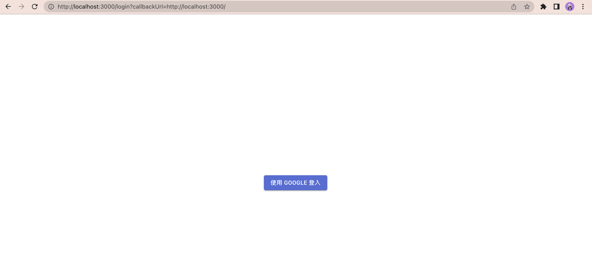
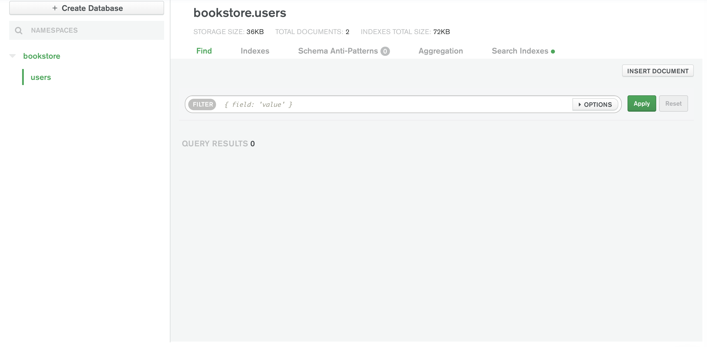

# 第三章

- 概述
- 初訪 `next-auth`
  - GCP（Google Cloud Platform）設定
  - `next-auth` 初版
- 何謂 OAuth
- session（網頁應用程式）
- Next.js API 路由
  - 基本形式 - 靜態路由
  - 動態 API 路由
  - 萬用 API 路由
- 重看 `next-auth` 初版
- 部署上 Vercel
- 前端改善
  - Favicon
  - Logo 字眼換成 `<Image>`
  - `<ResponsiveAppBar>` 根據登入狀態改變呈現
  - 使用我們自己的登入頁
- 將登入資訊存入 MongoDB
  - 簡單的重構
  - 測試驗證
- 總結

---

在我們開工之前，先取得`2-end`的程式碼。[2-end](https://github.com/menon-pheno/fullstack-bookstore/tree/master/book/2-end)資料夾位於[fullstack-bookstore repo](https://github.com/menon-pheno/fullstack-bookstore)`book`的目錄內。

- 如果你還沒有將 fullstack-bookstore 給 clone 下來的話，用`git clone https://github.com/menon-pheno/fullstack-bookstore`這個指令將 repo 複製到你的電腦上
- 注意：如果你想要用自己的 GitHub 帳號自己管理程式的話，你應該將我們的 repo fork 出來並且執行`git clone https://github.com/<你的 github 名稱>/fullstack-bookstore.git`。這樣你就可以將你的改動直接 push 到你的`fullstack-bookstore` repo
- 在`2-end`的資料夾內執行`yarn`來安裝所有的套件

我們在第三章有新增以下幾個套件：

- `"next-auth"`
- `"mongodb"`
- `"@next-auth/mongodb-adapter`

看一下第三章的 [package.json](https://github.com/menon-pheno/fullstack-bookstore/blob/master/book/3-end/package.json)。

請確定使用我們指定的套件跟版本，並忽略任何升級的警告。我們會定期更新套件且測試相容性。我們無法確保新的套件版本與目前的程式碼都相容，套件升級時有的時候會導致一些預料之外的問題。

記得將你第二章建立的 `.env.local` 檔案放到專案的根目錄下。到本章的尾聲時，你會另外加上：

- `GOOGLE_ID`
- `GOOGLE_SECRET`
- `NEXTAUTH_URL`
- `NEXTAUTH_SECRET`

到你的 `.env.local` 檔內。

我們鼓勵且歡迎你在閱讀本章的時候，可以在我們的 GitHub repo: [https://github.com/menon-pheno/fullstack-bookstore/issues/new](https://github.com/menon-pheno/fullstack-bookstore)回報任何 bug、錯字或是任何解釋不清楚的地方。

---

## 概述

我們到目前為止，有了一個可以和雲端 MongoDB Atlas 連接的網站，並且介紹了怎麼透過適合的 Material-UI 元件，來設計我們的頁面。這章最主要的重點在於，讓我們的網站可以進行使用者認證的功能。這章我們就要來讓網站支援 Google 登入，並且將資訊存入我們連接的 MongoDB Atlas 內。

---

## 初訪 `next-auth`

[Next.js 認證的官方建議](https://nextjs.org/docs/authentication)可以看到它建議的完整認證支援的套件是 `next-auth`。我們從善如流，安裝 `next-auth` 來使用：

```
yarn add next-auth
```

然後看一下 [next-auth 的官方說明](https://next-auth.js.org/getting-started/example#existing-project)

讓我們逐步說明每個步驟的意涵以及實作的內容。

### GCP（Google Cloud Platform）設定

由於我們這邊將會實作的是讓使用者可以透過他們的 Google 帳號來登入我們的網站，我們必須將我們的專案在 GCP 上註冊，以取得 GCP 核發給我們專案專屬的 `Client ID` 以及 `Client secret`。請參閱[GCP 註冊專案的官方文件](https://developers.google.com/identity/sign-in/web/devconsole-project)。由於官方文件相當清楚，我們不重複，就照著做，取得 OAuth 認證資料，要注意的有以下兩件事：

- `Authorized JavaScript origins` 填 `http://localhost:3000`
- `Authorized redirect URIs` 填 `http://localhost:3000/api/auth/callback/google`

另外一提，當我們要部署上 Vercel 的時候，要再各自新增雲端網址的 URI。

將取得的 `Client ID` 及 `Client Secret` 放到我們的 `.env.local` 檔內：

```
GOOGLE_ID="{你的 Google Client ID}"
GOOGLE_SECRET="{你的 Google Client Secret}"
```

### `next-auth` 初版

我們先來快速在我們的專案上實作一個有實際達到使用 Google 登入功能的階段性，然後再來解釋過程並且逐步改戰。

1. 新增 `pages/api/auth/[...nextauth].js` 這個檔案（同時新增 `pages/api` 以及 `pages/api/auth` 這兩個資料夾），內容如下：

   ```JavaScript
   import NextAuth from "next-auth";
   import GoogleProvider from "next-auth/providers/google";

   export default NextAuth({
    providers: [
      GoogleProvider({
        clientId: process.env.GOOGLE_ID,
        clientSecret: process.env.GOOGLE_SECRET,
      }),
    ],
    secret: process.env.NEXAUTH_SECRET,
   });
   ```

   - 上面的 `secret` 屬性，你可以使用終端機執行 `openssl rand -base64 32` 來取得一個安全性夠高的字串，然後將這個值加入到 `.env.local` 內
   - 另外在 `.env.local` 上加上 `NEXAUTH_URL="http://localhost:3000"` 這個環境變數

2. `pages/_app.js` 修改成以下（我把更動的部分上面加了註解）：

   ```JavaScript
   import PropTypes from "prop-types";
   import { CacheProvider } from "@emotion/react";
   import { CssBaseline } from "@mui/material";
   import { ThemeProvider } from "@mui/material/styles";
   import Head from "next/head";
   // 使用 `next-auth/react` 來紀錄使用者的 session
   import { SessionProvider } from "next-auth/react";

   import createEmotionCache from "../styling/createEmotionCache";
   import basicTheme from "../styling/themes/basicTheme";

   const clientSideEmotionCache = createEmotionCache();

   export default function MyApp(props) {
     const {
       Component,
       // pageProps 多補上一個 session 屬性
       pageProps: { session, ...pageProps },
       emotionCache = clientSideEmotionCache,
     } = props;
     return (
       // 將我們原本 _app.js 所回傳的元件，用 <SessionProvider> 包覆起來
       <SessionProvider session={session}>
         <CacheProvider value={emotionCache}>
           <Head>
             <meta name="viewport" content="initial-scale=1, width=device-width" />
           </Head>
           <ThemeProvider theme={basicTheme}>
             <CssBaseline />
             <Component {...pageProps} />
           </ThemeProvider>
         </CacheProvider>
       </SessionProvider>
     );
   }

   MyApp.propTypes = {
     Component: PropTypes.elementType.isRequired,
     emotionCache: PropTypes.object,
     pageProps: PropTypes.object.isRequired,
   };

   ```

3. `pages/index.js` 更動如下（我一樣在更動處加上註解）：

   ```JavaScript
   import Head from "next/head";
   // 使用 next-auth/react 所提供的功能
   import { useSession, signIn, signOut } from "next-auth/react";

   import dbConnect from "../lib/dbConnect";
   import User from "../models/User";
   import Header from "../components/Header";

   const Home = ({ users }) => {
     const { data: session } = useSession();
     return (
       <>
         <Head>
           <title>首頁</title>
           <meta name="描述" content="這是關於首頁的描述" />
         </Head>
         <Header />
         <p>從 MongoDB Atlas 取得資料</p>
         {users.map((user) => (
           <div key={user._id}>
             <p>{user.name}</p>
           </div>
         ))}

         {/*下面多了一個區塊做登入相關的展示*/}
         <p>登入測試</p>
         {session ? (
           <>
             以 {session.user.email} 登入 <br />
             <button onClick={() => signOut()}>登出</button>
           </>
         ) : (
           <>
             未登入 <br />
             <button onClick={() => signIn()}>登入</button>
           </>
         )}
       </>
     );
   };

   // 從 MongoDB 取得 user(s) 資訊

   export async function getServerSideProps() {
     await dbConnect();

     const result = await User.find({});
     const users = result.map((doc) => {
       const user = doc.toObject();
       user._id = user._id.toString();
       return user;
     });

     return { props: { users: users } };
   }

   export default Home;

   ```

我們看一下 `yarn dev` 的結果：


網頁下方就是我們在 `pages/index.js` 暫時加上的測試區，點擊`登入`按鈕：


網址列的值可以稍微注意一下，晚點的說明會提到。點擊`Sign in with Google`：


一樣注意一下網址列，它是指向 Google 所提供的外部網頁，不是我們自己的網站。點選一個想要登入的帳號：


可以看到，我們的頁面（http://localhost:3000）現在顯示已登入（如果你點擊`登出`也會對應的登出）。

總結一下，透過 `next-auth` 進行認證的功能其實相當簡單：

1. 我們加了一個 `[...nextauth].js` Next.js API 路由（待會說明 Next.js API 路由）
   - 裡面指定了我們要採取的認證方式（`GoogleProvider`）
2. 在 `_app.js` 包覆了一個 `SessionProvider` 讓我們的專案都可以存取到使用者是否登入的資訊（待會說明 session 的概念）
3. 而處理 Google OAuth 的細節跟實作則被 `next-auth` 給包辦了（待會說明 OAuth 的觀念）

讓我們在接下來的三個小節，反序地說明以上幾個重點觀念：OAuth、session、以及 Next.js 的 API 路由。有了這些觀念後，回頭看前面的程式碼應該會好理解很多。

---

## 何謂 OAuth

[OAuth Wikipedia 說明](https://en.wikipedia/wiki/OAuth) 裡可以看到，OAuth 是 Open Authorization 的簡寫。它本身是一套公開的標準，這個標準能夠讓使用者可以在不公開自己帳號的密碼之前提下，提供外部網站或是軟體所需要的資訊。以我們上面的實際程式碼為例子，可以看到我們在進行完登入後，於我們的 `http://localhost:3000` 有顯示使用者的 email（我拿截圖的 `pheno.the.best@gmail` 為例），但是登入的過程中，我們的網站都沒有接觸到 `pheno.the.best@gmail.com` 在 Google 的密碼。上面有提到，注意到實際進行登入行為（也就是輸入帳密的過程），是在 Google 所提供的頁面，跟我們網站本身無關，可以簡化的先想成，是在 Google 端登入成功後，Google 將 `pheno.the.best@gmail.com` 這樣的資訊回傳到我們的網站，因此我們是在沒有接觸到使用者的真正密碼的情況下完成了登入。

目前世界上多數的大公司（例如，Amazon、Google、Facebook、Microsoft 及 Twitter 等）都有支援這套標準。某種程度是對外部網站以及對各大公司的一個雙贏局面，對正在起步中的網站，要吸引使用者自行願意註冊帳號其實是很難的，如果網站提供 Google 帳號登入這樣的功能（就如同我們現在的實例），那所有具有 Google 帳號的使用者都變成了我們的潛在用戶。

在這邊我們在省略一些細節的情況下，利用我們上節寫的程式來大致描繪我們的網站透過 `next-auth` 如何進行 OAuth（會以 Google 為例） 的流程：

1. 當使用者在我們的網頁（http://localhost:3000）上點擊`登入`按鍵時
   1. 我們的 `onClick` 會呼叫 `next-auth` 提供的 `signIn()` 函式
   2. `signIn()` 實際上是會透過瀏覽器呼叫 `GET {ROOT_URL}/api/auth/signin` 的一個 HTTP request
   3. `GET {ROOT_URL}/api/auth/signin` 則是會被我們定義的 `pages/api/auth/[...nextauth].js` 給處理（這在後面討論 Next.js API 路由的時候，會比較清楚）。但是簡單看的話，可以看到 HTTP request 的 `/api/auth` 對應到 `(pages)/api/auth`，可以理解為 `[...nextauth].js` 這個檔案會處理這個 HTTP request
   4. `[...nextauth].js` 裡的 `NextAuth` 實際上會回傳給瀏覽器一個 `next-auth` 產出的頁面，這個頁面上會列出我們所設定的登入選項（也就是 `providers` 屬性）。因為我們只有設定一個 `provider`（`GoogleProvider`），因此回傳的頁面就只有 Google 這個選項：
      
      註：有興趣的話可以嘗試看看多加一個 `provider` 看看結果是什麼
2. 瀏覽器會渲染呈現收到 `next-auth` 所回傳的頁面（也就是正上方的截圖）。當使用者點擊`Sign in with Google` 這個按鈕時
   1. 瀏覽器會發出一個 `POST {ROOT_URL}/api/auth/signin/google` 的 HTTP 請求
   2. 這個請求一樣會是被我們的 `pages/api/auth/[...nextauth].js` 給處理
      - `[...nextauth].js` 所 export 的 `NextAuth` 會幫我們做一系列的設定，諸如設定我們打算要從 Google 端取得的資料範疇（scope，我們在網頁呈現的 email 就是 scope 的一部份）、Google 的 client ID 還有設定處理 Google 會做的 callback URL 等項目
   3. 上述步驟設定完後，`next-auth` 會從我們的 Next.js 伺服器發送 `GET google.com/login/oauth2/auth/` 也就是對外部的 Google 伺服器發送 HTTP request，而這個 request 會帶著上面第二步驟的準備好的資訊
   4. Google 的伺服器在收到 HTTP 請求後會回傳它自己的登入頁面到瀏覽器
      
3. 瀏覽器會渲染從 Google 收到的登入頁面（也就是正上方的截圖，並請注意到，這是 Google 提供的頁面，跟我們的專案無關，看網址列就可以發現）。使用者選擇 Google 帳號，並且輸入帳密後，瀏覽器會將帳密以 HTTP POST 的方式傳到 Google 伺服器（詳細網址由 Google 控制，可能會變動），讓 Google 的伺服器來驗證
   1. Google 的伺服器端驗證使用者的帳密正確
   2. Google 的伺服器會產生一個一次性的授權碼（access code）並且透過我們在前面 GCP 小節中設定的 `Authorized redirect URIs` callback 將這個一次性授權碼傳到 Next.js 的伺服器，以實際的例子，Google 伺服器會對我們的 Next.js 呼叫 `GET http://localhost:3000/api/auth/callback/google?code={一次性的授權碼}` 的 HTTP 請求，而這個請求一樣是 `[...nextauth].js` 會來處理
   3. `[...nextauth].js` 會在拿到一次性的授權碼後，用此授權碼向 Google 伺服器請求以取得可以存取所指定的資料範疇的 access token，我們的 Next.js 伺服器會透過 `next-auth` 對 Google 伺服器發出類似於 `POST google.com/login/oauth/access_token {code: 前面步驟取得的一次性授權碼}` 的 HTTP 請求
   4. Google 伺服器確認一次性的授權碼無誤後就會回傳 access token 給我們的 Next.js 伺服器
   5. 我們的 Next.js 伺服器有了 access token 後就可以取得資料範疇（scope）內所允許的資料，例如我們在頁面上呈現的使用者 email 等資訊
   6. `next-auth` 接著會產生所謂的 session token（待會說明，但是可以先想成是登入成功的相關資訊）並且將之存放（這也就是我們在 `pages/_app.js` 內 `SessionProvider` 會存有的資料），而由於 `pages/_app.js` 會將 `session` 資訊提供到所有的頁面，因此所有的頁面都可以被當作是已登入
4. 使用者在瀏覽器上看到我們登入網站了！

---

## session（網頁應用程式）

我們這小節的名稱可以看到一點澄清，因為 session 這個詞在資訊科學領域有很多地方都會使用。在接下來討論的 session，我們專指的是網頁應用程式（web application）的 session，當然，這也就適用於我們目前實際在開發的專案。那 session 到底是什麼？

簡言之，我們在開發網站的時候，往往會需要將與某使用者相關的資訊，暫時性的存放在伺服器端。舉個簡單的例子，假設有兩位使用者 John 及 Jean 在各自的電腦上登入我們的網站，我們當然會希望我們的網站要知曉現在有兩位使用者登入，並且 John 及 Jean 的電腦只看得到屬於自己帳號該有的資料。因此，在伺服器端就會需要存放兩組資料，一份是 John 的相關資訊，另一份是 Jean 的相關資訊。先撇開細節，但是在伺服器端所存放的使用者資訊就是我們所說的 session。以上面的例子來看，我們的伺服器就會存放兩個 session，一個是屬於 John 的，另外一個屬於 Jean 的。示意圖如下：


幾個重點值得注意：

- 前面提到的 session 是暫時性的，常見的幾個會清空 session 的情境是：
  - 使用者登出
  - 通常 session 會設定一個使用期限，使用期限到的時候會刪除 session 資訊
- 一個 session 只會對應到一個使用者（一個使用者其實可以對應到多個 session，但是這個情境我們暫時不討論，最常見的狀態通常都是一個使用者對應一個 session）
- 雖然示意圖看到 session 是存放於伺服器內，這不是唯一的做法
  - 我們目前的程式碼的確是將 session 資訊存於 Next.js 的記憶體內
  - 晚點我們會調整成將 session 存放到 MongoDB Atlas 內，將 session 存放到資料庫內是個常見的做法，因為可以確保資料不會因為 Next.js 伺服器關閉或重啟而消失
- 示意圖可以看到 `John Session 識別` 及 `Jean Session 識別` 這兩個箭頭，這代表的是從各自使用者的瀏覽器嘗試對 Next.js 伺服器發出 HTTP request 時要傳送某種資訊，讓伺服器知道這個 HTTP request 是要使用/存取對應的正確 session 資訊，至於怎麼傳送，還有傳送的詳情基本上有滿多變化的，[next-auth session 設定官方文件](https://next-auth.js.org/configuration/options#session) 可以看到 `next-auth` 有提供許多設定的彈性

---

## Next.js API 路由

上面程式碼我們用到了 Next.js 提供的一個重要功能：[Next.js API 路由](https:nextjs.org/docs/api-routes/introduction)，這節我們對這個功能進行說明。

Next.js 的 API 路由功能是一個方便我們在 Next.js 專案裡建立 Web API 的方式。簡言之，所有放在 `pages/api` 目錄下的檔案都會被轉換成一個 Web API，會被 Next.js 當作一個 API 端口（API endpoint）處理，而不是像 `pages` 以及其他 `pages/other_folders` 裡的檔案被當作網頁 react 元件般處理。

因為我們的 `pages/api/auth/[...nextauth].js` 位於 `pages/api` 內，所以它會是一個 API 端口，而非網頁頁面。`[...nextauth]` 這樣的檔案命名方式是有特別意義的，我們先看一下比較簡單的例子，再回頭看這樣命名的檔案代表的意思。

### 基本形式 - 靜態路由

用一個簡單的例子，新增一個 `pages/api/test.js`，內容如下：

```JavaScript
export default function handler(req, res) {
  res.status(200).json({ testing: "success" });
}
```

如果你這時候造訪 `http://localhost:3000/api/test`：


可以看到，`pages/api/test.js` 會被對應到一個 API（名為 `api/test`）的端口，而非一個 React 頁面。原則上，你在 `pages/api` 目錄放什麼 `xxx.js` 檔案，Next.js 就會產出對應的 `{ROOT_URL}/api/xxx` 的 API 端口（不過檔案名稱是有限制，不能有 `[]`，因為 `[]` 是保留給我們接下來要提到的**動態 API 路由**）。

### 動態 API 路由

往往，我們 API 端口會需要有動態的特性，以我們的書店專案來說，多半會需要類似於：

```JavaScript
{ROOT_URL}/api/books/{bookId}
```

這樣形式的 API，透過上面這樣的 API 取得不同 `bookId` 的書本內容：

```JavaScript
{ROOT_URL}/api/books/1 => 取得 bookId == 1 的書本資訊
{ROOT_URL}/api/books/2 => 取得 bookId == 2 的書本資訊
...
```

可想見的，不可能去不斷地自己做 `pages/api/books/1.js`、`pages/api/books/2.js` 等檔案。而 [Next.js 的動態 API 路由](https://nextjs.org/docs/api-routes/dynamic-api-routes) 正是可以支持這樣需求的方式。做法是定義一個檔名由中括號所包起來的 `[fileName]` 來表示這會是一個動態 API 路由。我們用個實際範例來看看。

新增一個 `pages/api/books/[bookId].js` 檔案（也新增 `books` 目錄），內容如下：

```JavaScript
export default function handler(req, res) {
  const { bookId } = req.query;
  res.end(
    `BookId: ${bookId}, usually get bookId's related data from DB and return as well`
  );
}
```


你如果試著改變 `bookId`，你可以看到這個動態路由都會給予正確的回應。有了 API 靜態以及動態路由的概念，我們來看一下最後一個觀念 - 萬用 API 路由（catch all），我們前面的 `[...nextauth].js` 正是使用所謂的萬用 API 路由。

### 萬用 API 路由

[Next.js 的萬用 API 路由](https://nextjs.org/docs/api-routes/dynamic-api-routes) 簡單說是前節的動態路由的延伸，我們本來的範例 `pages/api/books/[bookId].js` 可以動態的回應不同 `bookId` 的 API 端口。如果我們在中括號內加上 `...` 則這個路由就會變身成萬用路由。主要是可以支援額外的子路徑。我們沿用之前的範例，相信會比較清楚。將 `pages/api/books/[bookId].js` 改名為 `pages/api/books/[...bookInfo].js`，內容如下：

```JavaScript
export default function handler(req, res) {
  const { bookInfo } = req.query;
  res.end(`Book: ${bookInfo.join("-")}`);
}
```

如果這時候造訪 `http://localhost:3000/api/books/343/4/2/3`：


可以看到上面的結果，不論 `{ROOT_URL}/api/books/` 之後有多少層的 `/` 都會被我們的 `[...bookInfo].js` 給處理，從實用面來看，你可以想成這個萬用路由可以拿來回應某本書的某章的某節的某小節（可以無限延伸，假設你的書真的很長的話）：

```JavaScript
{ROOT_URL}/api/books/{bookId}/{chapterId}/{sectionId}/{subsectionId}/...無止境
```

而我們的 `pages/api/auth/[...nextauth].js` 正是一個萬用 API 路由。照我們定義的路徑來看，以下的幾個範例 API 路由都會被我們的 `[...nextauth].js` 給接收並且處理：

```
{ROOT_URL}/api/auth/test
{ROOT_URL}/api/auth/something
{ROOT_URL}/api/auth/firstLevel/again
...
```

簡單來說，所以 `{ROOT_URL}/api/auth/` 開頭的 API 呼叫都會被 `[...nextauth].js` 給處理。

---

## 重看 `next-auth` 版

有了 OAuth、session 及 Next.js API 路由的觀念後，我們可以回頭來說明前面的程式了。可以看到 `next-auth` 幫我們處理了很多事情。

我們的 `http://localhost:3000` 會顯示 `pages/index.js`，而在未登入的情況下會有一個 `登入` 按鈕：

```JSX
<button onClick={() => signIn()}>登入</button>
```

- 可以看到當點擊這個按鈕時，會觸發 `signIn()` 這個函式，這個 `signIn()` 函式是我們在檔案的上方 `import { useSession, signIn, signOut } from "next-auth/react";` 所引入的
- `signIn()` 實際上會對 `http://localhost:3000/api/auth/signin` 發出 `GET` HTTP 請求，而如同我們前面提到的，這會被我們的 `pages/api/auth/[...nextauth].js` 萬用路由接收並且處理，並且回傳給瀏覽器一個選擇登入方式的選單頁面（選單只有 Google 這個選項，由於我們在 `[...nextauth].js` 裡面只有設定 Google 這個 `provider` 屬性）
- 使用者在看到登入選單並且點擊 `Sign in with Google` 時，會對 `http://localhost:3000/api/auth/signin/google` 發出 `POST` HTTP 請求，然後我們再次透過 `[...nextauth].js` 萬用路由來處理這個請求（接下來就是 OAuth 這個標準所制定的流程了）
  - `next-auth` 會在這時提供 Google 伺服器所需要的資訊，並且與 Google 伺服器溝通後轉導到 Google 所提供的登入頁
    - 使用者提供正確的帳密給 Google
  - Google 會對 `http://localhost:3000/api/auth/callback/google?code={oneTimeToken}` 發出 `GET` HTTP 請求（可以看到 `[...nextauth].js` 萬用路由的功效，處理了各種以 `/api/auth/` 為開頭的 API 端口）
    - `next-auth` 透過 `[...nextauth].js` 接收來自 Google 的 `{oneTimeToken}` 並透過這個 token 取得這個 Google 使用者的資訊
    - `next-auth` 接著透過 Google 使用者的資訊在 Next.js 伺服器端建立 `session` 資訊，並且透過 `SessionProvider` 從 `pages/_app.js` 將 `session` 資訊傳入到所有的頁面內

---

## 部署上 Vercel

我們要將目前的專案部署到 Vercel 需要做一些設定：

1. 在 Vercel 網站上我們將我們在 `.env.local` 的環境變數加上：

- `NEXTAUTH_SECRET`
- `GOOGLE_ID`
- `GOOGLE_SECRET`

2. 在 GCP 上我們要將專案雲端的網址加到 `Authorized JavaScript origins` 及 `Authorized redirect URIs`：


大功告成，我們專案在雲端也復活了。

---

## 前端改善

我們來換換口味，來玩玩前端的部分。

### Favicon

我想該是讓我們的網站有個 Favicon 的時候了。步驟如下：

1. 先取得需要的圖像檔
2. 將圖像透過 Next.js 的 `next/head` 來置入網站中

#### 取得需要的圖像檔

我們是使用免費的 [Real Favicon Generator](https://realfavicongenerator.net) 來產生我們的 favicon 圖像。它可以讓我們上傳圖像檔（唯一的要求是圖檔至少要 70px X 70px 像素），然後這個網站就會幫我們產出所有需要的 favicon 檔案。這邊有提供一個範例的 png 檔讓你使用：[範例 png 檔](https://assets.coderrocketfuel.com/build-a-coding-blog-floppy-disk.png)

要打算轉換成 favicon 格式的圖準備好後，造訪 [Real Favicon Generator](https://realfavicongenerator.net)，點選 `Select your Favicon image` 按鈕，並且將你的圖上傳：


這會帶你到一些可以做設定的頁面，基本上可以略過，然後在最底下點選 `Generate your Favicons and HTML code`：


這網站會產出 favicon 的圖檔，點選 `Favicon package` 來下載：


這包就是我們需要的 favicon 圖檔。

#### 將 favicon 加到 Next.js

[Next.js 關於靜態檔案的處理](https://nextjs.org/docs/basic-features/static-file-serving) 可以看到，靜態檔案可以放在根目錄下的 `public` 目錄下，而在程式裡面可以透過 `/` 這個 URL 來存取這些檔案。

新增 `public` 資料夾，並且將以下幾個檔案放置到 `/public` 目錄內：

- `favicon.ico`
- `favicon-16x16.png`
- `favicon-32x32.png`
- `android-chrome-192x192.png`
- `android-chrome-256x256.png`
- `safari-pinned-tab.svg`
- `apple-touch-icon.png`
- `site.webmanifest`

註：下載下來的 zip 檔內可能還有其他的檔案，剩餘的不需要。

當上述的檔案放到 `public` 目錄後，我們的網站就可以存取到這些檔案，你可以試著在瀏覽器造訪 `http://localhost:3000/favicon.ico` 就可以看到你的 icon 圖片，換檔案名也可以看到其他的圖檔。

我們接著就可以使用 `next/head` 的 `<Head>` 元件來將這些 favicon 加到 html 裡的 `<head>` 元素內。由於我們打算讓整個網站都使用這個 favicon，所以我們可以在 `pages/_app.js` 的 `<Head>` 元素內加上這些設定：

```JavaScript
<link
  rel="icon"
  type="image/png"
  sizes="32x32"
  href="/favicon-32x32.png"
/>
<link
  rel="icon"
  type="image/png"
  sizes="16x16"
  href="/favicon-16x16.png"
/>
<link
  rel="apple-touch-icon"
  sizes="180x180"
  href="/apple-touch-icon.png"
/>
<link rel="manifest" href="/site.webmanifest" />
<link rel="mask-icon" href="/safari-pinned-tab.svg" color="#5bbad5" />
```

程式碼本身應該不難懂，會有這麼多檔案主要是透過 `rel` 這個標籤來指定不同的瀏覽器以及手機裝置該使用哪個對應的 favicon 圖。下面簡要的描述一下各個檔案與瀏覽器以及裝置之間的關係：

- `favicon.ico`：這是古早的 Internet Explorer 會使用的，不過一般的瀏覽器，假設沒有透過 `rel` 指定的話，就會預設使用這個圖檔

- `favicon-16x16.png`：目前多數瀏覽器都是使用這個

- `favicon-32x32.png`：Mac OS 的 Safari 瀏覽器使用

- `android-chrome-192x192.png`：Android 裝置的 Chrome 瀏覽器在偏低解析度的螢幕上使用這個

- `android-chrome-256x256.png`：Android 裝置的 Chrome 瀏覽器在較高解析度的螢幕上使用這個

- `safari-pinned-tab.svg`：當使用者在 iOS 裝置上將你的網站釘選時，會使用這個檔案來呈現

- `apple-touch-icon.png`：iPhone 及 iPad 的使用者可以將網頁轉成一個應用程式圖示並放置到裝置的主畫面，外觀會像是一個 iOS 原生的應用程式。這時候會使用這個檔案

### Logo 字眼換成 `<Image>`

我們目前的 `components/ResponsiveAppBar.js` 只有簡單的顯示 `LOGO` 這樣的字串。我們來將 `LOGO` 這個地方改為放一個真正的 logo 圖。我們將會使用 [Next.js 的 Image 元件](https://nextjs.org/docs/basic-features/image-optimization) 來呈現 logo。

1. 先一樣的把你的 logo 圖放到 `public` 資料夾內，將之取名為 `appbar-logo.png`

2. 在 `components/ResponsiveAppBar.js` 內引用 `next/image`：

   ```JavaScript
   import Image from "next/image";
   ```

3. 將 `LOGO` 字串替換成以下：

   ```JavaScript
   <Image src="/appbar-logo.png" alt="logo" width="32" height="32" />
   ```

   - 注意一下，`LOGO` 字串在 `components/ResponsiveAppBar.js` 內有兩個地方喔

你的 `components/ResponsiveAppBar.js` 應該變成：

```JavaScript
import * as React from "react";
import AppBar from "@mui/material/AppBar";
import Box from "@mui/material/Box";
import Toolbar from "@mui/material/Toolbar";
import IconButton from "@mui/material/IconButton";
import Typography from "@mui/material/Typography";
import Menu from "@mui/material/Menu";
import MenuIcon from "@mui/icons-material/Menu";
import Container from "@mui/material/Container";
import Avatar from "@mui/material/Avatar";
import Button from "@mui/material/Button";
import Tooltip from "@mui/material/Tooltip";
import MenuItem from "@mui/material/MenuItem";
import Link from "next/link";
import Image from "next/image";

const ResponsiveAppBar = ({ options, pages }) => {
  const [anchorElNav, setAnchorElNav] = React.useState(null);
  const [anchorElUser, setAnchorElUser] = React.useState(null);

  const handleOpenNavMenu = (event) => {
    setAnchorElNav(event.currentTarget);
  };
  const handleOpenUserMenu = (event) => {
    setAnchorElUser(event.currentTarget);
  };

  const handleCloseNavMenu = () => {
    setAnchorElNav(null);
  };

  const handleCloseUserMenu = () => {
    setAnchorElUser(null);
  };

  return (
    <AppBar position="static">
      <Container maxWidth="xl">
        <Toolbar disableGutters>
          <Typography
            variant="h6"
            noWrap
            component="div"
            sx={{ mr: 2, display: { xs: "none", md: "flex" } }}
          >
            <Image src="/appbar-logo.png" alt="logo" width="32" height="32" />
          </Typography>

          <Box sx={{ flexGrow: 1, display: { xs: "flex", md: "none" } }}>
            <IconButton
              size="large"
              aria-label="account of current user"
              aria-controls="menu-appbar"
              aria-haspopup="true"
              onClick={handleOpenNavMenu}
              color="inherit"
            >
              <MenuIcon />
            </IconButton>
            <Menu
              id="menu-appbar"
              anchorEl={anchorElNav}
              anchorOrigin={{
                vertical: "bottom",
                horizontal: "left",
              }}
              keepMounted
              transformOrigin={{
                vertical: "top",
                horizontal: "left",
              }}
              open={Boolean(anchorElNav)}
              onClose={handleCloseNavMenu}
              sx={{
                display: { xs: "block", md: "none" },
              }}
            >
              {pages.map((page) => (
                <MenuItem key={page} onClick={handleCloseNavMenu}>
                  <Typography textAlign="center">{page}</Typography>
                </MenuItem>
              ))}
            </Menu>
          </Box>
          <Typography
            variant="h6"
            noWrap
            component="div"
            sx={{ flexGrow: 1, display: { xs: "flex", md: "none" } }}
          >
            <Image src="/appbar-logo.png" alt="logo" width="32" height="32" />
          </Typography>
          <Box sx={{ flexGrow: 1, display: { xs: "none", md: "flex" } }}>
            {pages.map((page) => (
              <Button
                key={page}
                onClick={handleCloseNavMenu}
                sx={{ my: 2, color: "white", display: "block" }}
              >
                {page}
              </Button>
            ))}
          </Box>

          <Box sx={{ flexGrow: 0 }}>
            <Tooltip title="Open settings">
              <IconButton onClick={handleOpenUserMenu} sx={{ p: 0 }}>
                <Avatar alt="Remy Sharp" src="/static/images/avatar/2.jpg" />
              </IconButton>
            </Tooltip>
            <Menu
              sx={{ mt: "45px" }}
              id="menu-appbar"
              anchorEl={anchorElUser}
              anchorOrigin={{
                vertical: "top",
                horizontal: "right",
              }}
              keepMounted
              transformOrigin={{
                vertical: "top",
                horizontal: "right",
              }}
              open={Boolean(anchorElUser)}
              onClose={handleCloseUserMenu}
            >
              {options.map((option) => (
                <div key={option.text}>
                  {option.anchor ? (
                    <MenuItem
                      onClick={(event) => {
                        event.preventDefault();
                        window.location.href = option.href;
                        handleCloseUserMenu();
                      }}
                    >
                      {option.text}
                    </MenuItem>
                  ) : (
                    <Link href={option.href} as={option.as || option.href}>
                      <MenuItem>{option.text}</MenuItem>
                    </Link>
                  )}
                </div>
              ))}
            </Menu>
          </Box>
        </Toolbar>
      </Container>
    </AppBar>
  );
};
export default ResponsiveAppBar;

```

網站現在變成：


### `<ResponsiveAppBar>` 根據登入狀態改變呈現

我們目前的 `components/ResponsiveAppBar.js` 的呈現不太對：

1. 如果在未登入時，右方不應該是一個頭像圖示

   我們在之前已經示範了如何偵測使用者是否登入，現在要做的僅是把所學的套用到 `ResponsiveAppBar.js` 內：

   - 在 `components/ResponsiveAppBar.js` 內引用 `import { useSession, signIn, signOut } from "next-auth/react";`

   - 在 `components/ResponsiveAppBar.js` 加上 `const { data: session } = useSession();` 用來判斷是否有登入

   - 我們在本來顯示頭像的地方，做一個條件式渲染（conditional rendering），假設是登入狀態，維持本來的程式碼，但是在沒有登入時，我們顯示一個登入的按鈕：

   ```JSX
    <Box sx={{ flexGrow: 0 }}>
      {session ? (
        <>
          <Tooltip title="Open settings">
            <IconButton onClick={handleOpenUserMenu} sx={{ p: 0 }}>
              <Avatar
                alt="Remy Sharp"
                src="/static/images/avatar/2.jpg"
              />
            </IconButton>
          </Tooltip>
          <Menu
            sx={{ mt: "45px" }}
            id="menu-appbar"
            anchorEl={anchorElUser}
            anchorOrigin={{
              vertical: "top",
              horizontal: "right",
            }}
            keepMounted
            transformOrigin={{
              vertical: "top",
              horizontal: "right",
            }}
            open={Boolean(anchorElUser)}
            onClose={handleCloseUserMenu}
          >
            {options.map((option) => (
              <div key={option.text}>
                {option.anchor ? (
                  <MenuItem
                    onClick={(event) => {
                      event.preventDefault();
                      window.location.href = option.href;
                      handleCloseUserMenu();
                    }}
                  >
                    {option.text}
                  </MenuItem>
                ) : (
                  <Link href={option.href} as={option.as || option.href}>
                    <MenuItem>{option.text}</MenuItem>
                  </Link>
                )}
              </div>
            ))}
          </Menu>
        </>
      ) : (
        <Button
          variant="contained"
          color="secondary"
          onClick={() => signIn()}
        >
          登入
        </Button>
    )}
   </Box>
   ```

   `components/ResponsiveAppBar.js` 現在應該如下：

```JSX
import * as React from "react";
import AppBar from "@mui/material/AppBar";
import Box from "@mui/material/Box";
import Toolbar from "@mui/material/Toolbar";
import IconButton from "@mui/material/IconButton";
import Typography from "@mui/material/Typography";
import Menu from "@mui/material/Menu";
import MenuIcon from "@mui/icons-material/Menu";
import Container from "@mui/material/Container";
import Avatar from "@mui/material/Avatar";
import Button from "@mui/material/Button";
import Tooltip from "@mui/material/Tooltip";
import MenuItem from "@mui/material/MenuItem";
import Link from "next/link";
import Image from "next/image";
import { useSession, signIn, signOut } from "next-auth/react";

const ResponsiveAppBar = ({ options, pages }) => {
  const [anchorElNav, setAnchorElNav] = React.useState(null);
  const [anchorElUser, setAnchorElUser] = React.useState(null);
  const { data: session } = useSession();

  const handleOpenNavMenu = (event) => {
    setAnchorElNav(event.currentTarget);
  };
  const handleOpenUserMenu = (event) => {
    setAnchorElUser(event.currentTarget);
  };

  const handleCloseNavMenu = () => {
    setAnchorElNav(null);
  };

  const handleCloseUserMenu = () => {
    setAnchorElUser(null);
  };

  return (
    <AppBar position="static">
      <Container maxWidth="xl">
        <Toolbar disableGutters>
          <Typography
            variant="h6"
            noWrap
            component="div"
            sx={{ mr: 2, display: { xs: "none", md: "flex" } }}
          >
            <Image src="/appbar-logo.png" alt="logo" width="32" height="32" />
          </Typography>

          <Box sx={{ flexGrow: 1, display: { xs: "flex", md: "none" } }}>
            <IconButton
              size="large"
              aria-label="account of current user"
              aria-controls="menu-appbar"
              aria-haspopup="true"
              onClick={handleOpenNavMenu}
              color="inherit"
            >
              <MenuIcon />
            </IconButton>
            <Menu
              id="menu-appbar"
              anchorEl={anchorElNav}
              anchorOrigin={{
                vertical: "bottom",
                horizontal: "left",
              }}
              keepMounted
              transformOrigin={{
                vertical: "top",
                horizontal: "left",
              }}
              open={Boolean(anchorElNav)}
              onClose={handleCloseNavMenu}
              sx={{
                display: { xs: "block", md: "none" },
              }}
            >
              {pages.map((page) => (
                <MenuItem key={page} onClick={handleCloseNavMenu}>
                  <Typography textAlign="center">{page}</Typography>
                </MenuItem>
              ))}
            </Menu>
          </Box>
          <Typography
            variant="h6"
            noWrap
            component="div"
            sx={{ flexGrow: 1, display: { xs: "flex", md: "none" } }}
          >
            <Image src="/appbar-logo.png" alt="logo" width="32" height="32" />
          </Typography>
          <Box sx={{ flexGrow: 1, display: { xs: "none", md: "flex" } }}>
            {pages.map((page) => (
              <Button
                key={page}
                onClick={handleCloseNavMenu}
                sx={{ my: 2, color: "white", display: "block" }}
              >
                {page}
              </Button>
            ))}
          </Box>

          <Box sx={{ flexGrow: 0 }}>
            {session ? (
              <>
                <Tooltip title="Open settings">
                  <IconButton onClick={handleOpenUserMenu} sx={{ p: 0 }}>
                    <Avatar
                      alt="Remy Sharp"
                      src="/static/images/avatar/2.jpg"
                    />
                  </IconButton>
                </Tooltip>
                <Menu
                  sx={{ mt: "45px" }}
                  id="menu-appbar"
                  anchorEl={anchorElUser}
                  anchorOrigin={{
                    vertical: "top",
                    horizontal: "right",
                  }}
                  keepMounted
                  transformOrigin={{
                    vertical: "top",
                    horizontal: "right",
                  }}
                  open={Boolean(anchorElUser)}
                  onClose={handleCloseUserMenu}
                >
                  {options.map((option) => (
                    <div key={option.text}>
                      {option.anchor ? (
                        <MenuItem
                          onClick={(event) => {
                            event.preventDefault();
                            window.location.href = option.href;
                            handleCloseUserMenu();
                          }}
                        >
                          {option.text}
                        </MenuItem>
                      ) : (
                        <Link href={option.href} as={option.as || option.href}>
                          <MenuItem>{option.text}</MenuItem>
                        </Link>
                      )}
                    </div>
                  ))}
                </Menu>
              </>
            ) : (
              <Button
                variant="contained"
                color="secondary"
                onClick={() => signIn()}
              >
                登入
              </Button>
            )}
          </Box>
        </Toolbar>
      </Container>
    </AppBar>
  );
};
export default ResponsiveAppBar;
```

2. 登入後，我們應該顯示登入者的頭像

- 我們先做個簡單的描述翻譯，將 `Open Settings` 改成 `開啟選單`：

  ```JSX
  <Tooltip title={"開啟選單"}>
  ```

- 我們的 `components/ResponsiveAppBar.js` 的 `<Avatar>` 元件本來是直接使用 Material-UI 的範例，裡面的 `alt` 及 `src` 是直接寫死，現在我們已經有登入後的使用者資訊，我們來將之換成實際的使用者資料。可以看到 [next-auth 的 session 物件實際內容](https://next-auth.js.org/getting-started/client) 裡面會有一個 `user` 物件，內含有 `name`、`email`、`image` 三個屬性。我們實際上在 `pages/index.js` 就有用到 `session.user.email` 來顯示登入者的 email，比照辦理將 `<Avatar>` 內的屬性改成：

  ```JSX
  <Avatar alt={session.user.name} src={session.user.image} />
  ```

3. 修好我們選單的各選項。我想對我們的選單進行以下兩個調整：

   - 登出選項實際上無效 - 這個自然是因為我們並沒有在 `ResponsiveAppBar` 內沒有使用 `next-auth`
   - 我們的 `有問題嗎？` 選項會轉導到我們的 git repository，這本身不是錯誤，但是我會希望是另開分頁到 git repository，這樣就不用讓使用者離開我們的網站

   首先，我們將 `components/Header.js` 傳入到 `ResponsiveAppBar` 的內容調整如下（可以回憶一下，之前說過把 `options` 改為物件的陣列，這時候就提供了彈性了）：

   ```JSX
   const options = [
       {
         text: "有問題嗎？",
         isExternal: true,
         href: "https://github.com/menon-pheno/fullstack-bookstore/issues",
       },
       {
         text: "登出",
         href: "/logout",
         isLogout: true,
       },
     ];
   ```

   這裡的重點是，我們依序在陣列的兩個物件中加上了 `isExternal` 及 `isLogout` 兩個屬性。`isExternal` 拿來表示這個選項是一個外部的連結，而 `isLogout` 代表這是處理登出的選項。

   我們看一下我們 `components/ResponsiveAppBar.js` 內處理傳入的選項（`options`，也就是上面 `Header` 傳入的內容）：

   ```JSX
   {options.map((option) => (
     <div key={option.text}>
       {option.anchor ? (
         <MenuItem
           onClick={(event) => {
             event.preventDefault();
             window.location.href = option.href;
             handleCloseUserMenu();
           }}
         >
           {option.text}
         </MenuItem>
       ) : (
         <Link href={option.href} as={option.as || option.href}>
           <MenuItem>{option.text}</MenuItem>
         </Link>
       )}
     </div>
   ))}
   ```

   可以看到目前只有針對 `option.anchor` 的值來對應渲染出不同的內容。我們現在則是需要多針對 `option.isLogout` 及 `option.isExternal` 來做不同的處理。先看一下改完的樣子，我們再來說明：

   ```JSX
   {options.map((option) => {
     if (option.isLogout) {
       return (
         <div key={option.text}>
           <MenuItem onClick={() => signOut()}>
             {option.text}
           </MenuItem>
         </div>
       );
     }

     if (option.isExternal) {
       return (
         <div key={option.text}>
           <MenuItem>
             <a
               href={option.href}
               target="_blank"
               rel="noopener noreferrer"
               style={{
                 color: "inherit",
                 textDecoration: "none",
               }}
             >
               {option.text}
             </a>
           </MenuItem>
         </div>
       );
     }

     if (option.anchor) {
       return (
         <div key={option.text}>
           <MenuItem
             onClick={(event) => {
               event.preventDefault();
               window.location.href = option.href;
               handleCloseUserMenu();
             }}
           >
             {option.text}
           </MenuItem>
         </div>
       );
     }

     return (
       <div key={option.text}>
         <Link href={option.href} as={option.as || option.href}>
           <MenuItem>{option.text}</MenuItem>
         </Link>
       </div>
     );
   })}
   ```

   程式碼看起來很多，但是改動的其實不大，重點如下：

   - 不直接使用 `option.anchor` 作為條件式渲染的判斷，因為現在 `option` 的類型變多了，以前只有 `option.anchor` 與否；現在則是有 `option.isLogout`、`option.isExternal`、`option.anchor` 還有一個前三項都不符合的狀態（`!option.isLogout && !option.isExternal && !option.anchor`）。因此我們改變成針對 `option` 的屬性來 `return` 要渲染回傳的 react 元件

   - 處理 `option.isLogout` 的方式是採用我們在 `pages/index.js` 內呼叫 `next-auth` 所提供的 `signOut()`：

     ```JSX
     <div key={option.text}>
       <MenuItem onClick={() => signOut()}>
         {option.text}
       </MenuItem>
     </div>
     ```

   - 處理 `option.isExternal` 的方式則是把 `<MenuItem>` 內放入一個 `<a target="_blank">` 的標籤，這樣就會另開分頁，而不是直接離開我們的網站：

     ```JSX
     <div key={option.text}>
       <MenuItem>
         <a
           href={option.href}
           target="_blank"
           rel="noopener noreferrer"
           style={{
             color: "inherit",
             textDecoration: "none",
           }}
         >
           {option.text}
         </a>
       </MenuItem>
     </div>
     ```

   - 其餘的程式碼跟之前一樣，差異僅是使用 `if` 來判斷 `option.anchor`，而非使用 `option.anchor &&` 這樣的語法

你的 `components/ResponsiveAppBar.js` 現在變成了：

```JSX
import * as React from "react";
import AppBar from "@mui/material/AppBar";
import Box from "@mui/material/Box";
import Toolbar from "@mui/material/Toolbar";
import IconButton from "@mui/material/IconButton";
import Typography from "@mui/material/Typography";
import Menu from "@mui/material/Menu";
import MenuIcon from "@mui/icons-material/Menu";
import Container from "@mui/material/Container";
import Avatar from "@mui/material/Avatar";
import Button from "@mui/material/Button";
import Tooltip from "@mui/material/Tooltip";
import MenuItem from "@mui/material/MenuItem";
import Link from "next/link";
import Image from "next/image";
import { useSession, signIn, signOut } from "next-auth/react";

const ResponsiveAppBar = ({ options, pages }) => {
  const [anchorElNav, setAnchorElNav] = React.useState(null);
  const [anchorElUser, setAnchorElUser] = React.useState(null);
  const { data: session } = useSession();

  const handleOpenNavMenu = (event) => {
    setAnchorElNav(event.currentTarget);
  };
  const handleOpenUserMenu = (event) => {
    setAnchorElUser(event.currentTarget);
  };

  const handleCloseNavMenu = () => {
    setAnchorElNav(null);
  };

  const handleCloseUserMenu = () => {
    setAnchorElUser(null);
  };

  return (
    <AppBar position="static">
      <Container maxWidth="xl">
        <Toolbar disableGutters>
          <Typography
            variant="h6"
            noWrap
            component="div"
            sx={{ mr: 2, display: { xs: "none", md: "flex" } }}
          >
            <Image src="/appbar-logo.png" alt="logo" width="32" height="32" />
          </Typography>

          <Box sx={{ flexGrow: 1, display: { xs: "flex", md: "none" } }}>
            <IconButton
              size="large"
              aria-label="account of current user"
              aria-controls="menu-appbar"
              aria-haspopup="true"
              onClick={handleOpenNavMenu}
              color="inherit"
            >
              <MenuIcon />
            </IconButton>
            <Menu
              id="menu-appbar"
              anchorEl={anchorElNav}
              anchorOrigin={{
                vertical: "bottom",
                horizontal: "left",
              }}
              keepMounted
              transformOrigin={{
                vertical: "top",
                horizontal: "left",
              }}
              open={Boolean(anchorElNav)}
              onClose={handleCloseNavMenu}
              sx={{
                display: { xs: "block", md: "none" },
              }}
            >
              {pages.map((page) => (
                <MenuItem key={page} onClick={handleCloseNavMenu}>
                  <Typography textAlign="center">{page}</Typography>
                </MenuItem>
              ))}
            </Menu>
          </Box>
          <Typography
            variant="h6"
            noWrap
            component="div"
            sx={{ flexGrow: 1, display: { xs: "flex", md: "none" } }}
          >
            <Image src="/appbar-logo.png" alt="logo" width="32" height="32" />
          </Typography>
          <Box sx={{ flexGrow: 1, display: { xs: "none", md: "flex" } }}>
            {pages.map((page) => (
              <Button
                key={page}
                onClick={handleCloseNavMenu}
                sx={{ my: 2, color: "white", display: "block" }}
              >
                {page}
              </Button>
            ))}
          </Box>

          <Box sx={{ flexGrow: 0 }}>
            {session ? (
              <>
                <Tooltip title={"開啟選單"}>
                  <IconButton onClick={handleOpenUserMenu} sx={{ p: 0 }}>
                    <Avatar alt={session.user.name} src={session.user.image} />
                  </IconButton>
                </Tooltip>
                <Menu
                  sx={{ mt: "45px" }}
                  id="menu-appbar"
                  anchorEl={anchorElUser}
                  anchorOrigin={{
                    vertical: "top",
                    horizontal: "right",
                  }}
                  keepMounted
                  transformOrigin={{
                    vertical: "top",
                    horizontal: "right",
                  }}
                  open={Boolean(anchorElUser)}
                  onClose={handleCloseUserMenu}
                >
                  {options.map((option) => {
                    if (option.isLogout) {
                      return (
                        <div key={option.text}>
                          <MenuItem onClick={() => signOut()}>
                            {option.text}
                          </MenuItem>
                        </div>
                      );
                    }

                    if (option.isExternal) {
                      return (
                        <div key={option.text}>
                          <MenuItem>
                            <a
                              href={option.href}
                              target="_blank"
                              rel="noopener noreferrer"
                              style={{
                                color: "inherit",
                                textDecoration: "none",
                              }}
                            >
                              {option.text}
                            </a>
                          </MenuItem>
                        </div>
                      );
                    }

                    if (option.anchor) {
                      return (
                        <div key={option.text}>
                          <MenuItem
                            onClick={(event) => {
                              event.preventDefault();
                              window.location.href = option.href;
                              handleCloseUserMenu();
                            }}
                          >
                            {option.text}
                          </MenuItem>
                        </div>
                      );
                    }

                    return (
                      <div key={option.text}>
                        <Link href={option.href} as={option.as || option.href}>
                          <MenuItem>{option.text}</MenuItem>
                        </Link>
                      </div>
                    );
                  })}
                </Menu>
              </>
            ) : (
              <Button
                variant="contained"
                color="secondary"
                onClick={() => signIn()}
              >
                登入
              </Button>
            )}
          </Box>
        </Toolbar>
      </Container>
    </AppBar>
  );
};
export default ResponsiveAppBar;

```

### 使用我們自己的登入頁

`next-auth` 實際上有提供許多可以用來客製化的彈性。由於我們寫的是一個中文網站，目前 `next-auth` 自己提供的登入頁令人不太滿意。我們在這邊示範一下如何使用我們自己的登入頁。[NextAuth 可以透過設定選擇使用自己的登入頁](https://next-auth.js.org/configuration.pages)，做法是在 `pages/api/auth/[...nextauth].js` 加上一個 `pages` 屬性，我們在 `pages/api/auth/[...nextauth].js` 調整如下：

```JavaScript
import NextAuth from "next-auth";
import GoogleProvider from "next-auth/providers/google";

export default NextAuth({
  providers: [
    GoogleProvider({
      clientId: process.env.GOOGLE_ID,
      clientSecret: process.env.GOOGLE_SECRET,
    }),
  ],
  secret: process.env.NEXAUTH_SECRET,
  // 新增 pages 屬性
  pages: {
    signIn: "/login",
  },
});
```

`pages` 裡的 `signIn` 屬性會指定當我們呼叫 `next-auth` 的 `signIn()` 時，會轉導至指定的頁面（我們指定的是 `/login`），而非使用 `next-auth` 預設，“送”的頁面。

既然指定了 `/login` 為我們的登入頁，新增 `pages/login.js`，內容如下：

```JSX
import { Grid, Button } from "@mui/material";
import { signIn, getProviders } from "next-auth/react";
import { useRouter } from "next/router";

function Login({ providers }) {
  const router = useRouter();
  return (
    <>
      <Grid
        container
        spacing={0}
        direction="column"
        alignItems="center"
        justifyContent="center"
        style={{ minHeight: "100vh" }}
      >
        <Grid item xs={3}>
          {Object.values(providers).map((provider) => {
            return (
              <div key={provider.name}>
                <Button
                  variant="contained"
                  onClick={() =>
                    signIn(provider.id, {
                      callbackUrl: router.query.callbackUrl,
                    })
                  }
                >
                  使用 {provider.name} 登入
                </Button>
              </div>
            );
          })}
        </Grid>
      </Grid>
    </>
  );
}

export async function getServerSideProps(context) {
  const providers = await getProviders();
  return {
    props: { providers },
  };
}

export default Login;

```

上面程式碼的重點說明：

- 我們使用 Material-UI 的 `<Grid>` 來排版我們的網頁，這裡很簡單，單純的是將呈現的內容置中於畫面中央

- `{Object.values(providers).map((provider)` 這一段基本上在做的是把我們在 `[...nextauth].js` 裡面定義的 providers（實際上我們只有定義一個 provider），然後將 provider 用 Material-UI 的 `<Button>` 給呈現出來

- `<Button>` 內的 `onClick` 是實際進行登入動作的部分，可以看到它一樣是呼叫 `next-auth` 的 `signIn()` 函式，不過由於這是我們自己實作的頁面，我們要提供這個函式兩個參數：

  1.  `provider.id` - 這個實際上在我們的狀況就是 `"google"` 這個字串。簡單說，讓 `next-auth` 知道要跑哪個 provider 的登入流程

  2.  `callbackUrl: router.query.callbackUrl` - 這個值得留意一下。我們先把這個屬性拿掉看看會發生什麼事（將 `signIn` 改為 `signIn(provider.id`）。`yarn dev` 然後點擊登入（點頁面下方或是 `Header` 內的都可以），然後點擊 `使用 GOOGLE 登入`，可以看到熟悉的 Google 伺服器提供的登入頁，操作完後我們之前的狀況是會回到首頁，但是你會發現我們又回到 `http://localhost:3000/login` 這頁：

  

  這裡有好幾個重點：

  - 我們在 `pages/api/auth/[...nextauth].js` 定義的 `pages.signIn` 屬性有效果，呼叫 `next-auth` 的 `signIn()` 時，不會使用 `next-auth` 預設的頁面，而是使用我們指定的 `{ROOT_URL}/login` 頁面

  - 我們的 `/login` 頁面雖然很陽春，但是透過 Material-UI，我們整體風格算是很一致

  - `signIn()` 所傳入的 `provider.id`（也就是 Google）是有作用，我們的網站有實際透過 `next-auth` 進行與 Google 之間一系列的 OAuth 流程，如果造訪 `http://localhost:3000`，你會發現實際上是有登入了

  - 現在唯一的問題就是，登入完後，我們是回到登入頁（`pages/login`），這是 `next-auth` 的預設行為，從哪個網頁登入，當登入完後就回到進行登入的網頁。因此，我們是從 `http://localhost:3000/login` 呼叫 `signIn()`，所以當 OAuth 認證完成的時候，是會回到 `http://localhost:3000/login`。注意一下當 OAuth 流程完成時，回到 `http://localhost:3000/login` 的時候，實際上還有後面一段字串：`http://localhost:3000/login?callbackUrl=http://localhost:3000`，URL 在 `?` 之後的字串稱之為 [query string](https://en.wikipedia.org/wiki/Query_string)。所以上述的例子裡，query string 就是 `callbackUrl=http://localhost:3000`。等號的左邊叫做 query parameter（在這邊就是 `callbackUrl`），等號的右邊則是這個 query parameter 的值（也就是 `http://localhost:3000`）。附帶一提，如果有多個 query parameter，可以透過 `&` 來分隔，例如：`callbackUrl=http://localhost:3000&name=John`。可以看到 `callbackUrl` 這個 query parameter 的值（`http://localhost:3000`）正是我們實際上想要轉導到的地方。這也正是我們在 `signIn()` 裡的第二個參數的意義：

    ```JavaScript
    signIn(provider.id, {
      callbackUrl: router.query.callbackUrl,
    })
    ```

    - `router.query.callbackUrl` 的 `router` 是由 Next.js 提供的 [next/router](https://nextjs.org/doc/api-reference/next/router#userouter)，簡單說，可以利用它來存取網址列內的資訊。`query.callbackUrl` 的部分正是把名為 `callbackUrl` 的 query parameter 給抓出來，並且設定為 `signIn()` 裡的實際希望轉導的網址

到此，我們做了不少前端畫面的調整，我們可以將 `pages/index.js` 的登入測試部分移除掉了，因為我們已經在 `Header` 裡面提供這個功能了：

```JSX
import { Grid, Button } from "@mui/material";
import { signIn, getProviders } from "next-auth/react";
import { useRouter } from "next/router";

function Login({ providers }) {
  const router = useRouter();
  return (
    <>
      <Grid
        container
        spacing={0}
        direction="column"
        alignItems="center"
        justifyContent="center"
        style={{ minHeight: "100vh" }}
      >
        <Grid item xs={3}>
          {Object.values(providers).map((provider) => {
            return (
              <div key={provider.name}>
                <Button
                  variant="contained"
                  onClick={() =>
                    signIn(provider.id, {
                      callbackUrl: router.query.callbackUrl,
                    })
                  }
                >
                  使用 {provider.name} 登入
                </Button>
              </div>
            );
          })}
        </Grid>
      </Grid>
    </>
  );
}

export async function getServerSideProps(context) {
  const providers = await getProviders();
  return {
    props: { providers },
  };
}

export default Login;
```

## 將登入資訊存入 MongoDB

前面在說明 OAuth 的時候，有提到在登入流程完成時，會在伺服器端產生並且儲存 session 資料。另外也提到，session 的資料一般來說會存放在資料庫裡，這樣比較安全且不會遺失。附帶一提的，`next-auth` 在沒有指定資料庫的時候，會將 session 透過 [JSON Web Token, JWT](https://jwt.io/introduction) 來儲存（JWT 也是個重要的網路領域的概念，值得讀者去了解一下）。我們在這節就來將 `next-auth` 也就是登入的資訊存放到 MongodDB 內。

`next-auth` 是透過 [NextAuth.js adapters](https://next-auth.js.org/adapters/overview) 來將應用程式與資料庫連接起來。前述的連結可以看到 NextAuth.js 有一系列用來跟不同種類的資料庫連接的 adapter 列表。而我們當然是需要使用 [NextAuth.js MongoDB adapter](https://next-auth.js.org/adapters/mongodb)。

基本上，我們這邊會完全照 NextAuth.js 給的範例做。我們一樣，先實作，然後再解釋：

1. `yarn add @next-auth/mongodb-adapter mongodb`（注意，這一行與官方文件不同，我們拿掉 `next-auth`，因為已經安裝過了）

2. 新增 `lib/mongodb.js` 內容如下：

```JavaScript
import { MongoClient } from "mongodb";

const uri = process.env.MONGODB_URI;
const options = {
  useUnifiedTopology: true,
  useNewUrlParser: true,
};

let client;
let clientPromise;

if (!process.env.MONGODB_URI) {
  throw new Error(`MONGODB_URI 未定義`);
}

if (process.env.NODE_ENV === "development") {
  if (!global._mongoClientPromise) {
    client = new MongoClient(uri, options);
    global._mongoClientPromise = client.connect();
  }
  clientPromise = global._mongoClientPromise;
} else {
  client = new MongoClient(uri, options);
  clientPromise = client.connect();
}

export default clientPromise;

```

3. 在我們的 `pages/api/[...nextauth].js` 的 `NextAuth` 所需要的參數物件中，新增值為 `MongoDBAdapter(clientPromise)` 的 `adapter` 屬性：

```JavaScript
import NextAuth from "next-auth";
import { MongoDBAdapter } from "@next-auth/mongodb-adapter";
import GoogleProvider from "next-auth/providers/google";
import clientPromise from "../../../lib/mongodb";

export default NextAuth({
  providers: [
    GoogleProvider({
      clientId: process.env.GOOGLE_ID,
      clientSecret: process.env.GOOGLE_SECRET,
    }),
  ],
  secret: process.env.NEXAUTH_SECRET,
  pages: {
    signIn: "/login",
  },
  adapter: MongoDBAdapter(clientPromise),
});
```

第二步與第三步的重點如下：

- `pages/api/auth/[...nextauth].js` 的 `NextAuth` export 新增了一個 `adapter` 屬性，當定義這個屬性的時候，代表我們將 `NextAuth` 設定為要將登入的資訊與某個資料庫連接（在我們的實際需求中，是與 MongoDB 連接）

  - 因此我們將 `adapter` 屬性的值指定為 `MongoDBAdapter`（這是 `next-auth` 提供的官方連接器）

- 至於 `MongoDBAdapter` 所需要的參數則是由我們在 `lib/mongodb.js` 所定義的 `clientPromise`
  - 簡單說，`clientPromise` 就是一個與 MongoDB 建立好連線的物件，撇開程式碼裡面零星的處理不看，本質就是 `clientPromise = client.connect()`
  - 這裡使用的 `client` 是 `mongodb` 套件所提供的，如果讀者看一下 `lib/mongodb.js` 的內容，其實與我們之前 `lib/dbConnect.js` 的內容很相似，都是在對 MongoDB 進行連結，差異是一個使用 `mongodb` 套件，一個使用 `mongoose` 套件
    - [`mongodb` 與 `mongoose` 的差別](https://stackoverflow.com/questions/28712248/difference-between-mongodb-and-mongoose) 最主要在於 `mongodb` 算是 Node.js 對 MongoDB 的原生驅動程式（native driver），而 `mongoose` 是在原生驅動程式上面加上資料模型(object modeling) 的支援，我們在前一章節有看到我們透過 `mongoose` 建立一個所謂的 `User`（`models/User.js`）資料模型為何，然後透過 `mongoose` 可以存取一個 `User` 資料模型的內容，而 `mongoose` 針對 `User` 這個模型的 CRUD（新增/讀取/更新/刪除）提供了簡便的介面，我們就不需要去處理資料與 MongoDB 對應的互動。反觀，如果我們使用 `mongodb` 的時候，就沒有資料模型的概念存在，我們就是透過 `mongodb` 提供的 API 直接存取 MongoDB。
    - 我們的專案裡，`mongodb` 及 `mongoose` 都使用
      - 使用者登入這塊，由於完全仰賴 `next-auth`，所以我們使用 `mongodb`，讓 `next-auth` 利用它去自由決定它要如何處理 MongoDB 的使用
      - 專案接下來的開發，有許多部分的資料是值得使用資料模型去管理，那時候我們會使用 `mongoose`

---

### 簡單的重構

我們本來的 `lib/dbConnect.js` 雖然沒錯，但是新增的 `lib/mongodb.js` 也一樣是在進行資料庫的連接，因此我們將 `lib/dbConnect.js` 簡單的更名為 `lib/mongoose.js`，這樣比較明確表示出，`lib/` 的兩個檔案各自代表的意義：一個是使用 `mongoose` 進行連接，另一個則是使用 `mongodb`。請記得也要將 `pages/index.js` 內的 `import dbConnect from "../lib/dbConnect";` 改為 `mongoose.js`。

另外是，由於我們已經在 `Header` 元件內處理了登入，`pages/index.js` 內的 `import { useSession, signIn, signOut } from "next-auth/react";` 以及 `const { data: session } = useSession();` 也用不到了（目前），刪掉後 `pages/index.js` 如下：

```JSX
import Head from "next/head";

import dbConnect from "../lib/mongoose";
import User from "../models/User";
import Header from "../components/Header";

// users 這個 props 會是來自 MongoDB 的 bookstore.
const Home = ({ users }) => {
  return (
    <>
      <Head>
        <title>首頁</title>
        <meta name="描述" content="這是關於首頁的描述" />
      </Head>
      <Header />
      <p>從 MongoDB Atlas 取得資料</p>
      {users.map((user) => (
        <div key={user._id}>
          <p>{user.name}</p>
        </div>
      ))}
    </>
  );
};

// 從 MongoDB 取得 user(s) 資訊

export async function getServerSideProps() {
  await dbConnect();

  const result = await User.find({});
  const users = result.map((doc) => {
    const user = doc.toObject();
    user._id = user._id.toString();
    return user;
  });

  return { props: { users: users } };
}

export default Home;

```

---

### 測試驗證

我們可以來測試驗證了，我們主要是要驗證說，透過 `next-auth` 以及我們上面一串的程式，我們的網站可以透過 Google Auth 登入並且將對應的使用者資料存放到我們的 MongoDB 裡。

首先，我們將 MongoDB 的資料清空（如果讀者有完全照我們操作的步驟，目前 MongoDB Atlas 內應該有一個 users 集合，裡面存有兩筆手動新增的文件），手動刪除文件的方法是將滑鼠移到想要刪除的文件上，然後點選垃圾桶的圖示：


刪除完後，我們目前的 MongoDB Atlas 應該是空盪盪的：



造訪我們的網站（`http://localhost:3000`）：


- 如預期的 `從 MongoDB Atlas 取得資料` 的下方沒東西（因為我們已經手動把 MongoDB Atlas 內的資料刪除了）

按 `登入`，並且將 Google OAuth 流程跑完（這在還沒進行與資料庫連接的小節就已經做過，所以不再重複提供截圖）：

網站結果：


- 可以看到登入成功（這個不稀奇，我們還沒與資料庫連接時也是如此）
- **可以看到 MongoDB Atlas 有資料**，這是我們這節的重點，登入後，會更新我們的 MongoDB

來看看 MongoDB Atlas：


- 可以看到現在有 `users`、`sessions`、`accounts` 三個集合，而且裡面各有一個文件（document）
- 這當然是由 `next-auth` 透過它的 `MongoDB adapter` 所建立的，我們接著要探討這些集合的關係以及意義

可以從 [NextAuth.js 的資料模型](https:next-auth.js.org/adapters/models) 看到`users`、`sessions` 及 `accounts` 之間的關係（下圖的 `VerificationToken` 可以先不用理會）：


重點整理如下：

- `User` 可以想成是最上層的資料，代表的是使用者這個“人”
  - NextAuth.js 的行為是，當使用者是第一次進行登入時，會自動建立對應的 `User`
- `Account` 代表的是一位使用者可能有的多個帳戶
  - 所謂的不同帳戶，大致上代表多個 OAuth 登入方式，舉例來說，John（`User`） 可能同時有 Google, Facebook, Github 等帳戶(`Account`)，
  - `User` 對 `Account` 是一對多的關係，也就是一個使用者可能有多個帳戶，而帳戶只會對應到一位使用者
- `Session` 就是我們之前說的本來存放在 JWT 內的登入資訊，由於我們有指定資料庫，所以 NextAuth.js 會把登入資訊存放到 MongoDB 內
  - 一樣的，`User` 對 `Session` 也是一對多的關係，舉例來說，同個使用者可能同時使用電腦的瀏覽器以及手機的瀏覽器登入，這時候就會有兩個 `Session`，給各自的瀏覽器使用，但是都是對應到同個 `User`
  - 如果你這時候在我們的網站選擇登出，完成後，可以發現 `bookstore.sessions` 裡的文件被清空了，這當然是個正確的行為，因為 `Session` 存放的是，登入者的對應資訊，而當登出後自然應該要清空，NextAuth.js 幫我們處理了這一切，讀者可以自己思考看看，如果要自己實作這些功能會多複雜

---

## 總結

這章到這裡是尾聲，你的程式現在應該長得像 `book/3-end` 的內容。第三章主要重點有：

- 探討了 OAuth、session 的觀念
  - 介紹 OAuth 流程，以及登入後存放 session 的觀念
- 實作並介紹 Next.js API 路由
- 實作並且應用 `next-auth` 套件
- 將登入資訊有效地在我們的網站上應用
- 透過 `next-auth` 將登入流程與我們的 MongoDB 整合起來

可以比較一下，修改有問題的地方。

如果有發現任何 bug、錯字或是解釋不清楚的部分，歡迎透過 pheno_the_best@yahoo.com.tw 告知。

如果你覺得看了這本書有收穫，也歡迎給我們一些書評。也一樣歡迎將書評寄到 pheno_the_best@yahoo.com.tw，謝謝！
