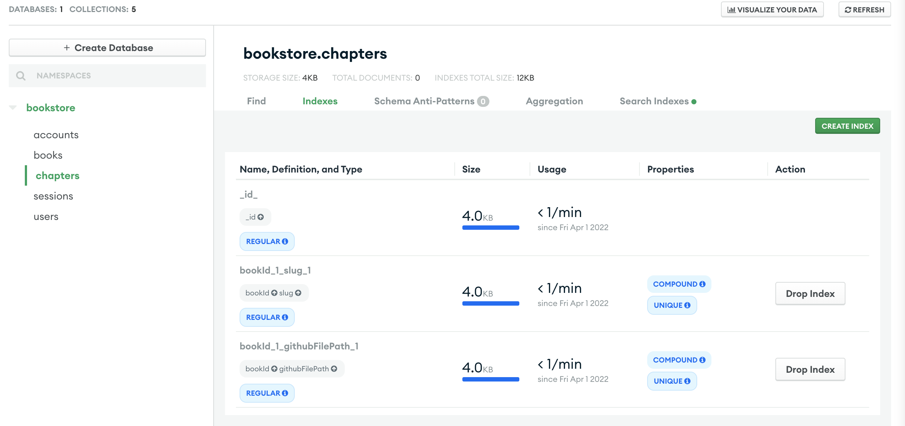
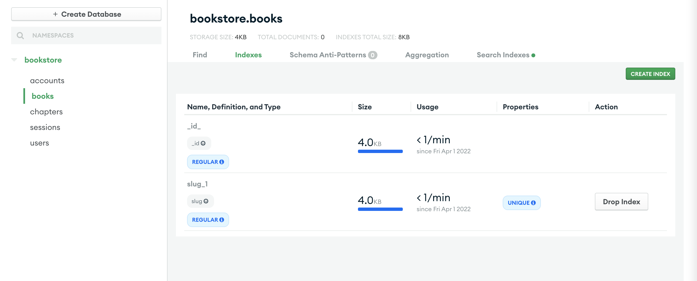
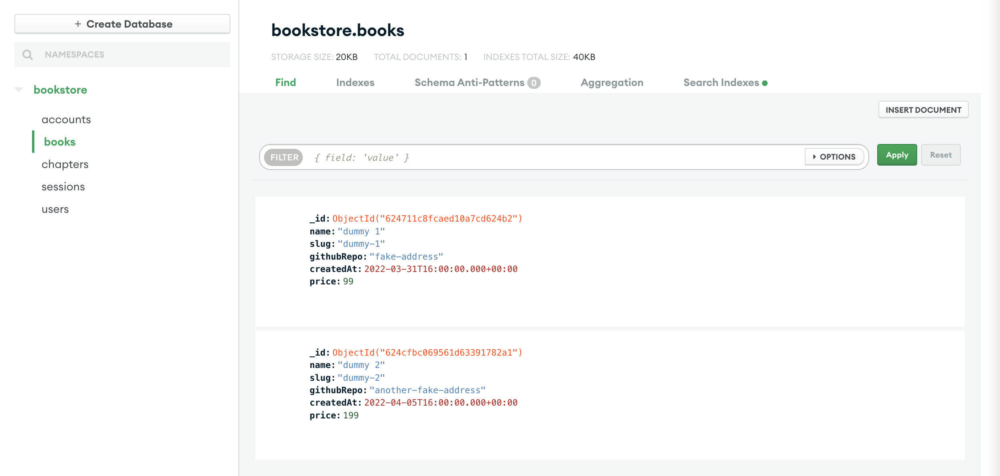
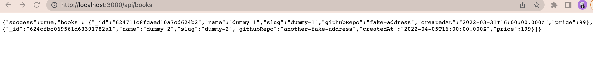
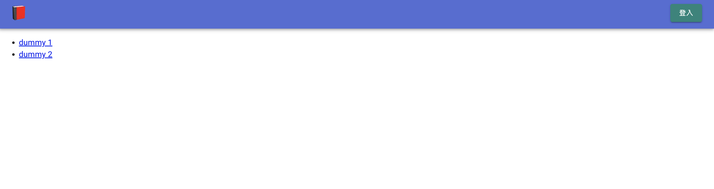
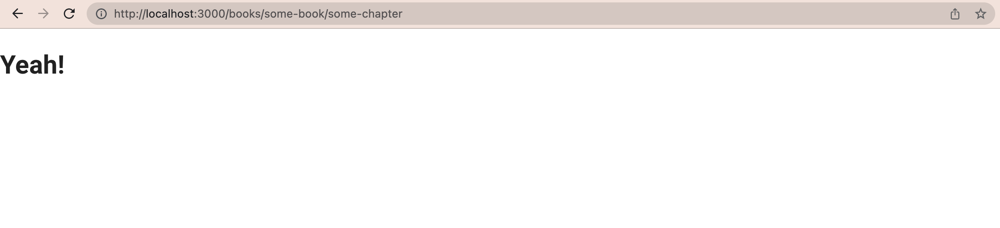
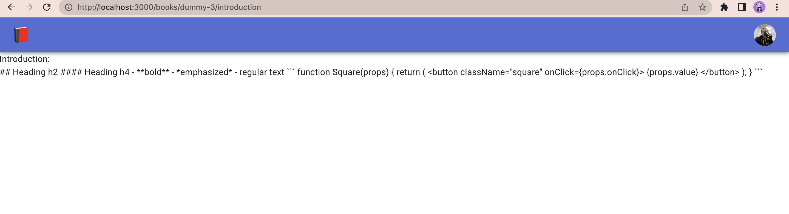

# 第四章

- 概述
- `Book` 資料模型
  - `BookSchema`
  - 靜態函式
    - `Book.list()`
    - `Book.getBySlug()`
    - `Book.add()`
    - `Book.edit()`
- `Chapter` 資料模型
  - `ChapterSchema`
  - 靜態函式
  - MongoDB index
    - 測試
- 書本列表
  - 在 MongoDB Atlas 建立書本資料
  - 瀏覽器端的資料撈取
- 章節內容
  - 在 MongoDB Atlas 建立書本及章節資料
  - 建立一個瀏覽章節的頁面
  - 將 `<Header>` 通用化
  - 建立取得章節資料的 API

---

在我們開工之前，先取得`3-end`的程式碼。[3-end](https://github.com/menon-pheno/fullstack-bookstore/tree/master/book/3-end)資料夾位於[fullstack-bookstore repo](https://github.com/menon-pheno/fullstack-bookstore)`book`的目錄內。

- 如果你還沒有將 fullstack-bookstore 給 clone 下來的話，用`git clone https://github.com/menon-pheno/fullstack-bookstore`這個指令將 repo 複製到你的電腦上
- 注意：如果你想要用自己的 GitHub 帳號自己管理程式的話，你應該將我們的 repo fork 出來並且執行`git clone https://github.com/<你的 github 名稱>/fullstack-bookstore.git`。這樣你就可以將你的改動直接 push 到你的`fullstack-bookstore` repo
- 在`3-end`的資料夾內執行`yarn`來安裝所有的套件

我們在第四章會新增以下的套件：

- `"lodash"`
- `"swr"`
- `"react-markdown"`

看一下第四章的 [package.json](https://github.com/menon-pheno/fullstack-bookstore/blob/master/book/4-end/package.json)。

請確定使用我們指定的套件跟版本，並忽略任何升級的警告。我們會定期更新套件且測試相容性。我們無法確保新的套件版本與目前的程式碼都相容，套件升級時有的時候會導致一些預料之外的問題。

記得將你第三章更新的 `.env.local` 檔案放到專案的根目錄下。

我們鼓勵且歡迎你在閱讀本章的時候，可以在我們的 GitHub repo: [https://github.com/menon-pheno/fullstack-bookstore/issues/new](https://github.com/menon-pheno/fullstack-bookstore)回報任何 bug、錯字或是任何解釋不清楚的地方。

---

## 概述

我們在前三章裡，建立了一個具有使用 Googlel OAuth 登入的網站架構。嚴格來說，我們這章才會真正進入設計書店。

---

## `Book` 資料模型

前面的章節有提到，`mongoose` 的方便處在於能夠定義資料模型，讓我們交由 `mongoose` 來透過資料模型與 MongoDB 進行資料的處理。我們在這節就來定義一個 `Book` 資料模型，顧名思義，這個資料模型代表了我們書店內的一本“書”，我們新增 `models/Book.js` 這個檔案並且先把程式碼的框架填上：

```JavaScript
import mongoose from "mongoose";

const { Schema } = mongoose;

// BookSchema 定義一個 Book 該有哪些資料
const BookSchema = new Schema({});

// BookClass 定義有哪些操作 Book 的靜態函式
class BookClass {}

// 這樣 BookSchema 就除了資料型態之外，更有我們在 BookClass 內定義的函式
BookSchema.loadClass(BookClass);

export default mongoose.models.Book || mongoose.model("Book", BookSchema);

```

上面的框架我們在第二章示範 `User` 資料模型的時候就做過很類似的過程。唯一的新的概念是 `BookSchema.loadClass(BookClass)`，[mongoose 的官方文件](https://mongoosejs.com/docs/api.html#schema_Schema-loadClass) 有說明，其主要作用是在我們的 `BookSchema` 上面添加函式。本章晚點會有實作，到時應該比較能夠體會它的作用。

因此我們建立 `Book` 資料模型需要做的就是：

- 定義好我們的 `BookSchema`
- 定義好我們需要把哪些（靜態）函式加到 `BookClass`（會透過 `.loadClass()` 被放進資料模型內）

---

### `BookSchema`

我們的 `Book` 資料模型，應該至少會需要以下五個欄位：

- `name`：拿來創建 `slug` 以及讓 SEO 未來可以容易搜尋
- `slug`：透過 `name` 創建的，拿來建立書本的 `URL` 以及接下來 `Book.getBySlug` 這個函式會用到
- `githubRepo`：我們將會使用 GitHub 來當作書本的存放位置，因此這個欄位會用來記錄書本是使用 GitHub 的哪個位址
- `githubLastCommitSha`：由於我們使用 GitHub 來存放書本，`Commit SHA` 代表了我們所記錄的 GitHub 該 repository（書本）的實際版號，我們未來會用這個來判斷是否需要更新我們 MongoDB 內的資料
- `createdAt`：可以拿來依據書本出版時間做書本呈現的排列
- `price`：書的定價，想收費總要有個定價吧

因此 `models/Book.js` 內的 `BookSchema` 變成：

```JavaScript
// BookSchema 定義一個 Book 該有哪些資料
const BookSchema = new Schema({
  name: {
    type: String,
    required: true,
  },
  slug: {
    type: String,
    required: true,
    unique: true,
  },
  githubRepo: {
    type: String,
    required: true,
  },
  githubLastCommitSha: String,
  createdAt: {
    type: Date,
    required: true,
  },
  price: {
    type: Number,
    required: true,
  },
});
```

---

### 靜態函式

我們先定義四個 `BookClass` 內的靜態函式（`.loadClass()` 會將這些函式加到資料模型內）：

- `Book.list()`：會將 MongoDB 內的 `books` 集合內全部的文件取出。這個函式會回傳一個含有 `books` 屬性的物件，這 `books` 這個物件則是一個 `book` 物件的陣列
- `Book.getBySlug()`：會從 MongoDB 內的 `books` 集合找到符合 `slug` 的 `book` 文件。從 `BookSchema` 可以看到這會是唯一的文件。這個函式回傳就是一個 `book` 物件。我們可以用這個函式來顯示單一本書的內容
- `Book.add()`：會在 MongoDB 新增一個 `books.book` 的文件。我們未來會在一個 `AddBook` 頁面上呼叫這個函式。此函式會回傳所新增的 `book` 物件
- `Book.edit()`：會在 MongoDB 上針對指定的 `book.book` 文件做欄位的更新。我們未來會在 `EditBook` 頁面上呼叫這個函式。此函式會回傳修改後對應的 `book` 物件

因此，我們的 `BookClass` 框架如下：

```JavaScript
// BookClass 定義有哪些操作 Book 的靜態函式
class BookClass {
  static async list({ offset = 0, limit = 10 } = {}) {
    // 程式邏輯
    // 回傳有 books 屬性的物件，而 books 是一個最多有 10 個元素的陣列
  }

  static async getBySlug({ slug }) {
    // 程式邏輯
    // 回傳 book 物件
  }

  static async add({ name, price, githubRepo }) {
    // 程式邏輯
    // 回傳新增的 book 物件
  }

  static async edit({ id, name, price, githubRepo }) {
    // 程式邏輯
    // 回傳修改過後的 book 物件
  }
}
```

我們依序來實作這幾個函式。

---

#### `Book.list()`

```JavaScript
static async list({ offset = 0, limit = 10 } = {}) {
  // 程式邏輯
  const books = await this.find({})
    .sort({ createdAt: -1 })
    .skip(offset)
    .limit(limit);
  // 回傳有 books 屬性的物件，而 books 是一個最多有 10 個元素的陣列
  return { books };
}
```

- `find({})` 會取出所有的資料
- `sort({ createdAt: -1 })` 代表按照書本出版日期排序，`-1` 會從最新的書排到最舊的
- `skip(offset)` 這代表從第 `offset` 本書開始回傳，我們預設 `offset = 0`，因此會從排序後的第一本書開始回傳
  - 雖然目前用不到，但是未來假設書本多的時候，我們可以利用這個值來進行分頁（pagination）處理的工作
- `limit(limit)` 表示最多回傳幾個文件，而預設 `limit = 10`，所以最多回傳 10 本書
  - 限制書本的數量可以減少對 MongoDB 的查詢時間，使用體驗較好

### `Book.getBySlug()`

```JavaScript
static async getBySlug({ slug }) {
  // 程式邏輯
  const bookDocument = await this.findOne({ slug });
  if (!bookDocument) {
    throw new Error("此書不存在");
  }
  const book = bookDocument.toObject();

  // 回傳 book 物件
  return book;
}
```

- `getBySlug()` 會接受一個參數 `slug`，請注意到 `BookSchema` 定義 `slug` 為 `unique`，因此 MongoDB 的 `books.book.slug` 都是唯一的
- 我們透過 Mongoose 的 [`findOne`](https://mongoosejs.com/docs/api.html#model_Model.findOne) API 來找到符合指定 `slug` 的 `book`
  - `findOne()` 會回傳一個 Mongoose 定義的 [`Query`](https://mongoosejs.com/docs/api/query.html#query_Query) 物件
- 我們再透過 Mongoose 的 [`toObject`](https://mongoosejs.com/docs/api.html#document_Document-toObject) 將 `findOne` 回傳的結果轉成基本的 javascript 物件回傳

#### `Book.add()`

要實作 `Book.add()` 之前我們先寫一個 `generateSlug` 的工具函式（utility method）。在網路的世界裡，[slug](https://yoast.com/slug) 指的是 URL 的一部份，通常拿來用一個人看得懂的描述來指定頁面。舉個簡單例子，很多部落格會用 slug 來讓文章的網址比較好記，例如：`https://someblog.com/post/hello-world`、`https://someblog.com/post/make-some-money` 等等。在前面兩個例子裡，`hello-world` 及 `make-some-money` 就是兩個 slug。slug 主要的優點是讓網址具有實際的意義，這樣比較易懂且好分享，另外個好處是，這個 slug 往往會被搜尋引擎列入排名的依據之一，所以有意義的 slug 可能會讓你的網站及網址更容易被搜尋引擎往上排。

一般來說，slug 的特性如下：

- 原則上 slug 在一個網站內是唯一的，既然是 URL 的一部份，原則上會希望唯一
  - 我們的 `BookSchema` 也可以看到，我們定義 `slug` 欄位為 `unique`
- 基本上是英文，雖然現在有時候會看到多語系的 slug，但是主流還是英文
- 一般來說會是都英文且小寫，然後用橫槓 `-` 隔字

我們的目標為，將書名（`Book.name`）變成一個唯一的 slug，當然這件事做完後就存放到 `Book.slug` 內。舉例來說，假設有本書名是 `How to Write JavaScript`，我們希望對應的 slug 是 `how-to-write-javascript`。更甚者，如果有第二本書也叫做 `How to Write JavaScript`，我們希望第二本書的 slug 是 `how-to-write-javascript-1`，以此類推，假設有同名的書，我們要在 slug 不斷地增加數字的值。

我們將使用 [`lodash`](https://lodash.com) 這個套件來協助我們完成這件事：

```
yarn add lodash
```

`lodash` 是一個著名的 Node.js 套件，它提供了很多工具函式，很多開發時常見的操作需求 `lodash` 都有提供函式，讓開發者不用再自己重新實作。例如，陣列操作、集合（collection）操作、時間（Date）操作、函式操作等等。而我們將要使用 `lodash` 在字串操作上的 [\_.kababCase()](https://lodash.com/docs/4.17.15#kebabCase) 函式。

我們先看一下 `kebabCase` 這個函式的行為：

```JavaScript
_.kebabCase("Foo Bar");
// => "foo-bar"

_.kebabCase("fooBar");
// => "foo-bar"

_.kebabCase("__FOO_BAR__");
// => "foo-bar"
```

可以看到 `kebabCase()` 會：

- 將特殊符號（包含空白）拿掉
- 會將字串內的大寫當作分隔，變成獨立的字
- 會把所有英文字改為小寫

簡單說，`kebabCase()` 基本上就完成了 slugify 的動作，唯一缺的是當 slug 名字重複的時候，應該要在 slug 後面補上一個 `-number` 來確保 slug 的唯一性。我們可以逐步來開發了。新增 `/lib/slugify.js` 檔案，內容如下：

```JavaScript
import _ from "lodash";

const slugify = (text) => _.kebabCase(text);

async function generateSlug(Model, name, filter = {}) {}

export default generateSlug;
```

- `slugify` 我們就是直接呼叫 `lodash` 的 `kebabCase()`
- 我們希望這個檔案 export 出一個 `generateSlug` 函式，會針對給定的 `Model` 與 `name`，回傳一個 slug 字串，這個回傳的字串會是由 `name` 經由 `kebabCase()` 後，且如果在對應的 `Model` 內撞名的話，會依序地補上 `-number` 直到這個 slug 是唯一的為止

我們逐步來實作 `generateSlug`，首先：

```JavaScript
async function generateSlug(Model, name, filter = {}) {
  const candidateSlug = slugify(name);

  const slugConflict = await Model.findOne(
    { slug: candidateSlug, ...filter },
    "id"
  );

  if (!slugConflict) {
    return candidateSlug;
  }

  // else, 要陸續對 slug 進行加數字的動作，直到名字唯一
}
```

- 我們透過 `slugify` 取得一個符合 slug 條件的字串
- `Model.findOne` 會從我們指定的資料模型內，尋找是否有名字衝突的 slug
  - 我們這樣寫的彈性，是以後任何資料模型都可以使用我們的 `generateSlug` 函式
- 如果 `Model.findOne` 發現沒有東西，也就是 `!slugConflict === true`，那我們就可以回傳 `candidateSlug` 了，因為它已經是對應 Model 內唯一的存在了

我們接下來則是處理有撞名，需要將字串補上數字的情形了，完成後如下：

```JavaScript
import _ from "lodash";

const slugify = (text) => _.kebabCase(text);

async function createUniqueSlug(Model, slug, count) {
    const slugConflict = await Model.findOne({ slug: `${slug}-${count}`, "id" });

    if (!slugConflict) {
        return `${slug}-${count}`;
    }

    return createUniqueSlug(Model, slug, count + 1);
}

async function generateSlug(Model, name, filter = {}) {
  const candidateSlug = slugify(name);

  const slugConflict = await Model.findOne(
    { slug: candidateSlug, ...filter },
    "id"
  );

  if (!slugConflict) {
    return candidateSlug;
  }

  return createUniqueSlug(Model, candidateSlug, 1);
}

export default generateSlug;
```

- 我們透過 `createUniqueSlug` 來幫我們找到唯一的 slug
  - 這個函式會將一個 `slug`（第二個參數）加上一個 `count` 數字（第三個參數），組成 `${slug}-＄{count}` 這個新的字串（這是要來查詢是否為合格的唯一 slug）
  - 我們一樣透過 `Model.findOne` 來看看這個 `${slug}-${count}` 是否存在於 MongoDB 中
    - 假設沒有，這就是個唯一的 slug，將這個字串回傳
    - 假設有（依舊撞名），我們就遞迴的跑 `createUniqueSlug`，但是把 `count` 加一
- 我們在 `generateSlug` 裡面把 `count` 當作一來啟動 `createUniqueSlug`

有了 `generateSlug` 以後，我們可以來實作 `Book.add` 了：

```JavaScript
static async add({ name, price, githubRepo }) {
  // 程式邏輯
  const slug = await generateSlug(this, name); // 記得要 import /lib/slugify
  if (!slug) {
    throw new Error(`${name} slug 產生失敗`);
  }
  // 回傳新增的 Book 物件
  return this.create({
    name,
    slug,
    price,
    githubRepo,
    createdAt: new Date(),
  });
}
```

- 有的 `generateSlug`，`Book.add` 就相當簡單了，用 `name` 來取得一個唯一的 slug，然後產生 `Book` 物件
  - `createdAt` 我們使用 `new Date()` 就會是產生當下的時間

#### `Book.edit()`

```JavaScript
static async edit({ id, name, price, githubRepo }) {
  // 程式邏輯
  const book = await this.findById(id, "slug name");

  if (!book) {
    throw new Error(`${id} 書本找不到`);
  }

  const modifier = { price, githubRepo };

  if (name !== book.name) {
    modifier.name = name;
    modifier.slug = await generateSlug(this, name);
  }

  // 回傳修改過後的 book 物件
  return this.updateOne({ _id: id }, { $set: modifier });
}
```

- 我們透過 [Mongoose 的 `findById`](https://mongoosejs.com/docs/api.html#model_Model.findById) 來找到 `id` 這個參數對應的書本
- 如果從 MongoDB 拿回來的書本名稱（`book.name`）與傳入的 `name` 不一樣，我們就將 `name` 更新並且產生一個唯一的 slug
- 最後我們透過 [Mongoose 的 `updateOne`](https://mongoosejs.com/docs/api/model.html#model_Model.updateOne) 來更新 MongoDB 內這個 `id` 的書本資訊

`models/Book.js` 應該如下了：

```JavaScript
import mongoose from "mongoose";
import generateSlug from "../lib/slugify";

const { Schema } = mongoose;

// BookSchema 定義一個 Book 該有哪些資料
const BookSchema = new Schema({
  name: {
    type: String,
    required: true,
  },
  slug: {
    type: String,
    required: true,
    unique: true,
  },
  githubRepo: {
    type: String,
    required: true,
  },
  githubLastCommitSha: String,
  createdAt: {
    type: Date,
    required: true,
  },
  price: {
    type: Number,
    required: true,
  },
});

// BookClass 定義有哪些操作 Book 的靜態函式
class BookClass {
  static async list({ offset = 0, limit = 10 } = {}) {
    // 程式邏輯
    const books = await this.find({})
      .sort({ createdAt: -1 })
      .skip(offset)
      .limit(limit);

    // 回傳有 books 屬性的物件，而 books 是一個最多有 10 個元素的陣列
    return { books };
  }

  static async getBySlug({ slug }) {
    // 程式邏輯
    const bookDocument = await this.findOne({ slug });
    if (!bookDocument) {
      throw new Error("此書不存在");
    }
    const book = bookDocument.toObject();

    // 回傳 book 物件
    return book;
  }

  static async add({ name, price, githubRepo }) {
    // 程式邏輯
    const slug = await generateSlug(this, name);
    if (!slug) {
      throw new Error(`${name} slug 產生失敗`);
    }
    // 回傳新增的 book 物件
    return this.create({
      name,
      slug,
      price,
      githubRepo,
      createdAt: new Date(),
    });
  }

  static async edit({ id, name, price, githubRepo }) {
    // 程式邏輯
    const book = await this.findById(id, "slug name");

    if (!book) {
      throw new Error(`${id} 書本找不到`);
    }

    const modifier = { price, githubRepo };

    if (name !== book.name) {
      modifier.name = name;
      modifier.slug = await generateSlug(this, name);
    }

    // 回傳修改過後的 book 物件
    return this.updateOne({ _id: id }, { $set: modifier });
  }
}

// 這樣 BookSchema 就除了資料型態之外，更有我們在 BookClass 內定義的函式
BookSchema.loadClass(BookClass);

export default mongoose.models.Book || mongoose.model("Book", BookSchema);

```

我們接著來實作 `Chapter` 資料模型了。

---

## `Chapter` 資料模型

在我們的書店裡，書本是由多個章節（`Chapter`）來組成的。我們在本章後面會實作一個 `ReadChapter` 頁面，它將會把單一章節的內容給渲染出來。在我們定義完 `Chapter` 資料模型後，我們將會利用 web API 將資料取出並且渲染在我們的網頁上。

我們建立 `Chapter` 資料模型的過程與上節的 `Book` 是非常接近的。新增 `models/Chapter.js`：

```JavaScript
import mongoose from "mongoose";

const { Schema } = mongoose;

const ChapterSchema = new Schema({
  // schema 內容
});

class ChapterClass {
  // 需要的函式
}

ChapterSchema.loadClass(ChapterClass);

export default mongoose.models.Chapter ||
  mongoose.model("Chapter", ChapterSchema);
```

這個框架應該已經有一定熟悉度了。

---

### `ChapterSchema`

```JavaScript
const ChapterSchema = new Schema({
  // schema 內容
  bookId: {
    type: Schema.Types.ObjectId,
    required: true,
  },
  isFree: {
    type: Boolean,
    required: true,
    default: false,
  },
  githubFilePath: {
    type: String,
  },
  title: {
    type: String,
    required: true,
  },
  slug: {
    type: String,
    required: true,
  },
  excerpt: {
    type: String,
    default: "",
  },
  content: {
    type: String,
    default: "",
    required: true,
  },
  htmlContent: {
    type: String,
    default: "",
    required: true,
  },
  createdAt: {
    type: Date,
    required: true,
  },
  order: {
    type: Number,
    required: true,
  },
  seoTitle: String,
  seoDescription: String,
});
```

其中的幾個重點欄位的說明：

- `bookId`：這是對應 MongoDB 內的書本文件，指定 `Chapter` 應該屬於哪本書
- `title`：類似於書名（`book.name`），我們會用來建立 `slug`
  - `slug`：用來在頁面的 URL 以及搜尋引擎優化使用
- `seoTitle`及`seoDescription`：用來提供給 Google bot 或是其他的搜尋引擎 bot 來提高搜尋排行
- `isFree`：用來指定該章節是否免費，可以看到這個的預設值是 `false`
- `content`、`htmlContent`、`excerpt`：都是用來存放章節的實際內容，差異為：
  - `content`：是 .md（markdown 格式）
  - `htmlContent`：是 html 格式
  - `excerpt`：只有章節的節錄，想成該章節可以免費試閱的部分（markdown 格式）
- `githubFilePath`：顧名思義，這是章節在 GitHub 上的 .md 檔路徑（一個 `chapter` 就會是一個 .md 檔）
- `order`：顧名思義，這用來表示這是第幾章節，舉例來說，第一章就會是 `"order": 1`

`Chapter` schema 到此告一段落，我們來看看 `ChapterClass`（定義靜態函式的地方）。

---

### 靜態函式

回想一下，我們在 `BookClass` 定義了四個靜態函式，功能為：

- 取得一個書本物件（晚點就會補上書本與章節間的關係）
- 新增一個 MongoDB `book` 文件
- 修改一個已存在的 MongoDB `book` 文件
- 取得所有的書本

至於我們的 `Chapter` 資料模型是否需要這種 CRUD 型的一系列靜態函式呢？答案是不需要，原因是，我們將會把所有的 `Chapter` 資料存放在 GitHub 上。GitHub 上的資料就是我們的唯一資訊源（SSOT, single source of truth）。因此，我們章節的 CRUD 內的 C/U/D 就交由 GitHub 包辦，我們只需要定義一個 `Chapter.getBySlug` 的靜態函式就可以了。

```JavaScript
static async getBySlug({ bookSlug, chapterSlug }) {
  const book = await Book.getBySlug({ slug: bookSlug });
  if (!book) {
    throw new Error(`${bookSlug} 書本不存在`);
  }

  const chapter = await this.findOne({ bookId: book._id, slug: chapterSlug });

  if (!chapter) {
    throw new Error(`${chapterSlug} 章節不存在`);
  }

  const chapterObject = chapter.toObject();
  chapterObject.book = book;

  return chapterObject;
}
```

`getBySlug` 整體滿簡單的：

- 先找出書本
- 書本存在的話再取得符合 `chapterSlug` 的章節
- 將 Mongoose 從 MongoDB 取出的章節透過 `toObject()` 轉成 JavaScript 物件（POJO, plain old javascript object），然後補上一個 `book` 屬性，回傳給呼叫者

---

### MongoDB index

接著，我們需要介紹一個重要的概念，MongoDB index。先看一下我們 `ChapterClass.getBySlug` 裡面的其中一行：

```JavaScript
const chapter = await this.findOne({ bookId: book._id, slug: chapterSlug });
```

`findOne` 會從 MongoDB 的 `chapters` 集合內找到一筆 `bookId` 及 `slug` 符合我們指定的值的文件。這裡的重點在於 `bookId` 及 `slug` 這個組合，需要在 `chapters` 這個集合內是唯一的存在。假設有兩筆文件 `bookId` 及 `slug` 都一樣，則 `findOne` 會回傳最早在 MongoDB 建立的文件。而這不一定是我們要的結果。

舉個例子來說，如果 MongoDB 同時有兩個（下面不是正式的程式碼，僅為示意的 pseudo code）：

```JavaScript
chapterA = {
  bookId: 123,
  slug: "i-am-a-chapter",
  content: "我是對的"
}

chapterB = {
  bookId: 123,
  slug: "i-am-a-chapter",
  content: "我才是對的"
}
```

當我們用 `findOne` 的時候，就有可能拿到 `chapterA` 或是 `chapterB`（視哪個是先建立的）：

- 我們可能拿到的不是我們要的章節
- 這本身也不合理，同一本書不應該有兩個章節名稱一模一樣

所以簡言之，我們希望 `chapters` 集合內，`bookId` 加上 `slug` 這兩個欄位的組合要唯一。我們可以透過 [MongoDB 的唯一組合索引（unique compound index）](https://docs.mongodb.com/manual/core/index-unique/#unique-compound-index) 來確保這件事。

當指定了唯一組合索引的時候，MongoDB 就會在當有人嘗試建立一個重複的 `bookId` 加 `slug` 值的文件時，拋出 `error`（如以下）：

```
E11000 duplicate key error index
```

在我們實際設定唯一組合索引之前，我們則需要先了解索引（index）、組合索引（compound index）以及唯一索引（unique index）。

- 索引（index）：MongoDB 的集合是由文件所組成（舉例來說，`books` 集合會有許多 `book` 文件）。舉例來說，當你希望透過 `name` 這個欄位來找到某筆文件時，就需要對整個集合的每個欄位都掃一次來找到符合條件的文件。當文件數、欄位數多的時候，這會相當耗時。而 [索引（index）](https://docs.mongodb.com/manual/indexes/#index-types) 是一個資料結構，它可以存放一個或多個欄位以及對應的值，這樣如果我們的搜尋條件是索引這個資料結構具備的欄位，那 MongoDB 就只需要針對索引這個資料結構進行搜尋，而不需要針對整個文件的每個欄位進行搜尋。用前面的例子來看，假設我們知道我們的應用程式會常常針對 `name` 這個欄位進行搜尋，那將 `name` 欄位加進索引就可能是個不錯的選擇，因為這樣搜尋時就可以只針對索引做搜尋。事實上，MongoDB 預設就會將 `_id` 建立到索引（這也是為什麼透過 `_id` 搜尋速度是快的）。而我們想要針對別的欄位建立到索引內，我們會需要使用 MongoDB 提供的 `createIndex` 函式：

  ```JavaScript
  db.records.createIndex({ someDocumentField: 1 });
  ```

  上面的 `1` 代表會將該欄位的值從小排到大的建立到索引（`-1` 則是大排到小）。而由於我們使用 mongoose，所以我們的語法會是：

  ```JavaScript
  mongoSchema.index({ someDocumentField: 1 });
  ```

  實際上，mongoose 的 `index` 函式背後就會去呼叫 `createIndex`。

- [組合索引（compound index）](https://docs.mongodb.com/manual/core/index-compound)：這是具有超過一個欄位的索引，語法很簡單：

  ```JavaScript
  mongoSchema.index({ field_1: 1, field_2 });
  ```

- [唯一索引（unique index）](https://docs.mongodb.com/manual/core/index-unique)：是一個保證所指定要建立索引的欄位值是不會重複的索引。事實上 MongoDB 的 `_id` 欄位不僅是索引，更是唯一索引。另外，由於 `_id` 這個欄位與值是 MongoDB 產生的，它會確保 `_id` 的值在集合內是唯一的，mongoose 建立唯一索引的語法是：

  ```JavaScript
  mongoSchema.index({ field: 1 }, { unique: true });
  ```

- [唯一組合索引（unique compound index）](https://docs.mongodb.com/manual/core/index-unique/#unique-compound-index)：相信可以猜得到了。
  這是存放多個欄位的索引，且這些欄位不會同時與第二筆文件**完全**相同：

  ```JavaScript
  mongoSchema.index({ field_1: 1, field_2: 1 }, { unique: true });
  ```

有了這觀念後，就可以理解，我們需要將 `ChapterSchema` 的 `{ bookId: 1, slug: 1 }` 這個組合建立一個唯一組合索引，在 `models/Chapter.js` 加上：

```JavaScript
ChapterSchema.index({ bookId: 1, slug: 1 }, { unique: true });
```

我們另外多加一個唯一組合索引：

```JavaScript
ChapterSchema.index({ bookId: 1, githubFilePath: 1 }, { unique: true });
```

希望讀者不會對這個意外，這個索引代表的是一個章節文件裡 `bookId` + `githubFilePath` 的欄位必須要唯一，畢竟，一個章節就會對應 GitHub 的一個檔案，那同本書有兩個章節對到同個檔案本身是沒有意義且不合理的。

---

#### 測試

這邊主要來測試並展示一下建立 MongoDB 索引的結果。至於怎麼做這件事呢：

1. 我們會建立一個 `chapterIndexTest` 的 API，裡面的內容會透過 mongoose 使用我們的 `Chapter` 資料模型，也就理所當然的會呼叫到我們前面提到的 `ChapterSchema.index`
2. 我們直接透過瀏覽器去呼叫這個 API（`http://localhost:3000/api/chapterIndexTest`）
3. 觀察 MongoDB Atlas

讓我們開始吧：

1. 新增 `pages/api/chapterIndexTest.js`，內容如下：

```JavaScript
import dbConnect from "../../lib/mongoose";
import Chapter from "../../models/Chapter";

export default async function chapterIndexTest(req, res) {
  const { method } = req;

  await dbConnect();

  switch (method) {
    case "GET":
      try {
        Chapter.create({
          bookId: "somethingTemporary",
        }).catch((err) => {
          console.log(err);
        });
      } catch (error) {
        res.status(400).json({ success: false });
      }
      break;
    default:
      res.status(400).json({ success: false });
      break;
  }
}

```

幾個重點如下：

- 我們一樣使用 `lib/mongoose.js` 的 `dbConnect()` 來對 MongoDB 做連線
- 可以注意一下 `switch` 的這個架構，這樣可以將 API 透過 `switch` 來針對一般 Web API 會有的不同 request（GET/POST/PUT/DELETE）做不一樣的處理
  - 我們這邊單純為了測試，所以就只對 GET 做處理，因為瀏覽器打上網址時是會發出 GET request
- 我們在收到 GET request 後，會呼叫 `Chapter.create()`，這個 mongoose 函式會透過我們前面定義的 `Chapter` 資料模型嘗試去對我們的 MongoDB 新增一筆 `chapter` 文件

2. `yarn dev` 啟動我們的專案，在瀏覽器造訪 `http://localhost:3000/api/chapterIndexTest`

3. 我們來看看會發生什麼事：



- 可以看到我們的 MongoDB 多了兩個集合：`books` 及 `chapters`
  - `chapters` 好理解，我們在 `chapterIndexTest` 裡呼叫了 `Chapter.create()`，因此會建立這個集合
  - `books` 會被建立的原因是，`models/Chapter.js` 有引入 `Book`：`import Book from "./Book";`，因此 `Book` 會被建構，也連帶將 `BookSchema` 導入至 MongoDB 中
- 可以看到 `chapters` 裡面有三個索引
  - `_id`：如前面所說的，MongoDB 會自動對 `_id` 這個欄位建立索引
  - `bookId` + `slug`：可以在 `Properties` 裡看到它是 `COMPOUND` + `UNIQUE`，正是我們前面所描述的
  - `bookId` + `githubFilePath`：可以在 `Properties` 裡看到它是 `COMPOUND` + `UNIQUE`，正是我們前面所描述的
- 終端機可以看到許許多多的 error，隨便截取其中的一個錯誤訊息 - `order: ValidatorError: Path order is required.` 簡單說這邊代表我們 `ChapterSchema` 的定義是有效的，我們定義了很多屬性需要是 `required`，而我們在呼叫 `Chapter.create()` 時並沒有提供這些內容，所以就回傳錯誤，而也可以看到我們在 MongoDB Atlas 的 `bookstore.chapters` 的 `TOTAL DOCUMENTS: 0`
  - 不過我們不用太在意這些錯誤，因為這只是單純的測試我們所以有正確建立我們指定的索引，我們實際上也沒有要透過這個 API 建立章節
- 值得注意的是，我們的 `bookstore.books` 除了 `_id` 這個索引，更有 `slug` 這個索引：
  
  - 這是由於我們 `models/Book.js` 裡的 `BookSchema.slug` 定義為 `unique: true`，mongoose 會順便地將設定為 `unique` 的欄位建立索引

---

## 書本列表

我們來真的把書本列表呈現到我們的主頁吧，總算真的進入到書店的世界了。我們先把 `/pages/index.js` 歸零到如下：

```JSX
import Head from "next/head";

import Header from "../components/Header";

const Home = () => {
  return (
    <>
      <Head>
        <title>首頁</title>
        <meta name="描述" content="這是關於首頁的描述" />
      </Head>
      <Header />
      <h1>總算跟書店真的有關係了</h1>
    </>
  );
};

export default Home;
```

- 我們將顯示 `User` 等相關程式碼拿掉了

接著，讓我們看看怎麼把 MongoDB 內的書本呈現到我們的 `pages/index.js` 上。

---

### 在 MongoDB Atlas 建立書本資料

首先，我們在 MongoDB Atlas 上面手動新增兩本書的資料，這樣我們晚點才能驗證是否有正確的撈取到資訊。之前有手動增加過 `bookstore.users` 的 `user` 文件，這邊做法很類似：

- 點選 `bookstore.books` 頁面內的 `INSERT DOCUMENT`
- 根據我們的 `models/Book.js` 所指定的必要欄位（`required: true`）的各欄位，新增資料，我這邊的範例是：
  - 第一本書
    - name: "dummy 1"(string)
    - slug: "dummy-1"(string)
    - githubRepo: "fake-address(string)
    - createdAt: 2022-03-31(date)
    - price: 99(Int32)
  - 第二本書
    - name: "dummy 2"(string)
    - slug: "dummy-2"(string)
    - githubRepo: "another-fake-address"(string)
    - createdAt: 2022-04-05(date)
    - price: 199(Int32)
  - 上面括號內的資料型態是在手動於 MongoDB Atlas 新增文件時可以做的指定
  - `_id` 不需要我們增加，MongoDB 會自動增加

結果會如下：



好了，我們現在 MongoDB 內有兩本“書”了，該是嘗試把這樣的資料呈現在我們的網站上了。

---

### 瀏覽器端的資料撈取

雖然我們的網站可以透過伺服器端渲染來將書本資料在伺服器端就準備好，筆者覺得趁現在介紹[Next.js 關於瀏覽器端的資料撈取](https://nextjs.org/docs/basic-features/data-fetching/client-side)是個不錯的時機點，我們如同慣例，透過實作來將概念導入。

根據 Next.js 團隊的推薦，我們將會使用 [SWR](https://swr.vercel.app) 這個套件來進行瀏覽器端的資料撈取：

```
yarn add swr
```

SWR 的用法是 import `swr` 套件內的 `useSWR` 這個 hook 後，呼叫方式如下：

```JavaScript
const { data, error } = useSWR(`/${apiRoute}`, fetcher);
```

- `useSWR` 的第一個參數指定所要進行 Web API 呼叫的路徑
- `useSWR` 的第二個參數則是指定要用什麼方式（工具）來進行實際的呼叫

我們在 `lib/dataFetcher.js` 定義上面的 `fetcher` 如下：

```JavaScript
async function dataFetcher(...args) {
  const response = await fetch(...args);
  return response.json();
}

export default dataFetcher;
```

- 可以看到我們的 `dataFetcher` 很單純，使用 JavaScript 內建的 `fetch` 函式去造訪我們的 Web API 路徑，並將結果 `json` 化回傳

至於 api 路徑的部分，一般 RESTful 的 api 路徑架構會如下（我們直接拿 `books` 為例子）：

- `GET api/books` - 這會取得所有書本的資料
- `GET api/books/12345` - 這會取得 `book` id 為 `12345` 的單一本書的資料

對應到 Next.js 的路由系統有兩個建立 api 路由檔案的方式可以達成以上目標：

- 第一個選項
  - `pages/api/books.js` - 這個處理 `GET api/books`
  - `pages/api/books/[bookId].js` - 這個處理 `GET api/books/12345`
- 第二個選項
  - `pages/api/books/index.js` - 這個處理 `GET api/books`
  - `pages/api/books/[bookId].js` - 這個處理 `GET api/books/12345`

上面兩個選項是相等的，我們在這邊會使用第二個選項（個人偏好，感覺 api 都會統一在資料夾內管理）。首先我們將 `pages/api/books/[...bookInfo].js` 刪除掉（這是之前為了示範萬用 api 路由所建立的，現在不用了）。另外新增 `pages/api/books/index.js` 如下：

```JavaScript
import dbConnect from "../../../lib/mongoose";
import Book from "../../../models/Book";

async function books(req, res) {
  const { method } = req;
  await dbConnect();

  switch (method) {
    case "GET":
      try {
        const result = await Book.find({});
        const books = result.map((doc) => {
          const book = doc.toObject();
          book._id = book._id.toString();
          return book;
        });
        res.status(200).json({ success: true, books });
      } catch (error) {
        console.log(error);
        res.status(400).json({ success: false });
      }
      break;
    default:
      res.status(400).json({ success: false });
      break;
  }
}

export default books;

```

- 我們透過 `lib/mongoose.js` 的 `dbConnect()` 與我們的 MongoDB 連線
- 我們一樣用 `switch` 的方式來判斷 request 的類別
  - 目前只會處理 `GET` 的 request
- `Book.find({})` 會將 MongoDB 的 `bookstore.books` 全部回傳
  - 我們接著將回傳的陣列透過 `Array.map()` 來將內容轉成 JSON 物件（值得注意一下，我們會把 `_id` 特別轉成字串）
  - 我們最後將結果透過 `res` 回傳，內容會有 `success: true` 以及 `books` 這個具有書本資料的屬性（會是個陣列）

如果這時造訪 `http://localhost:3000/api/books`：



- 可以看到 `api/books` 回傳的內容

我們有了這些可以來實作我們的 `pages/index.js` 了：

```JSX
import Head from "next/head";
import useSWR from "swr";
import { Box, CircularProgress } from "@mui/material";
import Link from "next/link";

import dataFetcher from "../lib/dataFetcher";
import Header from "../components/Header";

const Home = () => {
  const { data, error } = useSWR("/api/books", dataFetcher);
  if (error) {
    return (
      <>
        <Head>
          <title>首頁</title>
          <meta name="描述" content="有錯誤" />
        </Head>
        <Header />
        <h1>有錯誤</h1>
      </>
    );
  }
  if (!data) {
    return (
      <>
        <Head>
          <title>首頁</title>
          <meta name="描述" content="載入中" />
        </Head>
        <Header />
        <Box sx={{ display: "flex" }}>
          <CircularProgress />
        </Box>
      </>
    );
  }

  return (
    <>
      <Head>
        <title>首頁</title>
        <meta name="描述" content="這是關於首頁的描述" />
      </Head>
      <Header />
      <ul>
        {data.books.map((book) => (
          <li key={book._id}>
            <Link
              as={`/book-detail/${book.slug}`}
              href={`/book-detail?slug=${book.slug}`}
            >
              <a>{book.name}</a>
            </Link>
          </li>
        ))}
      </ul>
    </>
  );
};

export default Home;
```

幾個重點如下：

- `const { data, error } = useSWR("/api/books", dataFetcher);` 這就是利用 SWR 對 `/api/books` 這個位址使用 `dataFetcher` 來取得該 api 回傳的資料
  - `error` 是 SWR 提供的一個屬性，假設有錯誤的時候這個屬性會有值，我們簡單做個錯誤處理，在頁面顯示錯誤發生
  - `data` 則是 SWR 在還沒有取得 api 對應的回傳資料時會是 falsey 的狀態，我們在這時候使用 Material-UI 的 `CircularProgress` 元件來呈現一個載入中的示意
- 最後一段的 return 則是一切順利時候我們所渲染的頁面
  - `data` 會有東西（也就是 `pages/api/books/index.js` 回傳的 `{success: true, books}`）
  - 我們將 `data.books` 給 `map` 成一個個 `<li>`

`http://localhost:3000` 現在應該會看到下面的畫面（Vercel 上也應該有一樣的結果）：



---

## 章節內容

我們現在可以看到書本列表了，接下來，我們先讓我們的網站可以看到單一章節的實際內容。這樣我們的網站離書店又邁進一大步。

### 在 MongoDB Atlas 建立書本及章節資料

先跟前面章節一樣，在 MongoDB Atlas 建立一本書：

- name: "dummy 3"
- slug: "dummy-3"
- price: 40
- createdAt: 2022-04-06
- githubRepo: "fake-again-address"

以上內容讀者應該已經有一定熟悉度了。而跟之前不同的地方在於，我們增加一個額外的動作，我們這次會增加一個對應 `dummy 3` 這本書的章節。在 `bookstore.chapters` 內我們新增一個章節，內容如下：

- bookId: ObjectId(`${這裡要放你 dummy 3 書本的 _id 值}`)(ObjectId)
- isFree: true(Boolean)
- title: "Introduction"(String)
- slug: "introduction"(string)
- excerpt: "part of the chapter"(String)
- createdAt: 2022-04-06(Date)
- content: "

  ```
  ## Heading h2
  #### Heading h4
  - **bold**
  - *emphasized*
  - regular text

  {三個 back tick (`)}
  function Square(props) {
    return (
      <button className="square" onClick={props.onClick}>
        {props.value}
      </button>
    );
  }
  {三個 back tick (`)}
  ```

  "(String)

  - 上面這段可能會讓人有點困惑，但是主要是要在 `bookstore.chapters` 的 `chapter.content` 這個屬性放入一個 markdown 的文件，上面是 markdown 的一些常見的語法
  - 請把 `{三個 back tick}` 的部分換成 ```，這是 markdown 表示程式碼的方式

做了上面步驟後，代表我們在資料庫內有一本 `dummy 3` 的書，並且這本書有個 `Introduction` 的章節了。

---

### 建立一個瀏覽章節的頁面

接著，我們要來建立一個頁面，用來渲染一個章節的內容。我們在設計上，某一個章節的實際路徑應該會類似於：`{ROOT_URL}/books/{書名（slug）}/{章節名（slug）}`，而我們要怎麼在 Next.js 內支援這樣的頁面路徑呢？答案是使用 Next.js 動態路由頁面的功能來達成這個目標，我們一樣先實作。

新增 pages/books/[bookSlug]/[chapterSlug].js：

```JavaScript
const Chapter = () => {
  return (
    <>
      <h1>Yeah!</h1>
    </>
  );
};

export default Chapter;
```

- `[chapterSlug].js` 是使用 [Next.js 的動態路由頁面](https://nextjs.org/docs/basic-features/pages) 功能，這個設計跟我們之前講到的動態 API 路由很相似
- `pages/books/[bookSlug]/[chapterSlug].js` 會對應到 `{ROOT_URL}/books/{任何路由 A}/{任何路由 B}`，其中 `{任何路由 A}` 對應到 `[bookSlug]`，而 `{任何路由 B}` 對應到 `[chapterSlug]` 例如：

  - `http://localhost:3000/books/book-slug-1/chapter-slug-1`
  - `http://localhost:3000/books/this-is-a-book/chapter-5`

  可以看到，我們假設造訪 `http://localhost/books/some-book/some-chapter`，會正確渲染我們 `pages/books/[bookSlug]/[chapterSlug].js`
  

  - 這樣的好處是任何書本的任何章節都會對應到這個頁面，不用去指定實際頁面的名稱（更何況，我們根本無法現在定義出有哪些書本跟章節）

---

### 將 `<Header>` 通用化

上面畫面可以看到，雖然有渲染頁面了，但是也真的是素的可以。一個我們立刻發現可以通用化的，就是 `pages/index.js` 裡面引用的 `<Header>` 元件。基本上，我們的網站應該是所有頁面都應該要有 `<Header>` 這個元件。而既然如此，如果在每個頁面上都要引入並使用這個元件就太蠢了。這時候就要使用 Next.js 的 [`App` 元件](https://nextjs.org/docs/advanced-features/custom-app)。我們在之前的章節就有使用過 `App` 元件，也就是 `pages/_app.js` 這個檔案所 export 的元件。

因此，我們將 `<Header>` 元件改成在 `pages/_app.js` 引用，這樣所有的網頁都會有 `<Header>` 元件，`pages/_app.js` 相關的改動如下：

```JavaScript
// 省略
import Header from "../components/Header";

// 省略

export default function MyApp(props) {
  // 省略
  return (
    <SessionProvider session={session}>
      <CacheProvider value={emotionCache}>
        {/* 省略 */}
        <ThemeProvider theme={basicTheme}>
          {/* CssBaseline 會提供一個一致的 CSS 基準線 */}
          <CssBaseline />
          <Header />
          <Component {...pageProps} />
        </ThemeProvider>
      </CacheProvider>
    </SessionProvider>
  );
}
```

而自然的，我們可以將 `pages/index.js` 裡面有關於 `<Header>` 的部分給移除掉了，因為已經交由 `pages/_app.js` 來處理了（我們順帶將 `Link` 的路徑從 `book-detail` 改成 `books`，這樣跟我們的 API 維持一致）：

```JavaScript
import useSWR from "swr";
import { Box, CircularProgress } from "@mui/material";
import Link from "next/link";

import dataFetcher from "../lib/dataFetcher";

const Home = () => {
  const { data, error } = useSWR("/api/books", dataFetcher);
  if (error) {
    return (
      <>
        <h1>有錯誤</h1>
      </>
    );
  }
  if (!data) {
    return (
      <>
        <Box sx={{ display: "flex" }}>
          <CircularProgress />
        </Box>
      </>
    );
  }

  return (
    <>
      <ul>
        {data.books.map((book) => (
          <li key={book._id}>
            <Link
              as={`/books/${book.slug}`}
              href={`/books?slug=${book.slug}`}
            >
              <a>{book.name}</a>
            </Link>
          </li>
        ))}
      </ul>
    </>
  );
};

export default Home;

```

---

### 建立取得章節資料的 API

別忘記，我們目前的目標是要能夠在我們的網站呈現一個章節的內容，也就是 MongoDB 內的某個 `bookstore.chapters` 內 `content` 欄位的資訊。為此，我們當然需要一個 API 來取得單一章節的資訊。首先我們順手將之前做教學跟測試的兩個 API 給刪掉：

- `api/chapterIndexTest.js`
- `api/test.js`

接著，有點類似於我們的動態頁面路由，我們要建立一個 [動態通用 API 路由](https://nextjs.org/docs/api-routes/dynamic-api-routes)。我們預期來要某個章節的資訊的 API 應該要類似於：

- `{ROOT_URL}/api/books/{book-slug}/{chapter-slug}` （與我們前面小節的 `chapterSlug.js` 頁面其實是一樣的，就是呼叫一個 API 去取得 `chapterSlug.js` 所需要的資訊讓它可以用來呈現）

因此，我們要建立一個 `pages/api/books/[...slugs].js`，當檔案與路徑如此定義時：

- 任何 `{ROOT_URL}/api/books/` 開頭的 API 都會由 `[...slugs].js` 對應處理，例如：
  - `{ROOT_URL}/api/books/some-book`： 會有一個對應的 `{"slugs": ["some-book"]}` 的 `query` 物件
  - `{ROOT_URL}/api/books/some-book/some-chapter`： 會有一個對應的 `{"slugs": ["some-book", "some-chapter"]}` 的 `query` 物件

因此我們的 `pages/api/books/[...slugs].js` 內容如下：

```JavaScript
import dbConnect from "../../../lib/mongoose";
import Book from "../../../models/Book";
import Chapter from "../../../models/Chapter";

async function chapter(req, res) {
  const { slugs } = req.query;

  // 我們希望格式是 api/books/book-slug/chapter-slug 的格式
  if (slugs.length !== 2) {
    res
      .status(400)
      .json({ success: false, errorMessage: "something wrong with slug" });
  }

  const { method } = req;
  const bookSlug = slugs[0];
  const chapterSlug = slugs[1];
  await dbConnect();

  switch (method) {
    case "GET":
      try {
        const bookResult = await Book.find({ slug: bookSlug });
        if (bookResult.length === 0) {
          res
            .status(400)
            .json({ success: false, errorMessage: "No book found" });
        } else if (bookResult.length > 1) {
          res
            .status(400)
            .json({ success: false, errorMessage: "More than one book found" });
        } else {
          const book = bookResult[0].toObject();
          book._id = bookResult[0]._id.toString();

          const chapterResult = await Chapter.find({
            bookId: book._id,
            slug: chapterSlug,
          });
          if (chapterResult.length === 0) {
            res
              .status(400)
              .json({ success: false, errorMessage: "No chapter found" });
          } else if (chapterResult.length > 1) {
            res.status(400).json({
              success: false,
              errorMessage: "More than one chapter found",
            });
          } else {
            const chapter = chapterResult[0].toObject();
            chapter._id = chapterResult[0]._id.toString();
            res.status(200).json({ success: true, chapter });
          }
        }
      } catch (error) {
        console.log(error);
        res
          .status(400)
          .json({ success: false, errorMessage: "GET resulted in error" });
      }
      break;
    default:
      res.status(400).json({ success: false, errorMessage: "不該走到這..." });
  }
}

export default chapter;

```

幾個重點如下：

- 我們會檢查，確認 `query` 物件內的 `slugs` 剛好有兩個元素，第一個為 `bookSlug`、第二個為 `chapterSlug`
- 後續架構跟我們之前的 API 設計很像，目前就只處理 `GET` 的呼叫
  - 先利用 `Book` 模型來取得 `bookSlug` 對應的書本
  - 接著利用對應的書本 `_id` 以及 `chapterSlug` 用 `Chapter` 模型去將該章節的資料從 MongoDB 取出並且回傳

有了這個 Web API 後，我們來驗證一下，將 `pages/books/[bookSlug]/[chapterSlug].js` 更動成如下：

```JSX
import useSWR from "swr";
import { Box, CircularProgress } from "@mui/material";

import dataFetcher from "../../../lib/dataFetcher";

const Chapter = () => {
  const { data, error } = useSWR(
    "/api/books/dummy-3/introduction",
    dataFetcher
  );
  if (error) {
    return (
      <>
        <h1>有錯誤</h1>
      </>
    );
  }
  if (!data) {
    return (
      <>
        <Box sx={{ display: "flex" }}>
          <CircularProgress />
        </Box>
      </>
    );
  }
  return (
    <>
      {data.chapter.title}:
      <br />
      <>{data.chapter.content}</>
    </>
  );
};

export default Chapter;
```

- 我們繼續沿用之前用過的 `SWR` 來透過 API 抓取資料
- 目前單純的寫死往 `/api/books/dummy-3/introduction` 這個 API 端點查詢資料
- 從回傳的內容（`data`），我們呈現 `chapter.title` 以及 `chapter.content`



yarn add react-markdown

[chapterslug].js update
