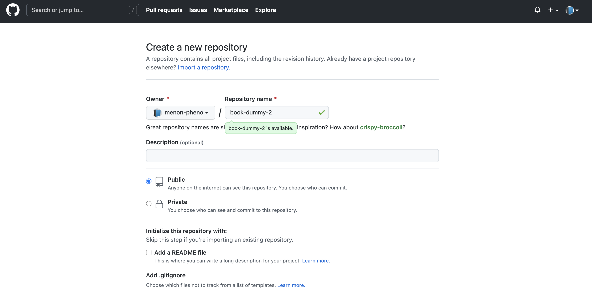
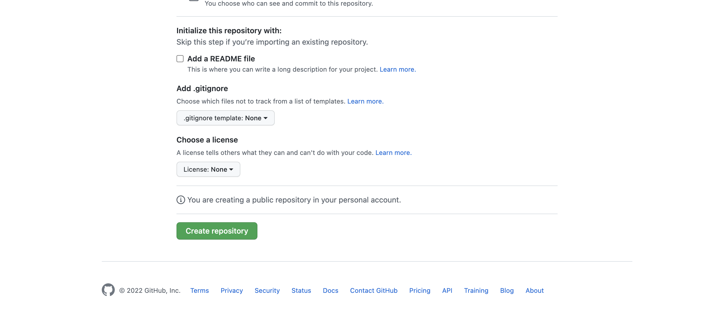
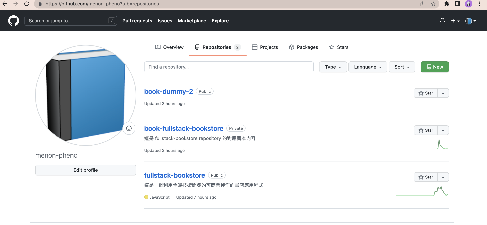
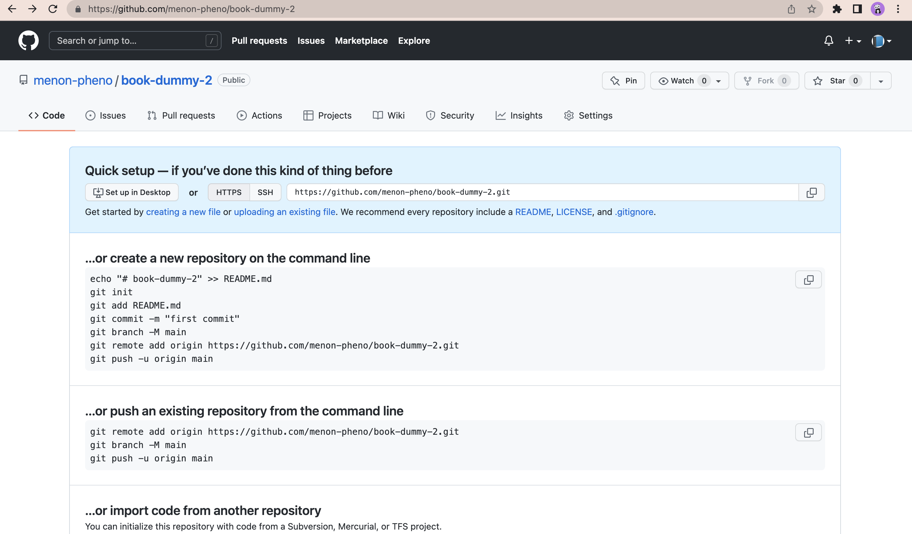
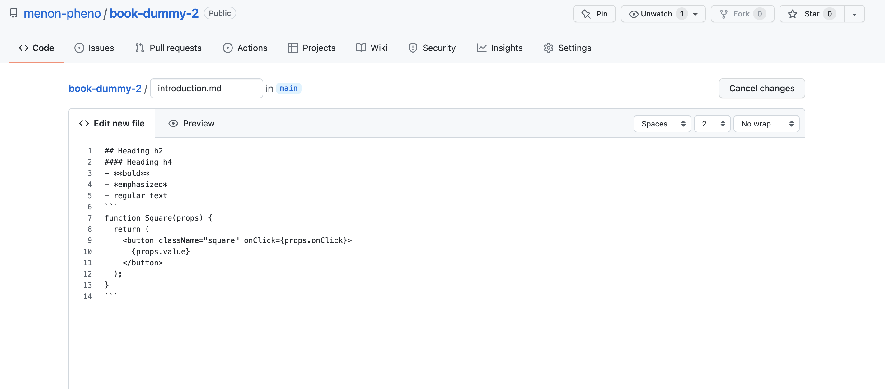
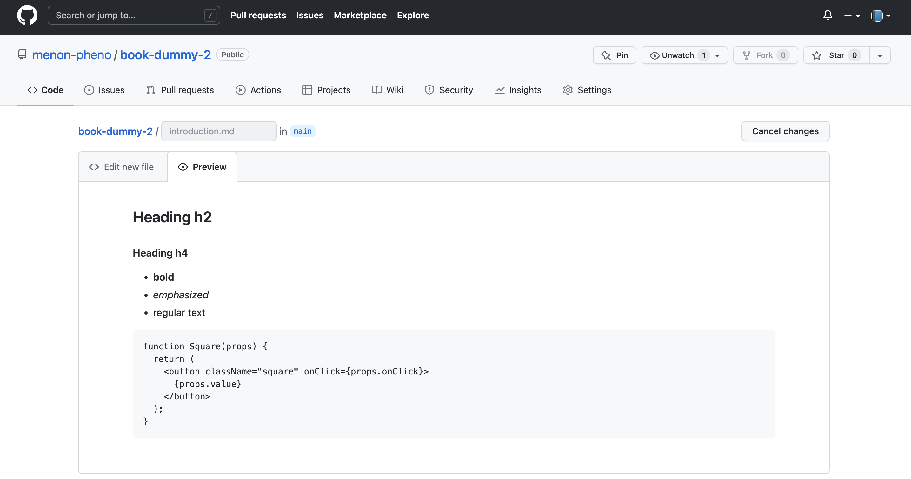
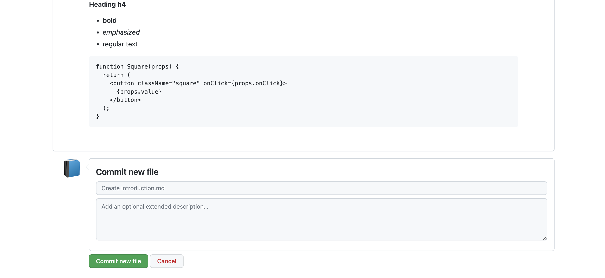
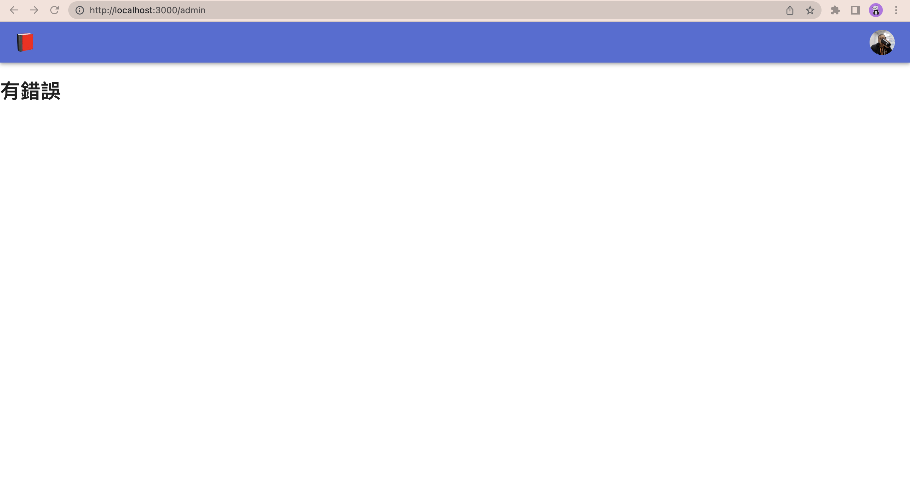

# 第五章

- 概述
- 與 Github 連線
  - 事前準備
  - 使用 `octokit`
- 總結

---

在我們開工之前，先取得`4-end`的程式碼。[4-end](https://github.com/menon-pheno/fullstack-bookstore/tree/master/book/4-end)資料夾位於[fullstack-bookstore repo](https://github.com/menon-pheno/fullstack-bookstore)`book`的目錄內。

- 如果你還沒有將 fullstack-bookstore 給 clone 下來的話，用`git clone https://github.com/menon-pheno/fullstack-bookstore`這個指令將 repo 複製到你的電腦上
- 注意：如果你想要用自己的 GitHub 帳號自己管理程式的話，你應該將我們的 repo fork 出來並且執行`git clone https://github.com/<你的 github 名稱>/fullstack-bookstore.git`。這樣你就可以將你的改動直接 push 到你的`fullstack-bookstore` repo
- 在`4-end`的資料夾內執行`yarn`來安裝所有的套件

我們在第四章會新增以下的套件：

- `"Octokit"`

看一下第五章的 [package.json](https://github.com/menon-pheno/fullstack-bookstore/blob/master/book/5-end/package.json)。

請確定使用我們指定的套件跟版本，並忽略任何升級的警告。我們會定期更新套件且測試相容性。我們無法確保新的套件版本與目前的程式碼都相容，套件升級時有的時候會導致一些預料之外的問題。

記得將你第四章更新的 `.env.local` 檔案放到專案的根目錄下。

我們鼓勵且歡迎你在閱讀本章的時候，可以在我們的 GitHub repo: [https://github.com/menon-pheno/fullstack-bookstore/issues/new](https://github.com/menon-pheno/fullstack-bookstore)回報任何 bug、錯字或是任何解釋不清楚的地方。

---

## 概述

我們在本章中將會將我們的網站與 Github 給對接起來，我們的目標是要將 Github 內所存放的書本資料透過我們 Next.js 的伺服器，將資訊存放到我們的 MongoDB 內。

我們另外也會有一些新的 UI 設計，像是一個 `連接 Github` 以及 `同步 Github` 的按鈕。這個實作完後，我們的管理者角色的使用者就可以建立一個新的書本，並且從 Github repository 將書本的資料給抓取下來。

---

## 與 Github 連線

我們的第一步，是先讓我們的網站能與 Github 做連接。莫忘初衷，我們的設計是將一個 Github 的 repository 當作一本書的全部內容。所以當我們能夠將網站與 Github 連接的時候，就代表我們可以拿到書本的內容了。

---

### 事前準備

筆者在這邊假設讀者有 [Github](https://github.com) 的帳號。Github 是目前世界上最大的程式碼管理中心。我們的網站會是設計為，一個 Github 帳戶可以想成是書店的一個作者，而作者在 Github 的一個 repository 則是當作一本書，而 repostory 內的 `.md` 檔案則對應到那本書的某個章節。如果你沒有 Github 的帳號，先去申請一個帳號吧。

接著，我們來建立一個 repository（這會代表一本書），在登入後的 Github 首頁上點選 `New` 來建立：


我們來盡量比照前一章我們手動在 MongoDB 建立的書本，因此書名（repository name）我們取為 `book-dummy-2`（我們在前置多放一個 `book`，以便更明顯的讓我們知道這個 repository 是一本“書”）：



其他選項可以單純的用預設值，然後按下 `Create Repository`：


新增完後，你在 Github 的 `Repositories` 就應該會出現剛剛所新增的“書本”了：



接著我們在 `book-dummy-2` repository 中新增一個 `introduction.md` 檔案。在 `book-dummy-2` repository 中點選 `creating a new file`（本書不打算討論太多使用 Github 的方法，我們單純的使用 Github 雲端的頁面來進行檔案的上傳。一般來說會透過在自己電腦與 Github 連接，並且透過一些指令或是工具來處理檔案的上傳動作）：



接著將檔案取名為 `introduction.md`，內容與我們上章建立的 MongoDB `introduction` 章節一樣：



值得注意一下，這裡有個 `Preview` 頁籤，這是因為 Github 本身也有支援 `.md`（markdown）的格式，所以這個頁籤可以看到 `introduction.md` 實際想要呈現的樣子（這跟我們自己網站從 MongoDB 抓取的 `md` 字串可以說是一模一樣）：



再按下網頁下方的 `Commit new file` 就可以將 `introduction.md` 給上傳（嚴格說，在 git 的體系內，這叫做 commit，也因此網頁上的按鈕才會寫 `Commit`）：



我們到這裡完成了事前準備：

- 建立了 Github 帳號
- 建立了一個 repository（書本）
- 建立了 repository 內的 `.md` （章節）

我們的網站將會透過 Web API 來與 Github 做資訊上的溝通，因此先看一下 [Github 建議的 API 認證方式](https://docs.github.com/en/enterprise-server@3.4/authentication/keeping-your-account-and-data-secure/creating-a-personal-access-token)，Github 建議使用 API 來存取 Github 時使用 personal access token 而不是使用帳號密碼的方式。

因此我們現在來申請一個 personal access token。申請 Github Personal Access Token 的方式在上面的網址描述的很清楚，我們在這裡就不重複了。

申請完畢後，將這個 personal access token 放到 `.env.local` 檔內：

```
GITHUB_PERSONAL_ACCESS_TOKEN="{你所申請到的 token}"
```

到這邊我們在 Github 端的準備就告一段落，我們接著就是要讓我們的網站能夠與 Github 溝通了。

---

### 使用 `octokit`

我們會透過 Github 官方認證的 [octokit](https://github.com/octokit/octokit.js) 來進行與 Github 連線的功能：

```
yarn add octokit
```

我們先建立一個 `pages/admin/index.js`，內容如下：

```JSX
import { Button, Box, CircularProgress } from "@mui/material";
import Link from "next/link";
import useSWR from "swr";

import dataFetcher from "../../lib/dataFetcher";

const Admin = () => {
  const { data, error } = useSWR(`/api/git/repos`, dataFetcher);

  if (error) {
    return (
      <>
        <h1>有錯誤</h1>
      </>
    );
  }

  if (!data) {
    return (
      <>
        <Box sx={{ display: "flex" }}>
          <CircularProgress />
        </Box>
      </>
    );
  }

  return (
    <>
      <ul>
        {data.repos.map((repo) => (
          <li key={repo}>{repo}</li>
        ))}
      </ul>
      <Link href="/admin/add-book">
        <Button variant="contained">新增書本</Button>
      </Link>
    </>
  );
};

export default Admin;
```

- 到這邊，應該已經對 Next.js 的頁面路由架構有一定的認識了。`pages/admin/index.js` 會對應到 `{ROOT_URL/admin}` 的這個頁面
- 這個頁面的程式碼應該也不陌生才對，就是呼叫一個 Web API（`/api/git/repos`，這個待會就會實作）然後將回傳的資料用一個 `<ul>` 給列表出來

現在假設造訪 `http://localhost:3000/admin`：



---

`pages/api/git/repos.js`
Add Environment Variable for Vercel

`pages/admin/index.js`

Admin user not connected to Github will see Connect Github
`models/User.js` add following four fields:

```JSON
isGithubConnected: {
    type: Boolean,
    default: false,
  },
  githubAccessToken: {
    type: String,
  },
  githubId: {
    type: String,
    unique: true,
  },
  githubUsername: {
    type: String,
    unique: true,
  },
```

```JavaScript
class UserClass {
  static publicFields() {
    return ["id", "name", "email", "image", "isAdmin", "isGithubConnected"];
  }
}
UserSchema.loadClass(UserClass);
```
