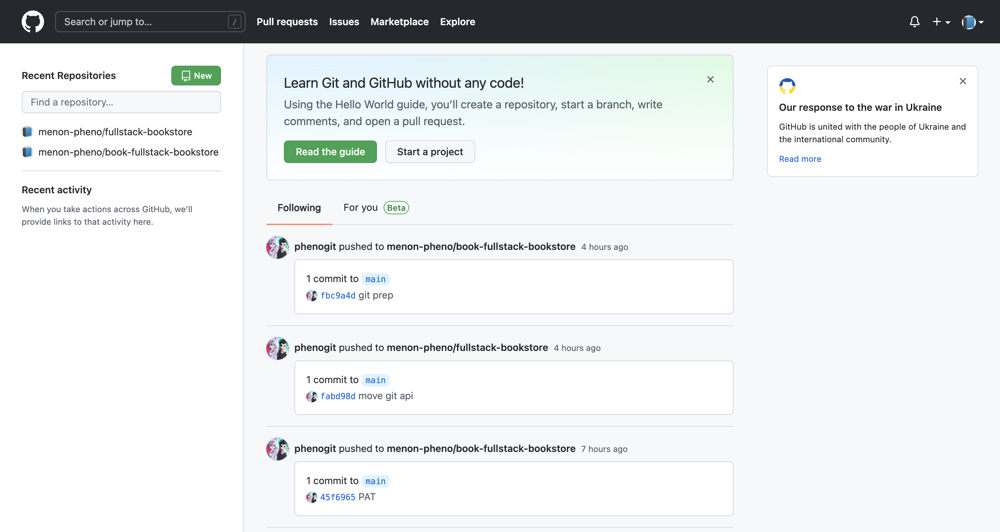

# 第五章

- 概述
- 與 Github 連線
  - 事前準備
  - 使用 `octokit`
  - 上 Vercel 雲端的調整
- Github 與 MongoDB 之間的關係
  - 測試並檢視成果
- UI 調整
- 總結

---

在我們開工之前，先取得`4-end`的程式碼。[4-end](https://github.com/menon-pheno/fullstack-bookstore/tree/master/book/4-end)資料夾位於[fullstack-bookstore repo](https://github.com/menon-pheno/fullstack-bookstore)`book`的目錄內。

- 如果你還沒有將 fullstack-bookstore 給 clone 下來的話，用`git clone https://github.com/menon-pheno/fullstack-bookstore`這個指令將 repo 複製到你的電腦上
- 注意：如果你想要用自己的 GitHub 帳號自己管理程式的話，你應該將我們的 repo fork 出來並且執行`git clone https://github.com/<你的 github 名稱>/fullstack-bookstore.git`。這樣你就可以將你的改動直接 push 到你的`fullstack-bookstore` repo
- 在`4-end`的資料夾內執行`yarn`來安裝所有的套件

我們在第四章會新增以下的套件：

- `"Octokit"`

看一下第五章的 [package.json](https://github.com/menon-pheno/fullstack-bookstore/blob/master/book/5-end/package.json)。

請確定使用我們指定的套件跟版本，並忽略任何升級的警告。我們會定期更新套件且測試相容性。我們無法確保新的套件版本與目前的程式碼都相容，套件升級時有的時候會導致一些預料之外的問題。

記得將你第四章更新的 `.env.local` 檔案放到專案的根目錄下。

我們鼓勵且歡迎你在閱讀本章的時候，可以在我們的 GitHub repo: [https://github.com/menon-pheno/fullstack-bookstore/issues/new](https://github.com/menon-pheno/fullstack-bookstore)回報任何 bug、錯字或是任何解釋不清楚的地方。

---

## 概述

我們在本章中將會將我們的網站與 Github 給對接起來，我們的目標是要將 Github 內所存放的書本資料透過我們 Next.js 的伺服器，將資訊存放到我們的 MongoDB 內。

我們另外也會有一些新的 UI 設計，像是一個 `連接 Github` 以及 `同步 Github` 的按鈕。這個實作完後，我們的管理者角色的使用者就可以建立一個新的書本，並且從 Github repository 將書本的資料給抓取下來。

---

## 與 Github 連線

我們的第一步，是先讓我們的網站能與 Github 做連接。莫忘初衷，我們的設計是將一個 Github 的 repository 當作一本書的全部內容。所以當我們能夠將網站與 Github 連接的時候，就代表我們可以拿到書本的內容了。

---

### 事前準備

筆者在這邊假設讀者有 [Github](https://github.com) 的帳號。Github 是目前世界上最大的程式碼管理中心。我們的網站會是設計為，一個 Github 帳戶可以想成是書店的一個作者，而作者在 Github 的一個 repository 則是當作一本書，而 repostory 內的 `.md` 檔案則對應到那本書的某個章節。如果你沒有 Github 的帳號，先去申請一個帳號吧。

接著，我們來建立一個 repository（這會代表一本書），在登入後的 Github 首頁上點選 `New` 來建立：



我們來盡量比照前一章我們手動在 MongoDB 建立的書本，因此書名（repository name）我們取為 `book-dummy-2`（我們在前置多放一個 `book`，以便更明顯的讓我們知道這個 repository 是一本“書”）：


其他選項可以單純的用預設值，然後按下 `Create Repository`：


新增完後，你在 Github 的 `Repositories` 就應該會出現剛剛所新增的“書本”了：


接著我們在 `book-dummy-2` repository 中新增一個 `introduction.md` 檔案。在 `book-dummy-2` repository 中點選 `creating a new file`（本書不打算討論太多使用 Github 的方法，我們單純的使用 Github 雲端的頁面來進行檔案的上傳。一般來說會透過在自己電腦與 Github 連接，並且透過一些指令或是工具來處理檔案的上傳動作）：


接著將檔案取名為 `introduction.md`，內容與我們上章建立的 MongoDB `introduction` 章節一樣：


值得注意一下，這裡有個 `Preview` 頁籤，這是因為 Github 本身也有支援 `.md`（markdown）的格式，所以這個頁籤可以看到 `introduction.md` 實際想要呈現的樣子（這跟我們自己網站從 MongoDB 抓取的 `md` 字串可以說是一模一樣）：


再按下網頁下方的 `Commit new file` 就可以將 `introduction.md` 給上傳（嚴格說，在 git 的體系內，這叫做 commit，也因此網頁上的按鈕才會寫 `Commit`）：


我們到這裡完成了事前準備：

- 建立了 Github 帳號
- 建立了一個 repository（書本）
- 建立了 repository 內的 `.md` （章節）

我們的網站將會透過 Web API 來與 Github 做資訊上的溝通，因此先看一下 [Github 建議的 API 認證方式](https://docs.github.com/en/enterprise-server@3.4/authentication/keeping-your-account-and-data-secure/creating-a-personal-access-token)，Github 建議使用 API 來存取 Github 時使用 personal access token 而不是使用帳號密碼的方式。

因此我們現在來申請一個 personal access token。申請 Github Personal Access Token 的方式在上面的網址描述的很清楚，我們在這裡就不重複了。

申請完畢後，將這個 personal access token 放到 `.env.local` 檔內：

```
GITHUB_PERSONAL_ACCESS_TOKEN="{你所申請到的 token}"
```

到這邊我們在 Github 端的準備就告一段落，我們接著就是要讓我們的網站能夠與 Github 溝通了。

---

### 使用 `octokit`

我們會透過 Github 官方認證的 [octokit](https://github.com/octokit/octokit.js) 來進行與 Github 連線的功能：

```
yarn add octokit
```

我們先建立一個 `pages/admin/index.js`，內容如下：

```JSX
import { Button, Box, CircularProgress } from "@mui/material";
import Link from "next/link";
import useSWR from "swr";

import dataFetcher from "../../lib/dataFetcher";

const Admin = () => {
  const { data, error } = useSWR(`/api/git/repos`, dataFetcher);

  if (error) {
    return (
      <>
        <h1>有錯誤</h1>
      </>
    );
  }

  if (!data) {
    return (
      <>
        <Box sx={{ display: "flex" }}>
          <CircularProgress />
        </Box>
      </>
    );
  }

  return (
    <>
      <ul>
        {data.repos.map((repo) => (
          <li key={repo}>{repo}</li>
        ))}
      </ul>
      <Link href="/admin/add-book">
        <Button variant="contained">新增書本</Button>
      </Link>
    </>
  );
};

export default Admin;
```

- 到這邊，應該已經對 Next.js 的頁面路由架構有一定的認識了。`pages/admin/index.js` 會對應到 `{ROOT_URL/admin}` 的這個頁面
- 這個頁面的程式碼應該也不陌生才對，就是呼叫一個 Web API（`/api/git/repos`，這個待會就會實作）然後將回傳的資料用一個 `<ul>` 給列表出來

現在假設造訪 `http://localhost:3000/admin`：


會有錯誤是正常的，因為我們還沒有定義 `/api/git/repos` 這個 API。但是可以看到我們的頁面路由是正確的。

我們接下來就是需要來實作這個 API，`pages/api/git/repos.js` 如下：

```JavaScript
import { Octokit } from "octokit";

async function repos(req, res) {
  const octokit = new Octokit({
    auth: process.env.GITHUB_PERSONAL_ACCESS_TOKEN,
  });

  const result = await octokit.rest.repos.listForAuthenticatedUser();
  const repos = result.data.map((entry) => entry.name);

  res.status(200).json({ repos });
}

export default repos;
```

- 可以看到我們使用 `octokit` 這個套件
- 我們在初始化 `Octokit` 的時候將我們前面設定好的 `GITHUB_PERSONAL_ACCESS_TOKEN` 透過環境變數給傳入
- `listForAuthenticatedUser` 這個 `octokit` 所提供的函式會回傳 `GITHUB_PERSONAL_ACCESS_TOKEN` 有權限存取的 repo 列表
- 我們將 repo 的名稱（`entry.name`）給擷取出來，然後用個陣列回傳

現在 `http://localhost:3000/admin` 應該變成類似（實際畫面取決於你的 repository 有哪些）：


由於你的 Github 有可能有非書本的 repository，我們做個簡單的 `filter` 來只把 repository 名稱開頭為 `book` 的項目抓出來，將 `pages/api/git/repos.js` 修改為：

```JavaScript
import { Octokit } from "octokit";

async function repos(req, res) {
  const octokit = new Octokit({
    auth: process.env.GITHUB_PERSONAL_ACCESS_TOKEN,
  });

  const result = await octokit.rest.repos.listForAuthenticatedUser();
  const repos = result.data
    .map((entry) => entry.name)
    .filter((repo) => repo.startsWith("book"));

  res.status(200).json({ repos });
}

export default repos;

```

- 可以看到我們多用了一個 `filter` 並且使用 Javascript 內建的 `startsWith` 函式來只保留 `"book"` 開頭的 repository

畫面變以下：


---

### 上 Vercel 雲端的調整

這邊很簡單，只是要在 Vercel 加上 GITHUB_PERSONAL_ACCESS_TOKEN 這個環境變數（方式之前章節已經做過很多次，就不贅述），我們的網站就維持 cloud-ready 的狀態了。

---

## Github 與 MongoDB 之間的關係

我們在上一節裡成功地將我們的網站與 Github 連接成功，但是這還沒有達成我們在本章的目的。我們希望書本的資料基本上都是存放在 MongoDB 裡，這有幾個原因：

- Github API 是有使用數量的限制
- MongoDB 可以多存放關於書本的其他資訊，例如價錢等
- Github 算是作者自己的世界，不應該讓其他的使用者接觸

我們在 `pages/admin/index.js` 裡的 `新增書本` 按鈕就是要來將 Github repository 內的資訊給複製到 MongoDB 裡。首先，我們看到 `pages/admin/index.js` 內點擊 `新增書本` 會導向 `<Link href="/admin/add-book">`，因此我們在網頁路由上要加上 `/admin/add-book` 這個頁面。新增 `pages/admin/add-book.js`，內容如下：

```JSX
import { useState } from "react";
import {
  TextField,
  Button,
  Alert,
  Select,
  Input,
  MenuItem,
  Box,
  CircularProgress,
} from "@mui/material";
import useSWR from "swr";
import Router from "next/router";

import dataFetcher from "../../lib/dataFetcher";

const AddBook = () => {
  const { data, error } = useSWR(`/api/git/repos`, dataFetcher);
  const [name, setName] = useState("");
  const [price, setPrice] = useState(0);
  const [githubRepo, setGithubRepo] = useState("");
  const [hasSubmitError, setHasSubmitError] = useState(false);
  const [errorMessage, setErrorMessage] = useState("");

  if (error) {
    return (
      <>
        <h1>有錯誤</h1>
      </>
    );
  }

  if (!data) {
    return (
      <>
        <Box sx={{ display: "flex" }}>
          <CircularProgress />
        </Box>
      </>
    );
  }

  const onSubmit = async (event) => {
    event.preventDefault();
    if (!name) {
      setHasSubmitError(true);
      setErrorMessage("書名必填");
      return;
    }
    if (!price) {
      setHasSubmitError(true);
      setErrorMessage("書價必填");
      return;
    }
    if (!githubRepo) {
      setHasSubmitError(true);
      setErrorMessage("Github repository 必填");
      return;
    }

    // TODO: save it to mongo
    // POST to /api/books with `book`
    const postBookRequestOptions = {
      method: "POST",
      headers: {
        "Content-Type": "application/json",
      },
      body: JSON.stringify({
        name,
        price,
        githubRepo,
      }),
    };

    try {
      const postBookResponse = await fetch(
        `/api/books`,
        postBookRequestOptions
      );
      const bookBody = await postBookResponse.json();
      const book = bookBody.book;
      const bookId = book._id;
      const [owner, repo] = githubRepo.split("/");
      const getChaptersResponse = await fetch(
        `/api/git/repoContent?owner=${owner}&repo=${repo}`
      );
      const chaptersBody = await getChaptersResponse.json();
      const chapters = chaptersBody.chapters;
      console.log(chapters);
      const postChaptersRequestOptions = {
        method: "POST",
        headers: {
          "Content-Type": "application/json",
        },
        body: JSON.stringify({
          bookId,
          chapters,
        }),
      };
      const postChaptersResponse = await fetch(
        `/api/chapters`,
        postChaptersRequestOptions
      );
      Router.push(`/books/${book.slug}}`);
    } catch (error) {
      console.log(error);
      console.log("error adding book/chapter");
    }
  };

  return (
    <>
      <h1>新增書本</h1>
      <form onSubmit={onSubmit}>
        <br />
        <TextField
          onChange={(event) => {
            setName(event.target.value);
          }}
          value={name}
          type="text"
          label="書名"
        />
        <br />
        <br />
        <TextField
          onChange={(event) => {
            setPrice(Number(event.target.value));
          }}
          value={price}
          type="number"
          label="書價"
        />
        <br />
        <span>Github repo:</span>
        <Select
          value={""}
          input={<Input />}
          onChange={(event) => {
            setGithubRepo(event.target.value);
          }}
        >
          <MenuItem value="">
            <em>-- 選擇 Github repo --</em>
          </MenuItem>
          {data.repos.map((repo) => (
            <MenuItem value={repo.fullName} key={repo.id}>
              {repo.fullName}
            </MenuItem>
          ))}
        </Select>
        <br />
        <br />
        <Button variant="contained" type="submit">
          送出
        </Button>
      </form>
      {hasSubmitError && <Alert severity="error">{errorMessage}</Alert>}
    </>
  );
};

export default AddBook;

```

這次程式稍微多一點，其中重點有以下：

- 我們這個頁面會需要幾個東西的資料

```JSX
const { data, error } = useSWR(`/api/git/repos`, dataFetcher);
const [name, setName] = useState("");
const [price, setPrice] = useState(0);
const [githubRepo, setGithubRepo] = useState("");
const [hasSubmitError, setHasSubmitError] = useState(false);
const [errorMessage, setErrorMessage] = useState("");
```

`name`、`price`、`githubRepo`、`hasSubmitError`、`errorMessage` 都是使用 react 的 `useState` 來記錄，而我們會對 `/api/git/repos` 做一個 Web API 呼叫來取得存在的 repository。

我們順道調整了一下 `pages/api/git/repos.js` 的內容：

```JavaScript
import { Octokit } from "octokit";

async function repos(req, res) {
  const octokit = new Octokit({
    auth: process.env.GITHUB_PERSONAL_ACCESS_TOKEN,
  });

  const result = await octokit.rest.repos.listForAuthenticatedUser();
  const repos = result.data
    .map((entry) => {
      return {
        id: entry.id,
        name: entry.name,
        fullName: entry.full_name,
      };
    })
    .filter((repo) => repo.name.startsWith("book"));

  res.status(200).json({ repos });
}

export default repos;

```

- 主要是多將 `id`、`fullName` 兩個屬性也透過 API 回傳，因為我們的 `AddBook` 頁面會需要

由於更動了 `pages/api/git/repos.js`，我們 `pages/admin/index.js` 的檔案也要對應調整：

```JSX
import { Button, Box, CircularProgress } from "@mui/material";
import Link from "next/link";
import useSWR from "swr";

import dataFetcher from "../../lib/dataFetcher";

const Admin = () => {
  const { data, error } = useSWR(`/api/git/repos`, dataFetcher);

  if (error) {
    return (
      <>
        <h1>有錯誤</h1>
      </>
    );
  }

  if (!data) {
    return (
      <>
        <Box sx={{ display: "flex" }}>
          <CircularProgress />
        </Box>
      </>
    );
  }

  return (
    <>
      <ul>
        {data.repos.map((repo) => (
          <li key={repo.name}>{repo.name}</li>
        ))}
      </ul>
      <Link href="/admin/add-book">
        <Button variant="contained">新增書本</Button>
      </Link>
    </>
  );
};

export default Admin;
```

- 頁面實際渲染的部分，其實很簡單，我們利用 Material UI 提供的元件，讓使用者提供 `name`、`price`、`githubRepo` 的值。值得一提的是，這三個值是跟我們 `models/Book.js` 裡面定義的 `add` 函式所需要的參數是一致的。

- 在填完需要的資訊後，我們透過 `onSubmit` 這個函式來進行將書本存放到 MongoDB 的動作，大致上分為以下幾個步驟：

  1. 先對 `/api/books` 呼叫一個 POST 請求，這會在 MongoDB 上面的 `book` 集合新增一個書本
  2. 接著，我們透過 `/api/git/repoContent` 這個 API 來取得該書本各章節的檔案
  3. 最後我們透過 `/api/chapters` 來將各個章節的 `.md` 檔案內容，連同 MongoDB 該書本的 `book.id` 給寫道 MongoDB 內的 `chapter` 集合

- 這些動作都完成後我們透過 `next/router` 的 `Router` 來將網站轉導至書本頁面（`/books/${bookSlug}`）

上面的步驟中，有幾個項目我們還沒有實作，接著我們把這些缺漏的東西補上。

依序是，`api/books/index.js` 需要處理 POST 請求：

```JavaScript
import dbConnect from "../../../lib/mongoose";
import Book from "../../../models/Book";

async function books(req, res) {
  const { method } = req;
  await dbConnect();

  switch (method) {
    case "GET":
      try {
        const result = await Book.find({});
        const books = result.map((doc) => {
          const book = doc.toObject();
          book._id = book._id.toString();
          return book;
        });
        res.status(200).json({ success: true, books });
      } catch (error) {
        console.log(error);
        res.status(400).json({ success: false });
      }
      break;
    case "POST":
      try {
        const book = await Book.add(req.body);
        res.status(200).json({ success: true, book });
      } catch (error) {
        console.log(error);
        res.status(400).json({ success: false });
      }
      break;
    default:
      res.status(400).json({ success: false });
      break;
  }
}

export default books;
```

- 這邊最主要的是我們多處理了 `POST` 這個請求類型。處理這個請求很單純，就是呼叫我們在 `model/Book.js` 裡面定義好的函式，這就會在 MongoDB 將這本書新增並且將新增的結果回傳

下一步則是 `api/git/repoContent.js`：

```JavaScript
import { Octokit } from "octokit";

async function repoContent(req, res) {
  const octokit = new Octokit({
    auth: process.env.GITHUB_PERSONAL_ACCESS_TOKEN,
  });

  console.log(req.query);
  const owner = req.query.owner;
  const repo = req.query.repo;

  try {
    const mainFolder = await octokit.rest.repos.getContent({
      owner,
      repo,
      path: "",
    });

    const chapters = await Promise.all(
      mainFolder.data.map(async (file) => {
        if (file.type !== "file") {
          return;
        }

        const chapter = await octokit.rest.repos.getContent({
          owner,
          repo,
          path: file.path,
        });
        //Buffer.from(str, 'base64') andbuf.toString('base64')
        const buffer = Buffer.from(chapter.data.content, "base64");
        return {
          title: file.path,
          content: buffer.toString("utf8"),
        };
      })
    );
    res.status(200).json({ chapters });
  } catch (error) {
    console.log("get main folder of git error");
    console.log(error);
    res.status(500);
  }
}

export default repoContent;

```

- 這個 API 會進行多次 `Octokit` 所提供的 `getContent` 函式。
  - 第一次使用 `path: ""`，這會拿到所指定的 repository 在根目錄下的所有檔案資訊
  - 取得 repository 各檔案路徑的資訊後，我們透過 `Array.map` 來對每個檔案路徑呼叫 `getContent({ path: file.path })`
- 對各個檔案的 `getContent` 我們用一個 `Promise.all` 給包起來，這樣可以確保所有的檔案都撈取正確才會回傳
- 另外，`getContent` 所回傳的 `chapter.data.content` 是一個 base64 編碼的字串，我們使用 Node.js 推薦的轉碼方式，透過 `buffer` 來解譯

類似於 `api/books/index.js`，我們也需要提供 `api/chapters/index.js` 來處理 POST chapters 的請求，來將各個章節給新增到 MongoDB 內：

```JavaScript
import dbConnect from "../../../lib/mongoose";
import Chapter from "../../../models/Chapter";

async function chapters(req, res) {
  const { method } = req;
  await dbConnect();

  switch (method) {
    case "POST":
      try {
        const bookId = req.body.bookId;
        const chapters = req.body.chapters;
        for (let i = 0; i < chapters.length; i++) {
          await Chapter.add({
            bookId,
            title: chapters[i].title.split(".").slice(0, -1).join("."),
            content: chapters[i].content,
          });
        }
        res.status(200).json({ success: true });
      } catch (error) {
        console.log(error);
        res.status(400).json({ success: false });
      }

      break;
    default:
      res.status(400).json({ success: false });
      break;
  }
}

export default chapters;

```

- 這個 API 主要是將各個章節透過 `models/Chapter.js`（這個檔案我們馬上會做些微調）的 `add` 函式，來將 `bookId`、`title`、`content` 傳入並且寫到 MongoDB 內

為了支援 `api/chapters/index.js`，我們 `models/Chapter.js` 修改成以下：

```JavaScript
import mongoose from "mongoose";
import generateSlug from "../lib/slugify";
import Book from "./Book";

const { Schema } = mongoose;

const ChapterSchema = new Schema({
  // schema 內容
  bookId: {
    type: Schema.Types.ObjectId,
    required: true,
  },
  isFree: {
    type: Boolean,
    required: true,
    default: false,
  },
  githubFilePath: {
    type: String,
  },
  title: {
    type: String,
    required: true,
  },
  slug: {
    type: String,
    required: true,
  },
  excerpt: {
    type: String,
    default: "",
  },
  content: {
    type: String,
    default: "",
    required: true,
  },
  htmlContent: {
    type: String,
    default: "",
    required: false,
  },
  createdAt: {
    type: Date,
    required: true,
  },
  order: {
    type: Number,
    required: false,
  },
  seoTitle: String,
  seoDescription: String,
});

class ChapterClass {
  // 需要的函式
  static async getBySlug({ bookSlug, chapterSlug }) {
    const book = await Book.getBySlug({ slug: bookSlug });
    if (!book) {
      throw new Error(`${bookSlug} 書本不存在`);
    }

    const chapter = await this.findOne({ bookId: book._id, slug: chapterSlug });

    if (!chapter) {
      throw new Error(`${chapterSlug} 章節不存在`);
    }

    const chapterObject = chapter.toObject();
    chapterObject.book = book;

    return chapterObject;
  }

  static async add({ bookId, title, content }) {
    console.log("Chapter Add");
    console.log(`${bookId}-${title}`);
    const slug = await generateSlug(this, title);
    if (!slug) {
      throw new Error(`${title} slug 產生失敗`);
    }
    return this.create({
      bookId,
      title,
      slug,
      content,
      createdAt: new Date(),
    });
  }
}

ChapterSchema.index({ bookId: 1, slug: 1 }, { unique: true });
ChapterSchema.index({ bookId: 1, githubFilePath: 1 }, { unique: true });

ChapterSchema.loadClass(ChapterClass);

export default mongoose.models.Chapter ||
  mongoose.model("Chapter", ChapterSchema);

```

- 我們把 `Schema` 的一些欄位調整成非必要（`required: false`），因為我們還沒打算要加這些欄位
- 最主要的是我們新增了 `add` 這個靜態函式，這正是我們 `api/chapters/index.js` 所需要使用的函式

我們快到這段的尾聲了，做個簡單的頁面路由 `pages/books/[bookSlug]/index.js`：

```JSX
import { useRouter } from "next/router";

const Book = () => {
  const router = useRouter();
  const { bookSlug } = router.query;

  return (
    <>
      <h1>這是書本介紹頁</h1>
      <h2>書本 slug: {bookSlug}</h2>
    </>
  );
};

export default Book;
```

- 這僅是單純讓我們加完書本與章節後轉導到 `/books/{bookSlug}` 的時候不要進入 404 錯誤頁，有個簡單的頁面（未來再繼續補充，這節已經相當長了）

---

### 測試並檢視成果

首先，我們把 MongoDB 內的 `books` 及 `chapters` 集合內的文件都刪除。

現在造訪 `http://localhost:3000/admin`：


接著點擊 `新增書本`，你會轉導到 `http://localhost:3000/admin/add-book` 頁面：


填上書名、書價、以及選擇該書本的 Github repo，點及 `送出`：


回頭看一下 MongoDB Atlas，`books` 集合：

## 

`chapters` 集合：

## 

可以看到我們 MongoDB Atlas 有正確地將書本與章節給建立起來了！最後，造訪 `http://localhost/books/sample-book/introduction`：

## 

到這邊，我們成功的將書本建立到 MongoDB 內，並且可以正確地呈現在我們網站上了。另外值得一提的是，我們上面的網站截圖，都是直接在 Vercel 的雲端，代表的是，我們所寫的程式已經是 cloud-ready，可以直接發佈的。

---

## UI 調整

我們現在來調整一下 `pages/books/[bookSlug].js`。之前我們只是暫時性的渲染了一個單純的頁面，我想，至少需要將書本對應的章節給列表出來吧。要做到這點，我們會需要兩件事：

- 提供一個取得一本書對應的所有章節的 API
- 將取得的章節呈現在 `pages/books/[bookSlug]/index.js`

首先，取得一本書對應的所有章節，我們透過調整 `pages/api/book/[...slugs].js`：

```JavaScript
import dbConnect from "../../../lib/mongoose";
import Book from "../../../models/Book";
import Chapter from "../../../models/Chapter";

async function chapter(req, res) {
  const { slugs } = req.query;

  // slugs.length == 1: api/books/book-slug
  // slugs.length == 2: api/books/book-slug/chapter-slug
  const { method } = req;
  let bookSlug, chapterSlug;
  switch (slugs.length) {
    case 1:
      bookSlug = slugs[0];
      await dbConnect();
      switch (method) {
        case "GET":
          try {
            const bookResult = await Book.find({ slug: bookSlug });
            if (bookResult.length === 0) {
              res
                .status(400)
                .json({ success: false, errorMessage: "No book found" });
            } else if (bookResult.length > 1) {
              res.status(400).json({
                success: false,
                errorMessage: "More than one book found",
              });
            } else {
              const book = bookResult[0].toObject();
              book._id = bookResult[0]._id.toString();

              const chapterResult = await Chapter.find({
                bookId: book._id,
              });
              if (chapterResult.length === 0) {
                res
                  .status(400)
                  .json({ success: false, errorMessage: "No chapter found" });
              } else {
                const chapters = chapterResult.map((chapter) => {
                  const processedChapter = chapter.toObject();
                  processedChapter._id = chapter._id.toString();
                  return processedChapter;
                });
                res.status(200).json({ success: true, chapters });
              }
            }
          } catch (error) {
            console.log(error);
            res
              .status(400)
              .json({ success: false, errorMessage: "GET resulted in error" });
          }
          break;
        default:
          res
            .status(400)
            .json({ success: false, errorMessage: "不該走到這..." });
          break;
      }
      break;
    case 2:
      bookSlug = slugs[0];
      chapterSlug = slugs[1];
      await dbConnect();

      switch (method) {
        case "GET":
          try {
            const bookResult = await Book.find({ slug: bookSlug });
            if (bookResult.length === 0) {
              res
                .status(400)
                .json({ success: false, errorMessage: "No book found" });
            } else if (bookResult.length > 1) {
              res.status(400).json({
                success: false,
                errorMessage: "More than one book found",
              });
            } else {
              const book = bookResult[0].toObject();
              book._id = bookResult[0]._id.toString();

              const chapterResult = await Chapter.find({
                bookId: book._id,
                slug: chapterSlug,
              });
              if (chapterResult.length === 0) {
                res
                  .status(400)
                  .json({ success: false, errorMessage: "No chapter found" });
              } else if (chapterResult.length > 1) {
                res.status(400).json({
                  success: false,
                  errorMessage: "More than one chapter found",
                });
              } else {
                const chapter = chapterResult[0].toObject();
                chapter._id = chapterResult[0]._id.toString();
                res.status(200).json({ success: true, chapter });
              }
            }
          } catch (error) {
            console.log(error);
            res
              .status(400)
              .json({ success: false, errorMessage: "GET resulted in error" });
          }
          break;
        default:
          res
            .status(400)
            .json({ success: false, errorMessage: "不該走到這..." });
      }
      break;
    default:
      res.status(400).json({ success: false, errorMessage: "網址有問題" });
      break;
  }
}

export default chapter;

```

- 之前這個 API 只有處理 `slugs` 長度為二的狀況，也就是 `api/books/book-slug/chapter-slug` 這樣的狀況，用來呈現單一章節的內容。我們現在要額外處理 `slugs` 長度為一的狀況，這會對應 `api/books/book-slug`，也就是針對一本書去把這本書的所有章節都取出來並回傳

我們頁面 `pages/books/[bookSlug]/index.js` 對應的調整為：

```JSX
import { Box, CircularProgress } from "@mui/material";
import { useRouter } from "next/router";
import useSWR from "swr";
import Link from "next/link";

import dataFetcher from "../../../lib/dataFetcher";

const Book = () => {
  const router = useRouter();
  const { bookSlug } = router.query;
  const { data, error } = useSWR(
    bookSlug ? `/api/books/${bookSlug}` : null,
    dataFetcher
  );

  if (error) {
    return (
      <>
        <h1>有錯誤</h1>
      </>
    );
  }

  if (!data) {
    return (
      <>
        <Box sx={{ display: "flex" }}>
          <CircularProgress />
        </Box>
      </>
    );
  }

  return (
    <>
      <h1>書本 slug: {bookSlug}</h1>
      <ul>
        {data.chapters.map((chapter) => (
          <li key={chapter._id}>
            <Link href={`/books/${bookSlug}/${chapter.slug}`}>
              <a>{chapter.title}</a>
            </Link>
          </li>
        ))}
      </ul>
    </>
  );
};

export default Book;

```

- 我們的頁面現在會呼叫 API 以取得章節的資訊
- 接著我們用 `Array.map` 來將各章節的 `title` 用 `<li>` 給顯示出來

最後，我們再調整一個簡單的 UI，以符合常見的一個使用習慣。我們的 `Header` 的左方有一個網站的 logo，一般來說，點擊 logo 應該會回到首頁。要做到這點很簡單，我們把 `Header` 裡的 logo 用 `next/link` 給包覆起來，`components/ResponsiveAppBar.js` 變成：

```JSX
import * as React from "react";
import AppBar from "@mui/material/AppBar";
import Box from "@mui/material/Box";
import Toolbar from "@mui/material/Toolbar";
import IconButton from "@mui/material/IconButton";
import Typography from "@mui/material/Typography";
import Menu from "@mui/material/Menu";
import MenuIcon from "@mui/icons-material/Menu";
import Container from "@mui/material/Container";
import Avatar from "@mui/material/Avatar";
import Button from "@mui/material/Button";
import Tooltip from "@mui/material/Tooltip";
import MenuItem from "@mui/material/MenuItem";
import Link from "next/link";
import Image from "next/image";
import { useSession, signIn, signOut } from "next-auth/react";

const ResponsiveAppBar = ({ options, pages }) => {
  const [anchorElNav, setAnchorElNav] = React.useState(null);
  const [anchorElUser, setAnchorElUser] = React.useState(null);
  const { data: session } = useSession();

  const handleOpenNavMenu = (event) => {
    setAnchorElNav(event.currentTarget);
  };
  const handleOpenUserMenu = (event) => {
    setAnchorElUser(event.currentTarget);
  };

  const handleCloseNavMenu = () => {
    setAnchorElNav(null);
  };

  const handleCloseUserMenu = () => {
    setAnchorElUser(null);
  };

  return (
    <AppBar position="static">
      <Container maxWidth="xl">
        <Toolbar disableGutters>
          <Typography
            variant="h6"
            noWrap
            component="div"
            sx={{ mr: 2, display: { xs: "none", md: "flex" } }}
          >
            <Link href="/">
              <Image src="/appbar-logo.png" alt="logo" width="32" height="32" />
            </Link>
          </Typography>

          <Box sx={{ flexGrow: 1, display: { xs: "flex", md: "none" } }}>
            <IconButton
              size="large"
              aria-label="account of current user"
              aria-controls="menu-appbar"
              aria-haspopup="true"
              onClick={handleOpenNavMenu}
              color="inherit"
            >
              <MenuIcon />
            </IconButton>
            <Menu
              id="menu-appbar"
              anchorEl={anchorElNav}
              anchorOrigin={{
                vertical: "bottom",
                horizontal: "left",
              }}
              keepMounted
              transformOrigin={{
                vertical: "top",
                horizontal: "left",
              }}
              open={Boolean(anchorElNav)}
              onClose={handleCloseNavMenu}
              sx={{
                display: { xs: "block", md: "none" },
              }}
            >
              {pages.map((page) => (
                <MenuItem key={page} onClick={handleCloseNavMenu}>
                  <Typography textAlign="center">{page}</Typography>
                </MenuItem>
              ))}
            </Menu>
          </Box>
          <Typography
            variant="h6"
            noWrap
            component="div"
            sx={{ flexGrow: 1, display: { xs: "flex", md: "none" } }}
          >
            <Image src="/appbar-logo.png" alt="logo" width="32" height="32" />
          </Typography>
          <Box sx={{ flexGrow: 1, display: { xs: "none", md: "flex" } }}>
            {pages.map((page) => (
              <Button
                key={page}
                onClick={handleCloseNavMenu}
                sx={{ my: 2, color: "white", display: "block" }}
              >
                {page}
              </Button>
            ))}
          </Box>

          <Box sx={{ flexGrow: 0 }}>
            {session ? (
              <>
                <Tooltip title={"開啟選單"}>
                  <IconButton onClick={handleOpenUserMenu} sx={{ p: 0 }}>
                    <Avatar alt={session.user.name} src={session.user.image} />
                  </IconButton>
                </Tooltip>
                <Menu
                  sx={{ mt: "45px" }}
                  id="menu-appbar"
                  anchorEl={anchorElUser}
                  anchorOrigin={{
                    vertical: "top",
                    horizontal: "right",
                  }}
                  keepMounted
                  transformOrigin={{
                    vertical: "top",
                    horizontal: "right",
                  }}
                  open={Boolean(anchorElUser)}
                  onClose={handleCloseUserMenu}
                >
                  {options.map((option) => {
                    if (option.isLogout) {
                      return (
                        <div key={option.text}>
                          <MenuItem onClick={() => signOut()}>
                            {option.text}
                          </MenuItem>
                        </div>
                      );
                    }

                    if (option.isExternal) {
                      return (
                        <div key={option.text}>
                          <MenuItem>
                            <a
                              href={option.href}
                              target="_blank"
                              rel="noopener noreferrer"
                              style={{
                                color: "inherit",
                                textDecoration: "none",
                              }}
                            >
                              {option.text}
                            </a>
                          </MenuItem>
                        </div>
                      );
                    }

                    if (option.anchor) {
                      return (
                        <div key={option.text}>
                          <MenuItem
                            onClick={(event) => {
                              event.preventDefault();
                              window.location.href = option.href;
                              handleCloseUserMenu();
                            }}
                          >
                            {option.text}
                          </MenuItem>
                        </div>
                      );
                    }

                    return (
                      <div key={option.text}>
                        <Link href={option.href} as={option.as || option.href}>
                          <MenuItem>{option.text}</MenuItem>
                        </Link>
                      </div>
                    );
                  })}
                </Menu>
              </>
            ) : (
              <Link href="/login">
                <Button
                  variant="contained"
                  color="secondary"
                  onClick={() => signIn()}
                >
                  登入
                </Button>
              </Link>
            )}
          </Box>
        </Toolbar>
      </Container>
    </AppBar>
  );
};
export default ResponsiveAppBar;

```

---

這章到這裡是尾聲，你的程式現在應該長得像 `book/5-end` 的內容。第五章主要重點有：

- 使用 `octokit` 與 Github 進行連線
- 取得一個 Github 帳號下的 repository 列表
- 取得一個 repository 內的檔案列表

可以比較一下，修改有問題的地方。

如果有發現任何 bug、錯字或是解釋不清楚的部分，歡迎透過 pheno_the_best@yahoo.com.tw 告知。

如果你覺得看了這本書有收穫，也歡迎給我們一些書評。也一樣歡迎將書評寄到 pheno_the_best@yahoo.com.tw，謝謝！
